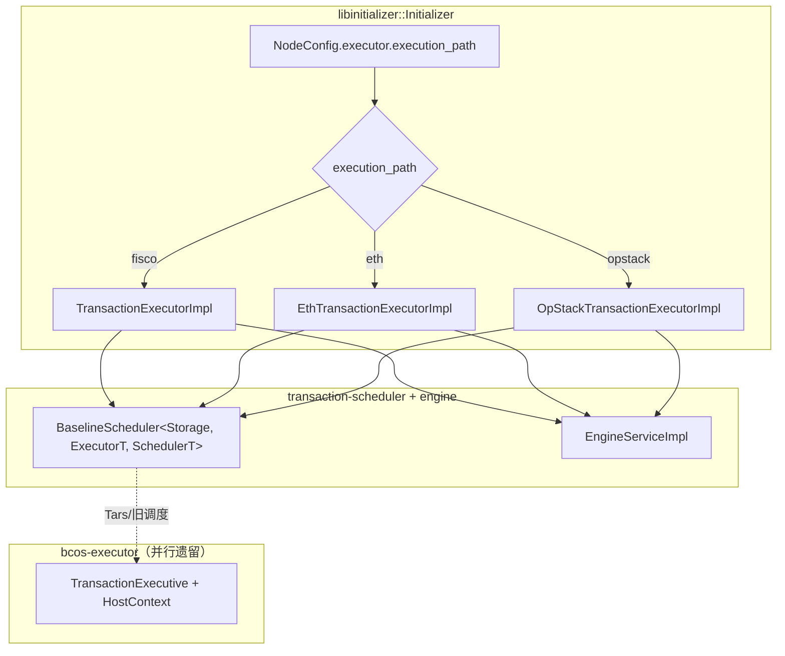
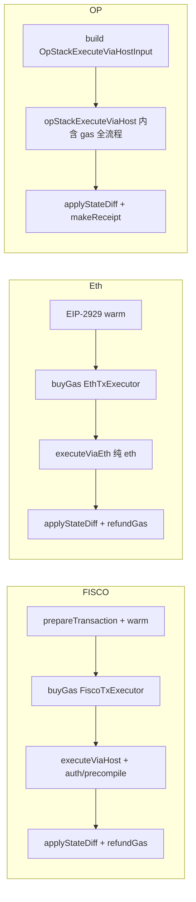
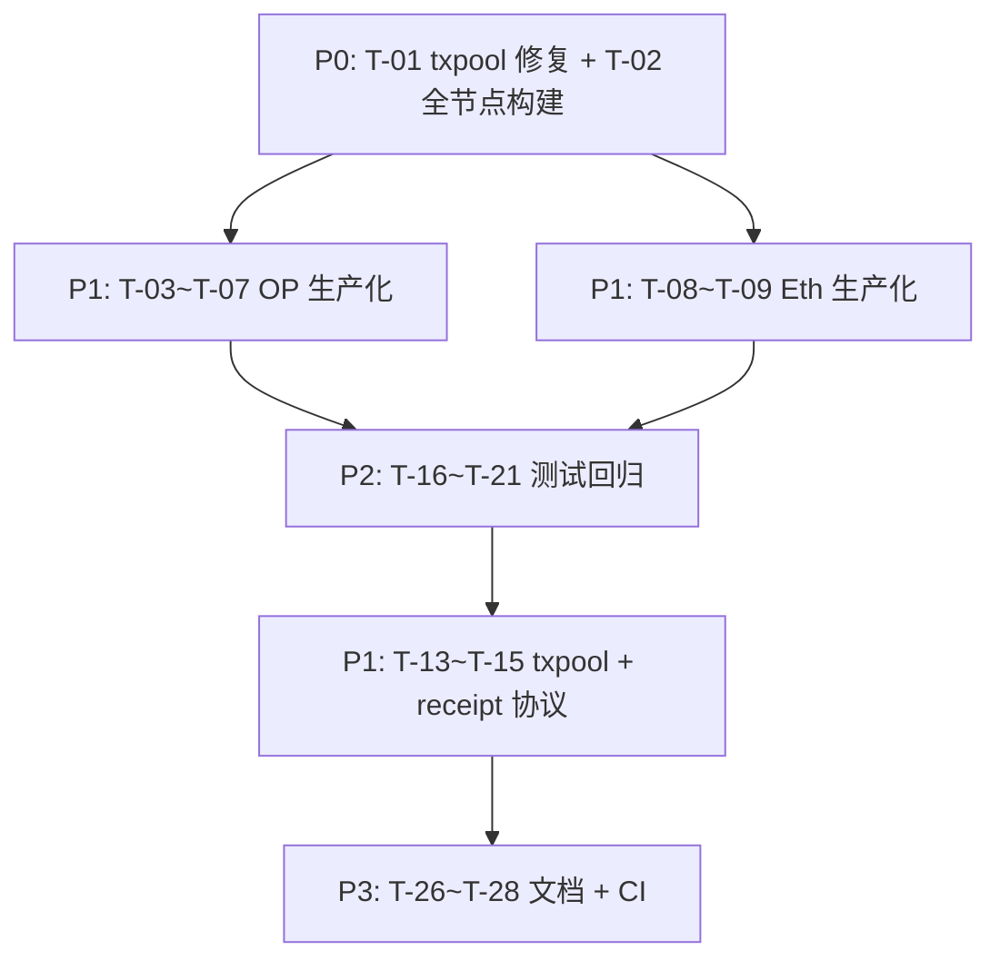

# 三路径集成 — 剩余任务清单

**日期：** 2026-06-18  
**分支：** `feat-evm-refactor`  
**关联文档：**
- OpStack Isthmus 进度：`.superpowers/sdd/progress.md`
- OpStack 设计：`docs/superpowers/specs/2026-06-18-opstack-isthmus-design.md`
- EVM 重构 spec：`docs/superpowers/specs/2026-06-18-bcos-evm-plan-c.md`
- 三路径架构说明：见本文 §2

---

## 1. 已完成基线

| 范围 | 状态 | 验证 |
|------|------|------|
| OpStack Isthmus 库层（Task 0–15 + F-1/F-2/F-3） | ✅ | `bcos-evm` ctest 40/40；Stage B gate 21/21 |
| 三执行器骨架（FISCO / Eth / OP） | ✅ | `transaction-executor` 编译通过 |
| Initializer 三分支接线 | ✅ | `libinitializer/Initializer.cpp` + `execution_path` 配置 |
| `BaselineScheduler` / `EngineService` 泛型化 | ✅ | 支持任意 `executor_v1::TransactionExecutor` concept |

### 1.1 三路径对应关系

| 配置值 | 执行器 | 编排入口 | Gas 处理 |
|--------|--------|----------|----------|
| `fisco`（默认） | `TransactionExecutorImpl` | `executeViaHost` | `FiscoTxExecutor` 外层 buy/refund |
| `eth` | `EthTransactionExecutorImpl` | `executeViaEth` | `EthTxExecutor` 外层 buy/refund |
| `opstack` / `op` | `OpStackTransactionExecutorImpl` | `opStackExecuteViaHost` | OP 层内部全流程 |

配置项（`config.ini`）：

```ini
[executor]
execution_path = fisco   # fisco | eth | opstack
```

### 1.2 关键文件索引

| 路径 | 用途 |
|------|------|
| `bcos-evm/bcos/ExecuteViaHost.h` | FISCO 编排入口 |
| `bcos-evm/eth/ExecuteViaEth.h` | Eth 编排入口 |
| `bcos-evm/opstack/OpStackExecuteViaHost.h` | OP 编排入口 |
| `transaction-executor/.../TransactionExecutorImpl.h` | FISCO 执行器 |
| `transaction-executor/.../EthTransactionExecutorImpl.h` | Eth 执行器 |
| `transaction-executor/.../OpStackTransactionExecutorImpl.h` | OP 执行器 |
| `transaction-executor/.../EthTxInputBuilder.h` | Eth 协议 → 输入映射 |
| `transaction-executor/.../OpStackTxInputBuilder.h` | OP 协议 → 输入映射 |
| `libinitializer/Initializer.cpp` | 执行器创建与三分支选择 |
| `bcos-tool/bcos-tool/NodeConfig.{h,cpp}` | `ExecutionPath` 枚举与配置解析 |

---

## 2. 三路径架构（目标态）



### 2.1 单笔交易路径对比



---

## 3. 剩余任务

优先级说明：**P0** = 阻塞构建；**P1** = 生产化必需；**P2** = 测试/回归；**P3** = 文档/CI。

### 3.1 P0 — 阻塞全节点构建

| ID | 任务 | 说明 | 涉及文件 |
|----|------|------|----------|
| T-01 | 修复 txpool 编译错误 | `TxValidator.cpp:306` 使用 `executor_v1::gas::computeTxIntrinsicGas`，应改为 `bcos::evm::gas::` | `bcos-txpool/bcos-txpool/txpool/validator/TxValidator.cpp` |
| T-02 | 验证全节点构建 | `cmake --build ... --target init` / `fisco-bcos-air` 在 `fisco` / `eth` / `opstack` 三种配置下均可编译链接 | `libinitializer/` |

---

### 3.2 P1 — OP 路径生产化

| ID | 任务 | 当前状态 | 涉及文件 |
|----|------|----------|----------|
| T-03 | `baseFeePerGas` 接入 | `buildOpStackBlockInfo()` 默认 0 | `OpStackTxInputBuilder.h`, `OpStackTransactionExecutorImpl.h` |
| T-04 | `gasPoolSubGasHook` 接入 | stub 恒 `true`；deposit 路径需区块 gas pool | `OpStackTransactionExecutorImpl.h`, scheduler |
| T-05 | Deposit `0x7E` 完整 RLP 解码 | 仅填 gas/value/data；缺 sourceHash、mint、systemTx 等 | `OpStackTxInputBuilder.h` |
| T-06 | `OpStackReceiptMeta` 写入 receipt | `l1Fee` / `operatorFee` / `depositNonce` 未写入协议层 | `OpStackTransactionExecutorImpl.h`, `bcos-protocol` |
| T-07 | EIP-7702 `authorizations` 输入映射 | OP 输入构建未解析 authorization list | `OpStackTxInputBuilder.h` |

---

### 3.3 P1 — Eth 路径生产化

| ID | 任务 | 当前状态 | 涉及文件 |
|----|------|----------|----------|
| T-08 | EIP-7702 `authorizations` 输入映射 | `fillWeb3Fields` 未填 `authorizations` / `authorizationListPresent` | `EthTxInputBuilder.h` |
| T-09 | Eth 路径端到端验证 | ✅ Layer 1 `ExecuteViaEthFixtureTest`（20 fixtures） | `bcos-evm/test/ExecuteViaEthFixtureTest.cpp` |
| T-09b | Eth executor 级 E2E | ✅ `EthTransactionExecutorFixture`（20 Phase1 + 6 Phase2 gas） | `transaction-executor/tests/TestEthTransactionExecutorFixture.cpp` |

---

### 3.4 P1 — 公共 / Engine / RPC

| ID | 任务 | 当前状态 | 涉及文件 |
|----|------|----------|----------|
| T-10 | 配置模板文档化 | `execution_path` 未写入 `config.ini` 模板 | `tools/BcosBuilder/src/tpl/` |
| T-11 | Engine `baseFeePerGas` | `EngineServiceImpl` 硬编码 `baseFeePerGas = 0` | `engine/bcos-engine/EngineServiceImpl.h` |
| T-12 | RPC `baseFeePerGas` 响应 | `BlockResponse` 返回 `"0x0"` stub | `bcos-rpc/bcos-rpc/web3jsonrpc/model/BlockResponse.cpp` |

---

### 3.5 P1 — txpool 集成（原 Isthmus spec Out of Scope）

| ID | 任务 | 说明 | 涉及文件 |
|----|------|------|----------|
| T-13 | Deposit tx `0x7E` 入池校验 | nonce 规则、system tx 拒绝、shape 检查 | `bcos-txpool/txpool/validator/` |
| T-14 | OP/Eth 路径 txpool gas 校验对齐 | EIP-7623 floor、EIP-1559 cap 等按链类型分支 | `TxValidator.cpp` |
| T-15 | Receipt RLP 编码扩展 | OP 特有 fee 字段的 receipt 序列化 | `bcos-protocol`, `bcos-tars-protocol` |

---

### 3.6 P2 — 测试与回归

| ID | 任务 | 当前状态 | 涉及文件 |
|----|------|----------|----------|
| T-16 | 修复 `EthTxGasSettlementExecutor` 失败用例 | 约 10/35 失败（`gasUsed` 42000 vs 21000 等） | `transaction-executor/tests/EthTxGasSettlementExecutorTest.cpp` |
| T-17 | 新增 `EthTransactionExecutorImpl` compat 测试 | ✅ T-09b fixture e2e（20+6 gas）；Compat 规模迁移待续 | `transaction-executor/tests/TestEthTransactionExecutorFixture.cpp` |
| T-18 | 新增 `OpStackTransactionExecutorImpl` compat 测试 | 仅 `bcos-evm/test/opstack/*` 库内单测 | `transaction-executor/tests/` |
| T-19 | 三路径 Initializer 集成测试 | 验证 `execution_path` 切换后 scheduler/engine 正常出块 | `libinitializer/` 或集成测试 |
| T-20 | `bcos-executor` compat filtered suite | 计划全局约束，全分支回归门禁 | `bcos-executor/test/` |
| T-21 | 全量 `transaction-executor` ctest 绿灯 | 含 `ExecuteViaHostCompat*`、`CompatHostContext*` 等 | `transaction-executor/tests/` |

---

### 3.7 P2 — 已知缺陷 / 技术债

| ID | 任务 | 严重度 | 说明 |
|----|------|--------|------|
| T-22 | `State::sub_refund`（F-4） | Minor | SSTORE 先清后恢复场景退款偏高；缺 `sub_refund` 计数器 |
| T-23 | Eth/OP 路径多余 `PrecompiledManager` | Minor | Initializer 在非 fisco 分支仍创建 FISCO precompile manager |
| T-24 | 遗留 `bcos-executor` 双栈并存 | 架构 | Tars/旧调度仍走 `TransactionExecutive`；长期需收敛 |
| T-25 | `EthTxGasSettlement.h` 去 `bcos-executor` 依赖 | 架构 | Plan-C §17 迁移项；txpool 命名空间错误即由此引发 |

---

### 3.8 P3 — 文档与 CI

| ID | 任务 |
|----|------|
| T-26 | 更新 Isthmus design spec 状态：库层 Implemented → 集成层 In Progress |
| T-27 | CI workflow 增加 `execution_path=eth` / `opstack` 构建矩阵 |
| T-28 | 三路径架构图写入部署 / 运维文档 |

---

## 4. 建议执行顺序



**最快 unblock 路径：**

1. **T-01** 修复 txpool `executor_v1::gas` 命名空间
2. **T-02** 验证 `init` 目标全量构建
3. 按目标链类型并行推进 OP（T-03~T-07）或 Eth（T-08~T-09）

---

## 5. 任务勾选表（跟踪用）

### P0
- [x] T-01 修复 txpool 编译错误
- [x] T-02 验证全节点构建（三分支）

### P1 — OP
- [x] T-03 baseFeePerGas 接入
- [x] T-04 gasPoolSubGasHook 接入
- [x] T-05 Deposit 0x7E 完整 RLP 解码
- [x] T-06 OpStackReceiptMeta 写入 receipt
- [x] T-07 OP EIP-7702 authorizations 映射

### P1 — Eth
- [x] T-08 Eth EIP-7702 authorizations 映射
- [x] T-09 Eth 路径端到端验证（Layer 1）
- [x] T-09b Eth executor 级 E2E（Phase 1 + Phase 2 gas）

### P1 — 公共
- [ ] T-10 配置模板文档化
- [ ] T-11 Engine baseFeePerGas
- [ ] T-12 RPC baseFeePerGas

### P1 — txpool
- [ ] T-13 Deposit 0x7E 入池校验
- [ ] T-14 OP/Eth txpool gas 校验对齐
- [ ] T-15 Receipt RLP 编码扩展

### P2 — 测试
- [ ] T-16 EthTxGasSettlementExecutor 失败修复
- [ ] T-17 EthTransactionExecutorImpl compat 测试（T-09b fixture e2e ✅；Compat 规模迁移待续）
- [ ] T-18 OpStackTransactionExecutorImpl compat 测试
- [ ] T-19 三路径 Initializer 集成测试
- [ ] T-20 bcos-executor compat suite
- [ ] T-21 transaction-executor 全量 ctest

### P2 — 技术债
- [x] T-22 State::sub_refund (F-4)
- [x] T-23 清理多余 PrecompiledManager
- [ ] T-24 bcos-executor 双栈收敛（长期）
- [x] T-25 EthTxGasSettlement 去 executor 依赖

### P3
- [ ] T-26 更新 Isthmus spec 状态
- [ ] T-27 CI 三分支构建矩阵
- [ ] T-28 部署文档

---

## 6. 修订记录

| 日期 | 变更 |
|------|------|
| 2026-06-18 | 初版：三路径集成剩余任务清单（基于 OpStack Isthmus SDD 完成 + Eth/OP 执行器骨架 + Initializer 接线） |
| 2026-06-18 | 完成 T-22（State::sub_refund + EIP-3529 SSTORE 退款）、T-23（FISCO 分支才创建 PrecompiledManager）、T-25（txpool 改用 bcos::evm::gas） |
| 2026-06-19 | 完成 T-09b（EthTransactionExecutorFixture：20 Phase1 + 6 Phase2 gas）；T-09 Layer 1 勾选 |
