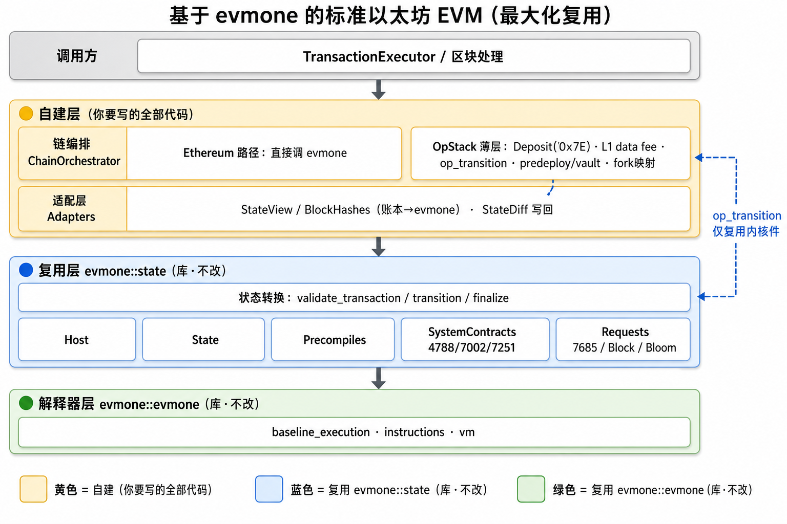
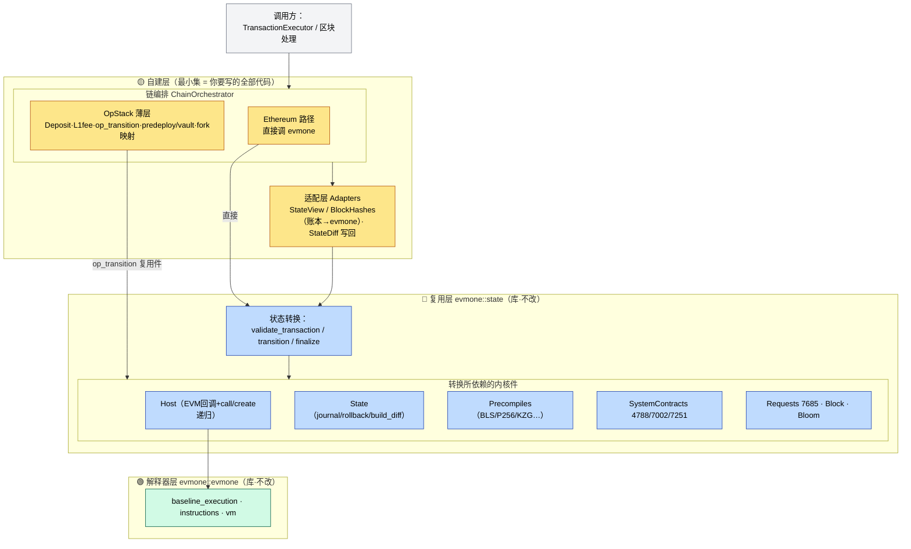
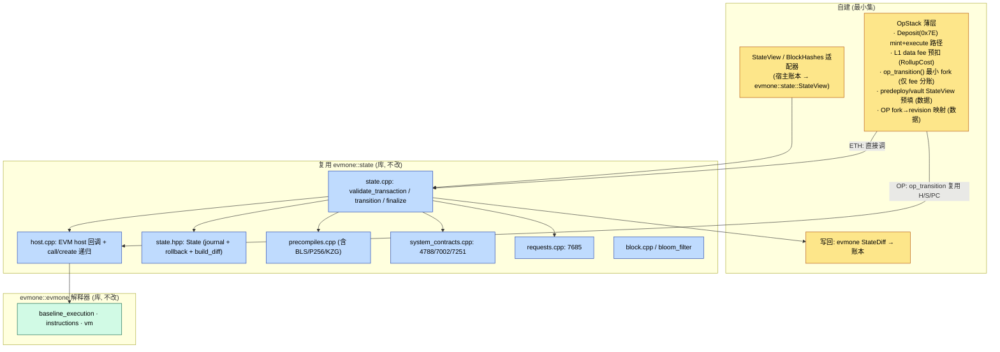
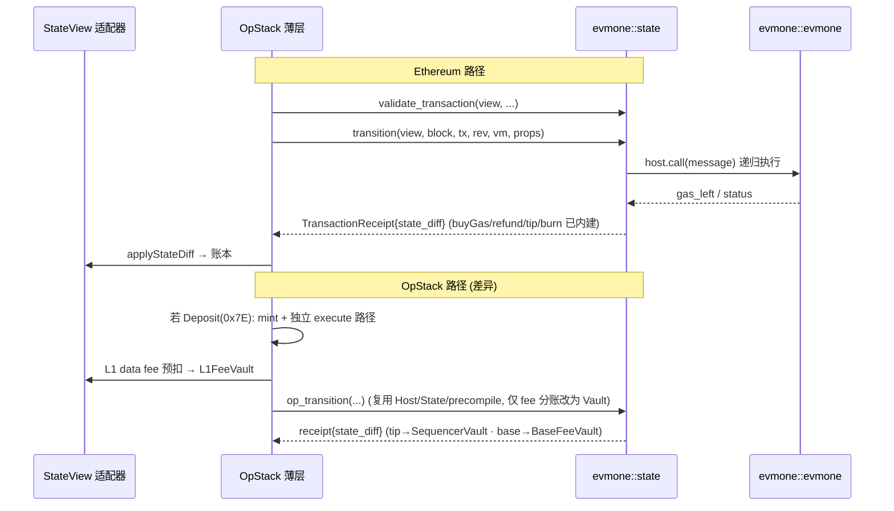

# 基于 evmone 的标准以太坊 EVM 设计（最大化复用 evmone·含 OpStack 兼容）

**版本：** 2026-07-08（rev.2 · 最大化复用 evmone） · **分支：** `feat-evm-refactor`

**参考基线：** `/Users/octopus/octo/code/blockchain-impl/evmone`（upstream `lib/evmone` 解释器 + `test/state` 状态转换，均以 STATIC 库形式导出）

**一句话：** 不再自建状态转换内核，而是**直接链接 `evmone::state` 库**——Ethereum 主网直接调用其 `validate_transaction()` / `transition()` / `finalize()`，零重写；OpStack 只自建三块薄层（Deposit 路径、L1 data fee 预扣、`op_transition()` 最小 fork），predeploy / vault / fork schedule 全部用数据预填。关闭 OP 时完全退化为主网。

**范围：** 只覆盖「单笔交易 / 单个区块的 EVM 状态转换」执行内核。不含共识、TxPool、区块调度、P2P、JSON-RPC。**本设计不考虑 FISCO 私链语义**（权限表 / 余额策略等，另见 `docs/DESIGN.md`）。

---

## 1. 核心结论：evmone 已把状态转换打成可复用库

`test/state/CMakeLists.txt` 将整个状态转换导出为静态库 `evmone::state`：

```cmake
add_library(evmone-state STATIC)
add_library(evmone::state ALIAS evmone-state)
target_include_directories(evmone-state PUBLIC ${PROJECT_SOURCE_DIR})
# 覆盖：state.cpp(validate/transition/finalize) · host.cpp · precompiles.cpp
#      · system_contracts.cpp(4788/7002/7251) · requests.cpp(7685) · block.cpp · bloom_filter
```

它对外只暴露一个极简的 `StateView`（`test/state/state_view.hpp`）：

```cpp
class StateView {
  virtual std::optional<Account> get_account(const address&) const = 0;   // nonce/balance/code_hash/has_storage
  virtual bytes   get_account_code(const address&) const = 0;
  virtual bytes32 get_storage(const address&, const bytes32&) const = 0;
};
class BlockHashes { virtual bytes32 get_block_hash(int64_t) const = 0; };
```

以及三个入口（`test/state/state.hpp`）：

- `validate_transaction(view, block, tx, rev, gasLeft, blobLeft) -> variant<TransactionProperties, error_code>`——纯校验，无副作用。
- `transition(view, block, hashes, tx, rev, vm, props) -> TransactionReceipt`——buyGas → EVM → refund，`receipt.state_diff` 为结果。
- `finalize(view, rev, coinbase, reward, ommers, withdrawals) -> StateDiff`——出块奖励 / withdrawals / 清空空账户。

**结论：** L1–L4（Host / State / StateTransition / Block / precompile / 系统合约 / requests）全部「拿来即用」，无需自建。自建代码量因此从「大」降到「小～中」。

---

## 2. 复用策略

### 2.1 Ethereum 主网 —— 零重写，直接调用

只需一个把宿主账本桥接到 `evmone::state::StateView` 的适配器，然后直接调用 evmone：

```cpp
auto props = evmone::state::validate_transaction(view, block, tx, rev, gasLeft, blobLeft);
if (holds_error(props)) { /* 拒绝，状态不变 */ }
auto receipt = evmone::state::transition(view, block, hashes, tx, rev, vm, get<Props>(props));
applyStateDiffToLedger(receipt.state_diff);   // 写回
```

`transition()` 内部的 buyGas、refund（EIP-3529 上限 /5、EIP-7623 地板）、tip→coinbase、base fee 销毁全部复用，**不自己实现任何 fee 数学**。

### 2.2 OpStack —— 薄包裹，复用 95%

OpStack 的差异大多**不需要改 evmone**：

| OpStack 差异 | 在复用 evmone 下如何实现 | 改 evmone? |
|-------------|------------------------|-----------|
| **Predeploy**（L1Block `0x42…15` / GasPriceOracle `0x42…0F` / 各 Vault） | 固定地址的普通合约账户，`StateView` 预填即可，evmone `Host` 原生处理 | ❌ 纯数据 |
| **OP fork → revision** | fork schedule（Bedrock…Isthmus）映射到 `evmc_revision` | ❌ 纯数据 |
| **区块开头写 L1 属性** | 一笔对 L1Block 的普通 CALL（或直接写 StateView），复用 Host | ❌ 数据/复用 |
| **L1 data fee** | 调 `transition()` **之前**从 sender 预扣，记入 L1FeeVault（RollupCost 公式按 fork 版本） | ⚠️ 外包裹 |
| **Fee Vault 三分账** | evmone 烧 base fee、tip 给 coinbase；OP 需按 vault 重分配 | ⚠️ 见下 §2.3 |
| **Deposit tx (0x7E)** | 非 evmone `Transaction::Type`；需独立 mint+execute 路径（复用 Host/State/EVM，绕开付费逻辑） | ⚠️ 自建薄路径 |

### 2.3 唯一真正的取舍：`transition()` 无 hook

`transition()` 是单体函数、fee 分账内嵌，OpStack 的 vault 语义无法从外部无痛注入。两条路：

| 方案 | 做法 | 优点 | 缺点 |
|------|------|------|------|
| **A 外包裹 + 事后重分配** | 不碰 evmone；pre 扣 L1 fee，post 把 base(销毁额)/tip(coinbase 增量) 搬进 Vault | 零 fork | 依赖复算 transition() 内部数值，脆弱 |
| **B 最小 fork `op_transition()`**（推荐） | 复制 `state.cpp::transition()`（~80 行），仅改 fee 分账段；Host/precompile/system_contracts/State 仍链接 `evmone::state` | fee 语义清晰内联、维护面仅 80 行 | 需随 upstream `transition()` 变更同步 |

推荐 **B**，与 op-geth fork go-ethereum `state_transition.go` 的做法一致。

---

## 3. 层次架构图（最大化复用 evmone）

### 3.1 分层堆栈（自上而下：每层自建 or 复用）





**分层职责与归属：**

| 层 | 内容 | 归属 |
|----|------|------|
| 调用方 | TransactionExecutor / 区块处理 | 既有 |
| 链编排 | ETH 直接调用；OpStack 薄层（Deposit 0x7E、L1 fee 预扣、`op_transition` 最小 fork、predeploy/vault 预填、fork→revision） | **自建** |
| 适配层 | `StateView`/`BlockHashes` 桥接账本、`StateDiff` 写回转换 | **自建（小）** |
| 状态转换 | `validate_transaction` / `transition`（buyGas+refund+tip+burn 内建）/ `finalize` | **复用 `evmone::state`** |
| 内核件 | Host / State / Precompiles / SystemContracts / Requests / Block / Bloom | **复用 `evmone::state`** |
| 解释器 | 字节码执行 | **复用 `evmone::evmone`** |

**边界纪律：** 黄色可依赖蓝色/绿色；蓝色/绿色**永不反向依赖**黄色——这保证「OpStack 关闭即退化为主网」。`op_transition`（黄→内核件的边）不复制内核，只复制 `transition()` 那 ~80 行改 fee 分账，其余仍指向蓝色复用件。

### 3.2 组件流向图



## 4. 数据流（单笔交易，ETH / OP 双路径）



---

## 5. 工作量对比（自建 vs 复用 evmone）

| 模块 | 原「自建」方案 | 「复用 evmone」方案 |
|------|--------------|-------------------|
| Host / State / StateTransition | 大（全部自写） | **✅ 链接 `evmone::state`，零写** |
| Precompiles / 系统合约 / requests | 大 | **✅ 复用，零写** |
| refund(3529/7623) / buyGas / finalize | 大 | **✅ 复用，零写** |
| StateView / BlockHashes 适配器 | — | 小（桥接账本） |
| build 集成 | — | 中（vcpkg port 需 export `evmone::state`，见 §6） |
| OpStack Deposit + L1 fee + vault | 中 | 中（`op_transition` 最小 fork + 薄路径） |
| **总量** | **大** | **小～中** |

### 5.1 工作分解（复用方案）

| 阶段 | 工作项 | 规模 |
|------|--------|------|
| 1 build | vcpkg port 导出 `evmone::state`（见 §6） | 中 |
| 2 适配 | `StateView` / `BlockHashes` 适配器 + `StateDiff` 写回转换 | 小 |
| 3 ETH | 直接调 `validate_transaction`/`transition`/`finalize`；EEST 对照 | 小 |
| 4 OP-数据 | predeploy/vault 账户预填、OP fork→revision 映射、区块首笔 L1 属性写入 | 小 |
| 5 OP-逻辑 | Deposit(0x7E) mint+execute 路径、L1 data fee(RollupCost)、`op_transition()` 最小 fork | 中 |
| 6 测试 | EEST state/blockchain runner（主网）+ op-geth 对照（OP） | 大 |

---

## 6. 前置工作：让 vcpkg port 导出 `evmone::state`

现 `ports/evmone/portfile.cmake` 只链接了 `evmone::evmone`（解释器）。复用状态转换需要额外构建并安装 `evmone-state`（位于 `test/state`，默认仅 `EVMONE_TESTING=ON` 时构建）。要点：

1. 打开 evmone 构建选项使 `test/state` 子目录参与（或单独 `add_subdirectory(test/state)`）。
2. `install(TARGETS evmone-state ...)` + 导出 `evmone::state` target 与其公开头文件（`state.hpp`/`state_view.hpp`/`transaction.hpp`/`block.hpp`/`state_diff.hpp` 等，注意其 `PUBLIC` include 是 `PROJECT_SOURCE_DIR`）。
3. 依赖链：`evmone-state PUBLIC evmone::precompiles evmc::evmc_cpp PRIVATE evmone`——需一并导出 `evmone::precompiles`。
4. 锁定 REF（现 `3585c2cb… / v0.21.0`）以规避 test 树 API 漂移。

---

## 7. 主要风险

- **`evmone::state` 属 test 树**：upstream 不保证 ABI/API 稳定；用固定 REF 控制，升级时集中适配。
- **`op_transition()` fork 漂移**：upstream 改 `transition()` 时需同步那 ~80 行。
- **StateDiff 语义**：evmone `StateDiff{modified_accounts, deleted_accounts}` 与宿主账本写回格式需一层转换；注意 Cancun 后 `deleted_accounts` 恒空（SELFDESTRUCT 语义变更）。
- **Predeploy 时序**：L1 属性必须在区块首笔 Deposit 之前写入。
- **共识等价性**：ETH 路径直接复用 evmone 天然等价；OP 路径需 op-geth 对照，重点是 L1 fee 与 vault 分账数值。

---

## 8. 一句话总结

「最大化复用 evmone」= **链接 `evmone::state` 库，Ethereum 主网直接调 `transition()`/`validate_transaction()`/`finalize()` 零重写；OpStack 仅自建三块薄层（Deposit 路径、L1 fee 预扣、`op_transition()` 最小 fork），predeploy/vault/fork 全用数据预填。** 唯一前置成本是把 vcpkg port 从「只装解释器」扩成「也装 `evmone::state`」。相比全自建，Host/State/精编译/系统合约/refund 数学全部省去。
