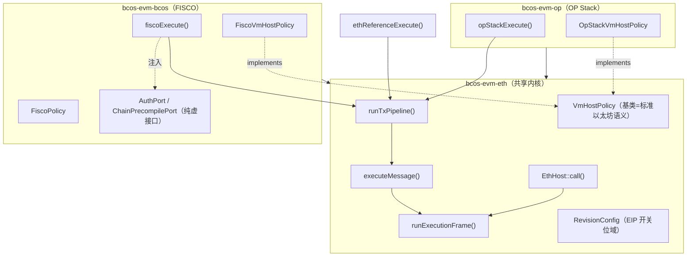

# bcos-evm 架构设计原理（评审稿）

**用途：** 供评审者快速理解 `bcos-evm` 的分层契约、扩展机制与治理纪律。
**配套文档：** 外部入口 [review-pack.md](review-pack.md)、[模块对接梳理（从区块执行开始）](module-integration-from-block-execution.md)、能力矩阵 `bcos-evm/capability-matrix.md`、决策记录 `bcos-evm/docs/adr/001–021`、已知缺口 `bcos-evm/docs/architecture-known-gaps.md`。
**校验：** 2026-06-25（ExecutionFrame PR1–2 统一帧层；`runTxPipeline` 三路径收敛）

---

## 1. 一句话定位

`bcos-evm` 把"一个标准以太坊 EVM 执行内核"和"三条链的差异化编排"彻底分层：**一个共享内核 + 三套编排外壳**，通过**单向依赖 + 注入式扩展点**保证内核纯净、链定制可插拔，并用**能力矩阵 + ADR + CI 门禁**把这套契约固化成可评审、可回归的工程纪律。

---

## 2. 三层库结构（物理边界）

`CMakeLists.txt` 把代码切成三个静态库，依赖单向收敛：

```cmake
add_library(bcos-evm-eth  STATIC ${BCOS_EVM_ETH_SOURCES})   # 共享内核 + ETH 参考路径
add_library(bcos-evm-bcos STATIC ${BCOS_EVM_BCOS_SOURCES})  # FISCO 生产编排
add_library(bcos-evm-op   STATIC ${BCOS_EVM_OP_SOURCES})    # OP Stack 生产编排
add_library(bcos-evm ALIAS bcos-evm-bcos)
```

| 库 | 目录 | 角色 | 依赖方向 |
| --- | --- | --- | --- |
| `bcos-evm-eth` | `eth/` | **共享内核** + 以太坊参考路径 | 仅依赖 evmone / 框架基础库 |
| `bcos-evm-bcos` | `bcos/` | FISCO 生产编排 | → `bcos-evm-eth` |
| `bcos-evm-op` | `opstack/` | OP Stack 生产编排 | → `bcos-evm-eth` |

**关键不变量：** `eth/` 永远不 include `bcos/` 或 `opstack/`。
- 由 `architecture-known-gaps.md` Gap 38 专门审计，并由 ADR-005 Rule 1 写成硬规则。
- 链差异只能通过下述扩展点**注入**，不得反向渗透进内核。这是整套设计成立的地基。



同一结构的 ASCII 视图（依赖只从外壳指向内核，绝不反向）：

```text
            ┌──────────────────────────┐   ┌──────────────────────────┐
            │   bcos-evm-bcos (FISCO)   │   │   bcos-evm-op (OP Stack)  │
            │  ──────────────────────   │   │  ──────────────────────   │
            │  fiscoExecute()           │   │  opStackExecute()         │
            │  FiscoVmHostPolicy        │   │  OpStackVmHostPolicy      │
            │  FiscoPolicy              │   │  (Isthmus profile)        │
            │  AuthPort /               │   │                           │
            │  ChainPrecompilePort      │   │                           │
            └────────────┬─────────────┘   └─────────────┬────────────┘
                         │   依赖（单向）                  │   依赖（单向）
                         ▼                                ▼
            ┌───────────────────────────────────────────────────────────┐
            │                  bcos-evm-eth （共享内核）                   │
            │  ───────────────────────────────────────────────────────   │
            │   runTxPipeline()      共享编排管线（ADR-019）            │
            │   executeMessage()        tx 级薄 adapter（warm/7702/nonce）│
            │   runExecutionFrame()     统一帧执行 deep module（PR1–2）   │
            │   EthHost::call()         evmc 嵌套帧 adapter → Nested     │
            │   VmHostPolicy            扩展点基类 = 标准以太坊默认语义     │
            │   RevisionConfig          EIP 开关位域（13 个 bool + 参数）   │
            │   PrecompileRouter        内核精编译路由                     │
            │   EthPolicy / EthReferenceBridge   以太坊参考路径（接线审计）  │
            └───────────────────────────────────────────────────────────┘
                         │
                         ▼  仅依赖
                ┌──────────────────────┐
                │ evmone / 框架基础库   │
                └──────────────────────┘

   ✗ 禁止：eth/ 不得 include bcos/ 或 opstack/   （ADR-005 Rule 1 / Gap 38 审计）
```

**`eth/state/` Legacy Enclave（ADR-020）：** basename 已统一为 PascalCase（如 `BloomFilter.hpp`、`State.hpp`）；`.hpp` 扩展名保留至 Phase 3（`.hpp → .h`），CI 仅豁免扩展名、不豁免 snake_case basename。

---

## 3. 执行流：三入口 → 共享编排 → 内核

自 ADR-019 起，三个执行桥入口均为薄 wrapper：映射输入 → 填充 `TxPipelineHooks` → 调用 `runTxPipeline` → 映射输出。共享步骤（intrinsic debit、`BuildExecuteMessageInput`、`AdoptEvmcResult`、settlement snapshot）在 `eth/orchestration/` 单点 enforcement。

`executeMessage` 现为 **tx 级薄 adapter**：warm 目标、7702 tx auth、sender nonce bump、`finalize_self_destructs` 与 `stateDiff` 映射留在 adapter；帧体（precompile route → checkpoint → value transfer → CREATE → evmone）统一委托 `runExecutionFrame(TopLevel)`。嵌套帧由 evmone 回调 `EthHost::call` → `runExecutionFrame(Nested)`。链行为仍仅通过 `VmHostPolicy*` 注入：

```cpp
// eth/ExecuteMessage.h
struct ExecuteMessageInput {
    state::EvmStateReader const* stateView;
    evmc::VM* vm;
    evmc_message message;
    bcos::evm_standard::RevisionConfig revisionConfig;
    state::VmHostPolicy* extension;   // 内核内唯一的链行为注入点
    // ...
};
ExecuteMessageOutput executeMessage(ExecuteMessageInput input);
```

**编排不变量：** `TxPipelineContext::message` 是 intrinsic 扣减的唯一可变 owner；步骤 ④ `debitIntrinsicGas` 修改它，步骤 ⑦ `executeMessage` 使用同一引用（源码：`TxPipeline.cpp`；三路径均 call `runTxPipeline`：`EthReferenceBridge.cpp`、`FiscoExecutionBridge.cpp`、`OpStackExecutionBridge.cpp`）。

### 3.1 Frame execution (ExecutionFrame)

```text
runTxPipeline → executeMessage (tx adapter)
                    └─ runExecutionFrame(TopLevel)
evmone callback → EthHost::call (nested adapter)
                    └─ runExecutionFrame(Nested)
                         └─ PrecompileRouter::dispatchPrecompile (step ③, sole call site)
```

`FrameScope` 由 adapter 显式传入（TopLevel / Nested），Frame 内部不根据 `message.depth` 驱动语义分叉。TopLevel 路径 defer `state.commit()` 至 adapter nonce bump 之后；Nested 路径忽略 `fr.gasRefund`（RR4）。

**PR4（2026-06-25）：** `ExecutionFrame.cpp` 内部 implementation 双轨已合并为命名 step + `runTopLevelSteps` / `runNestedSteps`；RR6/RR7 scope 执行序冻结不变。

三个编排入口签名风格一致，但各自携带链特有字段：

| 入口 | 文件 | 链特有输入 | 能力矩阵列语义 |
| --- | --- | --- | --- |
| `ethReferenceExecute` | `eth/EthReferenceBridge.h` | 无（标准以太坊） | ETH = **接线审计 / 契约测试**（非生产继承证明） |
| `fiscoExecute` | `bcos/FiscoExecutionBridge.h` | `AuthPort* / ChainPrecompilePort* / persistContractCreateNonce` | BCOS = **FISCO 生产继承契约** |
| `opStackExecute` | `opstack/OpStackExecutionBridge.h` | deposit tx、blob、rollup cost、fork schedule | OPStack = **OP 生产继承契约** |

> 评审提醒：ETH 列测试通过 **不等于** BCOS/OP 通过。矩阵中标 `inherited` 且 baseline-reachable 的行必须有 TE 路径测试。

### 3.2 固定编排管线（`runTxPipeline`，ADR-019）

```text
① validate(vm, hashImpl)     — try/catch 外
② hooks.txSetupMessage(ctx)
③ hooks.txCheckTransactionRules(ctx)      → earlyExit?
③½ hooks.txCheckGasAffordable(ctx)       → earlyExit?   （OpStack floor/balance）
④ debitIntrinsicGas(ctx.message, intrinsicPolicy) → earlyExit?
⑤ hooks.txCheckBalanceAndValue(ctx)
⑥ buildExecuteMessageInput(ctx) + hooks.txTuneExecutionInput
⑦ executeMessage(input)      — input.message == ctx.message
⑧ adoptEvmcResult(...)
⑨ captureSettlementSnapshot    — Eip7623 mode only
⑩ hooks.txPatchExecutionResult(ctx)
⑪ hooks.txFinalizeGasSettlement(ctx)
```

OpStack 异步 fee（`buyGas`/`refundGas`）、deposit state machine、最终 `stateDiff` 映射仍在 wrapper 外圈（ADR-019 Q7/Q18/Q19）。详见 ADR-019 与 [review-pack.md §2](review-pack.md#2-执行流全景adr-019)。

### 3.3 三路径调用流

```text
   ETH 参考路径        FISCO 生产路径            OP Stack 生产路径
  ──────────────     ─────────────────        ───────────────────
  ethReferenceExecute  fiscoExecute             opStackExecute
       │                  │                          │
       │             wrapper 外圈：auth、           wrapper 外圈：
       │             value xfer、21000 gas          buyGas/refund、deposit、
       │                                          L1 fee、gas pool
       └───────┬──────────┴────────────┬─────────────┘
               ▼                        ▼
        ┌──────────────────────────────────────────────┐
        │         runTxPipeline(ctx, hooks)           │
        │         ctx.message = intrinsic 唯一 owner     │
        └──────────────────────┬───────────────────────┘
                               ▼
        ┌──────────────────────────────────────────────┐
        │            executeMessage(input)               │
        │            ── tx adapter ──                     │
        │   warm / 7702 auth → runExecutionFrame(TopLevel)│
        │   nonce bump → commit → finalize_self_destructs │
        │                                                │
        │   evmone 嵌套回调 EthHost::call →              │
        │   runExecutionFrame(Nested)                    │
        │   遇到下列语义点回调扩展点：                     │
        │                                                │
        │     ├─ tryChainPrecompile()  ── 链精编译分发    │
        │     ├─ skipHostValueTransfer() ── 是否跳过转账  │
        │     ├─ allowSelfdestruct()   ── SELFDESTRUCT   │
        │     ├─ prepareMessage()/setCallerAddress()     │
        │     └─ bumpContractCreateNonce() ── CREATE     │
        │                   │                            │
        │                   ▼                            │
        │        VmHostPolicy*（多态派发）                │
        │   ┌───────────────┼────────────────┐          │
        │   ▼               ▼                ▼          │
        │ 默认基类     FiscoVmHostPolicy  OpStackVmHostPolicy │
        │ (标准以太坊)   (FISCO 语义)      (L1Block 预部署) │
        └──────────────────────────────────────────────┘
               │
               ▼
        ExecuteMessageOutput { result, stateDiff, logs, gasRefund }
        （最终 stateDiff/logs 由 wrapper 映射；OpStack 在 refund 后 build_diff）
```

---

## 4. 两种扩展机制（核心设计）

### 4.1 `VmHostPolicy` —— 内核**内部**的回调钩子

```cpp
// eth/policy/VmHostPolicy.h
struct VmHostPolicy {
    virtual bool allowSelfdestruct(const Account&)        { return true; }   // 默认=标准以太坊
    virtual bool allowDelegateCallToPrecompile()          { return true; }
    virtual bool skipHostValueTransfer()                  { return false; }
    virtual std::optional<evmc_result> tryChainPrecompile(evmc_revision, const evmc_message&);
    virtual void prepareMessage(evmc_revision, evmc_message&);
    virtual void setCallerAddress(const evmc_address&);
    virtual void bumpContractCreateNonce(const evmc_address&);
};
```

- **默认实现 = 标准以太坊语义**，链层只覆写差异。
- `FiscoVmHostPolicy`：禁 selfdestruct、禁 delegatecall-to-precompile、CREATE nonce 持久化、FISCO precompile 优先级。
- `OpStackVmHostPolicy`：只覆写 `tryChainPrecompile`，挂载 L1Block 预部署。
- 这些钩子在**内核调用树内部**触发（ADR-005 §3：`VmHostPolicy` 在 kernel 内运行；Orchestrator / `runTxPipeline` 在 `executeMessage` 之前运行）。

### 4.3 `TxPipelineHooks` —— 编排管线注入（ADR-019）

文件：`eth/orchestration/TxPipelineHooks.h`

链特有编排行为通过 hook 回调注入 `runTxPipeline`，**不得**在 `eth/orchestration/` 内 `#include bcos/` 或 `opstack/`。典型 hook：

| Hook | Eth | Fisco | OpStack |
| --- | --- | --- | --- |
| `txCheckTransactionRules` | 1559 caps、precheck | auth check | — |
| `txCheckGasAffordable` | — | — | floor/balance（`OpStackFloorGasPrecheck`） |
| `txCheckBalanceAndValue` | `canTransfer` | 21000 gas、value xfer | — |
| `txPatchExecutionResult` | included-tx vmerr | CREATE address 修补 | — |
| `txFinalizeGasSettlement` | — | revert logs | `postExecuteGasSettlement` |
| `txHandleIntrinsicGasFailure` / `txHandlePipelineException` | 链特有错误映射 | Fisco `fixErrorHandling` | internal error |

与 `VmHostPolicy` 的分界：hooks 在 `executeMessage` **之前/之后**的管线步骤运行；`VmHostPolicy` 在 evmone 调用树**内部**运行。

### 4.2 `Port` —— 编排层对 `bcos-executor` 的依赖倒置（ADR-017，本次重构新增）

```cpp
// bcos/ports/ChainPrecompilePort.h
struct ChainPrecompilePort {
    virtual std::optional<evmc_result> dispatch(evmc_revision, evmc_message const&) = 0;
};
// bcos/ports/AuthPort.h
struct AuthPort {
    virtual std::optional<EVMCResult> checkAuth(evmc_message const&) = 0;
    virtual void createAuthTable(evmc_message const&, std::string_view tablePath) = 0;
};
```

- `AuthPort` / `ChainPrecompilePort` 是纯虚接口，实现体留在 `transaction-executor/adapters/` + `bcos-executor`。
- 收益（ADR-017）：
  - `bcos-evm` 源码做到 **零 `bcos-executor` include**（可被 grep 固化为 CI 检查 A-2）；
  - 单测可 mock Port（已有 `ChainPrecompilePortTest`、`InMemoryChainPrecompileAdapter`、`InMemoryAuthAdapter`）；
  - **kernel 的 `PrecompileRouter` 与 chain 的 Port 正交**——内核精编译路由和链精编译分发互不感知。
- 这是 `feat-evm-refactor` 分支的主要价值：把"EVM 直接调 executor 精编译"的耦合改为依赖倒置（端口注入）。

依赖倒置前后对比（箭头 = 编译期 include 方向）：

```text
  重构前（耦合）                         重构后（ADR-017 端口注入）
  ─────────────                         ──────────────────────────
  ┌─────────────┐                       ┌─────────────┐
  │  bcos-evm   │                       │  bcos-evm   │   定义接口
  │             │ ──include──▶          │  AuthPort   │◀─┐ （纯虚）
  │  直接调用    │                       │  ChainPre-  │  │
  │  executor   │                       │  compilePort│  │ implements
  │  精编译      │                       └──────┬──────┘  │ （运行期注入）
  └──────┬──────┘                              │ dispatch│
         │                                     ▼         │
         ▼                              ┌────────────────┴───┐
  ┌─────────────┐                       │ transaction-executor/adapters/ │
  │bcos-executor│                       │ + bcos-executor 精编译 TU      │
  └─────────────┘                       └────────────────────┘
   ✗ bcos-evm 依赖 executor              ✓ bcos-evm 零 executor include
                                         ✓ 单测可 mock Port
                                         ✓ 内核 PrecompileRouter 与 Port 正交
```

---

## 5. Revision / EIP 开关：`RevisionConfig` + 三套 Policy（ADR-018）

EIP 启用状态统一收敛到 `RevisionConfig` 位域（`eth/RevisionConfig.h`），分三类：

- **A 类 feature-gated**（6 个）：`warm_access / eip2537 / eip7212 / eip7623 / eip7823 / eip7702`（FISCO 需显式 `Features::Flag`）
- **B 类 revision-derived**：`eip1153 / eip4844 / eip5656 / eip6780 / eip1559 / eip3651 / prague_post_execution`
- **C 类 fork 参数**：`calldata_floor_per_token`

**单一推导源（ADR-018）：** `revisionConfigFromRevision(evmc_revision)` 在 `RevisionConfig.h` 内 canonical 赋值；消费者（`PrecompileActive.h`、`EthHost::selfdestruct` 等）读 `cfg` bool，不在 consumer 侧写 `revision >= EVMC_*`。

由三套 Policy 生成：

| Policy | 门控依据 | 语义 |
| --- | --- | --- |
| `EthPolicy` | **块号** → `evmc_revision` → `revisionConfigFromRevision` | 以太坊主网时间线 |
| `FiscoPolicy` | `toFiscoRevision` → `revisionConfigFromRevision` → `applyFiscoFeatureGates` | A 类字段由 `FISCO_GATED_FLAG_MAP` 掩码；另含 `bugfix_*` flag |
| `makeIsthmusRevisionConfig` | **`revisionConfigFromRevision(EVMC_PRAGUE)`** | OP Isthmus **dense** canonical Prague profile（非 sparse） |

`FiscoPolicy` 的精髓：`derive(revision)` 给出 canonical 开关集，再用 feature flag **掩码** A 类字段 —— 旧链不开 flag 则对应 EIP 关闭，行为向前兼容。生产 TE 路径：`OpStackTransactionExecutorImpl` 调用 `makeIsthmusRevisionConfig()`。

`RevisionConfig.h` 用 `REVISION_CONFIG_BOOL_FIELDS` X-macro + `static_assert(... == 13)` 做漂移检测：任何字段增减都会触发 `RevisionConfigProfileTest` 编译期/CI 失败。

---

## 6. 治理机制：把"设计契约"变成"可回归的工程纪律"

这是该架构区别于一般重构的关键——它不止有代码，还有一套**强制对账系统**：

- **能力矩阵**（`capability-matrix.md`）：每个能力 × 路径（ETH/BCOS/OP）× 层（kernel / orchestration / tx input / revision profile）= 一个单元格；token 只能是 `inherited / explicit / feature-gated / unsupported / deviation`，非 `inherited` 必须写理由 + 测试引用。
- **ADR 链**（`docs/adr/001–019`）：每个设计决策（基线 vs 参考路径、域边界、7702 门控、precompile port、revision 单源、编排管线…）都有不可变记录。
- **CI 门禁**（`.github/workflows/capability-gate.yml`）：
  - `check-capability-matrix.sh` — 矩阵 token lint
  - `check-revision-single-source.sh` — A 类字段不得在 consumer 侧 `revision >=` 推导
  - `bcos-evm/` 零 `bcos-executor` include；`bcos-evm/eth/` 零 `bcos/Fisco` include
  - 改 capability surface / `RevisionConfig.h` 必须同 PR 更新矩阵或 profile test
- **已知缺口台账**（`architecture-known-gaps.md`）：技术债显式登记，而非隐藏。

---

## 7. 评审者应重点质疑的点

1. **profile-only 字段**（Gap 37）：`warm_access / eip1559 / prague_post_execution` 在 Policy 被赋值但尚无 TE 消费者（`prague_post_execution` 为 reserved，恒 `false`）。`eip3651` 已接线：`warmTransactionEntry` 读 `cfg.eip3651` 做 coinbase warm。剩余字段长期应决定**接线还是删字段**。
2. **warm 与 dispatch 未单源**（候选 2）：tx-entry warm 仍部分按 `evmc_revision` 硬编码，而 dispatch 已读 `cfg.eip2537` 等；FISCO `revision=PRAGUE` + `eip2537=false` 时可能 warm 但不 dispatch。见 [architecture-review-post-orchestration-2026-06-23.md](architecture-review-post-orchestration-2026-06-23.md)。
3. **`FiscoPolicy.h` 直接 include `transaction-executor/.../AuthCheck.h` 与 `PrecompiledManager.h`**：位于 `bcos/` 层（允许，且不违反零 `bcos-executor` include），但与 ADR-017 Port 全生命周期方向仍有张力。
4. **ETH 列定位**：矩阵明确 ETH 路径"不是生产继承证明"，勿把 ETH 测试通过误读为 BCOS/OP 通过。
5. **Prepare 阶段 dead warm**（Gap 36）：`prepareTransaction` 的 warm set 未持久化到 Execute，属已知无效逻辑，待产品决策清理。
6. ~~**内核帧语义双轨**~~ **Done (ExecutionFrame PR1–4)**：adapter 双轨（PR1–2）与 internal pipeline 双轨（PR4）均已闭合；`executeMessage` / `EthHost::call` delegate 至 `runTopLevelSteps` / `runNestedSteps`；PrecompileRouter 仍保留 transfer→checkpoint→dispatch 信封（与 geth 已知偏差，非 Frame 范围）。

---

## 8. 关键文件索引

| 关注点 | 文件 |
| --- | --- |
| 外部 review 入口 | `docs/review-pack.md` |
| 库划分 / 依赖 | `bcos-evm/CMakeLists.txt` |
| 共享编排管线 | `eth/orchestration/TxPipeline.cpp` |
| 编排上下文 / 钩子 | `eth/orchestration/TxPipelineContext.h`、`TxPipelineHooks.h` |
| 内核入口 | `eth/ExecuteMessage.h` / `.cpp` |
| ExecutionFrame module | `eth/execution/ExecutionFrame.h` / `.cpp` |
| Frame helpers | `eth/execution/RouteMessage.*`、`FrameValueTransfer.h`、`ResolveExecutionCode.h`、`FrameCaller.h` |
| Frame parity tests | `test/eth/ExecutionFrameTest.cpp` |
| 内核扩展点基类 | `eth/policy/VmHostPolicy.h` |
| EIP 开关 / 单一 derive | `eth/RevisionConfig.h`（`revisionConfigFromRevision`） |
| ETH 参考 Policy | `eth/vm/EthPolicy.h` |
| FISCO 编排入口 | `bcos/FiscoExecutionBridge.h` |
| FISCO 扩展实现 | `bcos/FiscoVmHostPolicy.h` |
| FISCO 钩子绑定 | `bcos/FiscoPipelineHookBinder.h` |
| FISCO Policy（derive + 掩码） | `bcos/FiscoPolicy.h` |
| 依赖倒置端口 | `bcos/ports/AuthPort.h`、`bcos/ports/ChainPrecompilePort.h` |
| OP 编排入口 | `opstack/OpStackExecutionBridge.h` |
| OP pre-debit | `opstack/OpStackFloorGasPrecheck.cpp` |
| OP 扩展实现 | `opstack/OpStackVmHostPolicy.h` |
| 能力契约 | `capability-matrix.md` |
| 决策记录 | `docs/adr/001–019` |
| 技术债台账 | `docs/architecture-known-gaps.md` |
