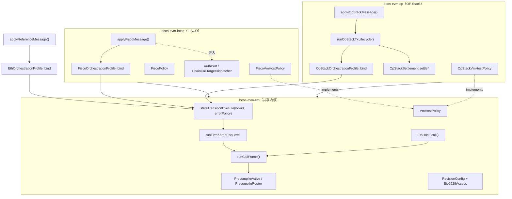

# bcos-evm 架构设计原理（评审稿）

**用途：** 供评审者快速理解 `bcos-evm` 的分层契约、扩展机制与治理纪律。
**配套文档：** 外部入口 [review-pack.md](review-pack.md)、[模块对接梳理（从区块执行开始）](module-integration-from-block-execution.md)、能力矩阵 `bcos-evm/capability-matrix.md`、决策记录 `bcos-evm/docs/adr/001–024`、已知缺口 `bcos-evm/docs/architecture-known-gaps.md`、编排后审查 [architecture-review-post-orchestration-2026-06-23.md](architecture-review-post-orchestration-2026-06-23.md)。
**校验：** 2026-06-30（ADR-032 Wave 5 doc sweep；CallTargetResolver ADR-024；`EvmTxContextView` ADR-027；`PrecompileRouter` envelope-only）

---

## 1. 一句话定位

`bcos-evm` 把"一个标准以太坊 EVM 执行内核"和"三条链的差异化编排"彻底分层：**一个共享内核 + 三套编排外壳**，通过**单向依赖 + 注入式扩展点**保证内核纯净、链定制可插拔，并用**能力矩阵 + ADR + CI 门禁**把这套契约固化成可评审、可回归的工程纪律。

---

## 2. 三层库结构（物理边界）

`CMakeLists.txt` 把代码切成三个静态库，依赖单向收敛：

```cmake
add_library(bcos-evm-eth  STATIC ${BCOS_EVM_ETH_SOURCES})   # 共享内核 + ETH 参考路径
add_library(bcos-evm-bcos STATIC ${BCOS_EVM_BCOS_SOURCES})  # FISCO 生产编排
add_library(bcos-evm-op   STATIC ${BCOS_EVM_OP_SOURCES})    # OP Stack 生产编排
add_library(bcos-evm ALIAS bcos-evm-bcos)
```

| 库 | 目录 | 角色 | 依赖方向 |
| --- | --- | --- | --- |
| `bcos-evm-eth` | `eth/` | **共享内核** + 以太坊参考路径 | 仅依赖 evmone / 框架基础库 |
| `bcos-evm-bcos` | `bcos/` | FISCO 生产编排 | → `bcos-evm-eth` |
| `bcos-evm-op` | `opstack/` | OP Stack 生产编排 | → `bcos-evm-eth` |

**关键不变量：** `eth/` 永远不 include `bcos/` 或 `opstack/`。
- 由 `architecture-known-gaps.md` Gap 38 专门审计，并由 ADR-005 Rule 1 写成硬规则。
- 链差异只能通过下述扩展点**注入**，不得反向渗透进内核。这是整套设计成立的地基。



同一结构的 ASCII 视图（依赖只从外壳指向内核，绝不反向）：

```text
            ┌──────────────────────────┐   ┌──────────────────────────┐
            │   bcos-evm-bcos (FISCO)   │   │   bcos-evm-op (OP Stack)  │
            │  ──────────────────────   │   │  ──────────────────────   │
            │  applyFiscoMessage()      │   │  applyOpStackMessage()    │
            │  FiscoOrchestrationProfile│   │  runOpStackTxLifecycle()  │
            │  FiscoVmHostPolicy        │   │  OpStackOrchestrationProf.│
            │  FiscoPolicy              │   │  OpStackSettlement        │
            │  AuthPort /               │   │  OpStackVmHostPolicy      │
            │  ChainPrecompilePort      │   │                           │
            └────────────┬─────────────┘   └─────────────┬────────────┘
                         │   依赖（单向）                  │   依赖（单向）
                         ▼                                ▼
            ┌───────────────────────────────────────────────────────────┐
            │                  bcos-evm-eth （共享内核）                   │
            │  ───────────────────────────────────────────────────────   │
            │   stateTransitionExecute()  共享编排管线 + StateTransitionErrorPolicy│
            │   innerExecute()           → runEvmKernelTopLevel（tx 级 adapter）│
            │   runCallFrame()       统一帧 deep module（PR1–4）           │
            │   EthHost::call()      嵌套帧 adapter → Nested               │
            │   PrecompileActive.h   warm/dispatch 单源                    │
            │   PrecompileRouter     resolveCallTarget→executePrecompileEnvelope │
            │   Eip2929Access.h      2929 / coinbase / CREATE warm gate    │
            │   VmHostPolicy         扩展点基类 = 标准以太坊默认语义         │
            │   RevisionConfig       EIP 开关位域（13 bool + 参数）          │
            │   ApplyReferenceMessage   以太坊参考路径（接线审计）              │
            └───────────────────────────────────────────────────────────┘
                         │
                         ▼  仅依赖
                ┌──────────────────────┐
                │ evmone / 框架基础库   │
                └──────────────────────┘

   ✗ 禁止：eth/ 不得 include bcos/ 或 opstack/   （ADR-005 Rule 1 / Gap 38 审计）
```

**`eth/state/` Legacy Enclave（ADR-020）：** basename 已统一为 PascalCase（如 `BloomFilter.hpp`、`State.hpp`）；`.hpp` 扩展名保留至 Phase 3（`.hpp → .h`），CI 仅豁免扩展名、不豁免 snake_case basename。

---

## 3. 执行流：三入口 → Profile 绑定 → 共享编排 → 内核

**双标签约定（ADR-029 + ADR-030 + ADR-032）：** 链 L1 入口使用 **geth 文档名** `apply{Chain}Message`（Tier C）；Tier E `*Execute` 已于 ADR-032 Wave 4（2026-06-30）移除。L2 步骤用 ADR-029 `pipeline*` 前缀；与 geth `stateTransition.execute` 对齐的步骤用 ADR-030/031 规范名（`stateTransitionExecute`、`innerExecute`）。完整映射见 ADR-030 §2–§8。

自 ADR-019 起，三条链在 **`stateTransitionExecute` 之前**各自装配 `TxPipelineHooks` + `StateTransitionErrorPolicy`；自 profile 重构起，装配收敛为具名 **`OrchestrationProfile::bind(BindingsContext)`**（Eth / Fisco / Op 各一份），替代原 inline lambda / `*PipelineHookBinder` 文件。

**双上下文（ADR-027 naming follow-up）：** 每个 bridge / lifecycle 入口并行维护两类上下文，**不合并**：

```text
TxPipelineContext ctx
  → *ExecutionBundle{ctx, input}        // wire() → ctx.txContextView
  → BindingsContext bindingsCtx         // orchestration policy bind input
  → Profile::bind(bindingsCtx)          // → { precheckPolicy, errorPolicy }
  → stateTransitionExecute(ctx, ...)
```

`BindingsContext`（编排 policy 绑定输入）≠ `EvmTxContextView`（内核执行环境注入 View）。

共享步骤（intrinsic debit、`EvmTxContextView::toExecuteMessageInput`、`AdoptEvmcResult`、settlement snapshot、错误归一化）在 `eth/pipeline/` 单点 enforcement。`stateTransitionExecute(ctx, hooks, errorPolicy)` 在 RAII guard 内调用 `errorPolicy.onComplete`。

**内核入口分层：**

```text
innerExecute(input)                           // geth: innerExecute (ADR-031 canonical)
    └─ runEvmKernelTopLevel(input)           // warm / 7702 tx auth / trace
           └─ runCallFrame(TopLevel)
EthHost::call(msg)
    └─ runCallFrame(Nested)
```

`TxExecutionRunner::runEvmKernelTopLevel` 负责 tx 级语义：EIP-2929 tx-entry warm（`WarmTransactionEntry`）、7702 authorization 预应用、sender nonce bump、`finalize_self_destructs`、`stateDiff` 映射。帧体（precompile route → checkpoint → value → CREATE → evmone）在 `runCallFrame` 内；链行为通过 `VmHostPolicy*` 注入。

```cpp
// eth/execution/InnerExecute.h — 对外接口
ExecuteMessageOutput innerExecute(ExecuteMessageInput input);

// eth/execution/TxExecutionRunner.h — 实现体
namespace bcos::evm::execution {
struct TxExecutionRunner {
    static ExecuteMessageOutput runEvmKernelTopLevel(ExecuteMessageInput input);
};
}
```

**编排不变量：** `TxPipelineContext::message` 是 intrinsic 扣减的唯一可变 owner；步骤 ④ `deductIntrinsicGas` 修改它，步骤 ⑦ `innerExecute` 使用同一引用。三路径内核调用点：`EthReferenceExecute.cpp`、`FiscoExecute.cpp`、`OpStackTxLifecycle.cpp`（经 `OpStackOrchestrationProfile::bind`）。

### 3.1 Frame execution (ExecutionFrame)

```text
stateTransitionExecute → innerExecute → runEvmKernelTopLevel
                                    └─ runCallFrame(TopLevel)
evmone callback → EthHost::call (nested adapter)
                    └─ runCallFrame(Nested)
                         ├─ FrameTargetResolver (7702 / CREATE address normalization)
                         └─ PrecompileRouter::executePrecompileEnvelope (envelope 唯一 dispatch 点)
```

`FrameScope` 由 adapter 显式传入（TopLevel / Nested），Frame 内部不根据 `message.depth` 驱动语义分叉。TopLevel 路径 defer `state.commit()` 至 `TxExecutionRunner` nonce bump 之后；Nested 路径忽略 `fr.gasRefund`（RR4）。

**Precompile 单源：** tx-entry warm（`WarmTransactionEntry` → `forEachActivePrecompile`）与 dispatch（`PrecompileRouter` → `isActivePrecompile`）共用 `PrecompileActive.h`。帧级路由由 `FrameTargetResolver` 单源产出 `executionAddress`。FISCO `eip2537=false` 时 0x0b–0x11 既不 warm 也不 dispatch（`EipPrecompileRevisionGateTest`）。

**Precompile envelope：** `checkpoint → transfer → dispatch`；失败 `revert`（`PrecompileRouter.cpp`；`PrecompileRouterEnvelopeTest`）。

**PR4：** `ExecutionFrame.cpp` 内部为 `runTopLevelSteps` / `runNestedSteps` + 命名 step；RR6/RR7 执行序冻结。

三个编排入口签名风格一致，但各自携带链特有字段。**L1 命名：** ADR-030 文档名 `apply*Message`（Tier E `*Execute` 已移除，ADR-032 Wave 4）。

| geth | ADR-030 文档名 | 文件 | Profile / 外圈 | TE 调用 | 能力矩阵列语义 |
| --- | --- | --- | --- | --- | --- |
| `ApplyMessage` | `applyReferenceMessage` | `eth/apply/ApplyReferenceMessage.h` | `EthOrchestrationProfile::bind` | `applyReferenceMessage` | ETH = **接线审计**（非生产继承证明） |
| `ApplyMessage` | `applyFiscoMessage` | `bcos/ApplyFiscoMessage.h` | `FiscoOrchestrationProfile::bind`；`AuthPort*` / `ChainPrecompilePort*` | `applyFiscoMessage` | BCOS = **FISCO 生产继承契约** |
| `ApplyMessage` + op lifecycle | `applyOpStackMessage` | `opstack/ApplyOpStackMessage.h` | validate → `runOpStackTxLifecycle`（ADR-023） | `applyOpStackMessage` | OPStack = **OP 生产继承契约** |
| — | — | `runOpStackTxLifecycle` | `opstack/OpStackTxLifecycle.h` | precheck → gasPool → deposit\|normal → `settle*` | — | ADR-023 characterization 主面 |

> 评审提醒：ETH 列测试通过 **不等于** BCOS/OP 通过。矩阵中标 `inherited` 且 baseline-reachable 的行必须有 TE 路径测试。

### 3.2 固定编排管线（`stateTransitionExecute`，ADR-019）

```text
① validate(vm, hashImpl)
② hooks.txSetupMessage(ctx)
③ hooks.txCheckTransactionRules(ctx)      → earlyExit?
③½ hooks.txCheckGasAffordable(ctx)       → earlyExit?   （OpStack floor/balance）
④ deductIntrinsicGas(ctx.message, intrinsicPolicy) → earlyExit?
    └─ on failure: errorPolicy.onIntrinsicGasFailure
⑤ hooks.txCheckBalanceAndValue(ctx)
⑥ ctx.txContextView.toExecuteMessageInput(ctx) + hooks.txTuneExecutionInput   （ADR-027）
⑦ innerExecute(input)      — input.message == ctx.message
⑧ adoptEvmcResult(...)
⑨ captureSettlementSnapshot    — Eip7623 mode only
⑩ errorPolicy.onFinalizeGasUsed(ctx)
⑪ （guard）errorPolicy.onComplete(ctx)
```

异常路径：`errorPolicy.onException`。链特有 hook 逻辑由 `*OrchestrationProfile` 填充，不再散落在 bridge cpp 匿名 namespace。

**执行环境注入（ADR-027）：** 三入口在 `stateTransitionExecute` 前构造链侧 `*ExecutionBundle`（拥有 `VmHostPolicy` / `ChainCallTargetAdapter`），暴露 kernel `EvmTxContextView`；`wire()` 一次写入 `ctx.txContextView` / `ctx.chainPort` / `ctx.extension`；pipeline ⑥ 经 `toExecuteMessageInput(ctx)` 投影，nested `EthHost::call` 与 top-level 共享同一 `chainPort*`。

### 3.3 OpStack 外圈（ADR-021 + ADR-023）

`applyOpStackMessage` 仅校验 `stateView` / `vm` / `hashImpl`，委托 **`runOpStackTxLifecycle`**：

```text
OpStackPrecheckPolicy::lifecycleCheckEntryRules（buyGas 前 sync 规则）
acquireGasPool
branch:
  deposit:  depositNonce → mint → checkpoint → stateTransitionExecute → settleDeposit
  normal:   checkpoint → OpStackNormalTxFeeCoordinator::buyGas
            → (fail: abortNormalAfterBuyGas) → stateTransitionExecute
            → completeAfterPipeline（ADR-025 决策树内聚）
```

Normal 路径：`OpStackNormalTxFeeCoordinator` deep module（`buyGas` + `completeAfterPipeline`）；内部经 `finalizeNormal` + `refundGas` + receipt meta。Deposit 仍用 `settleDeposit`（`finalizeDeposit` + gasPool）。`OpStackOrchestrationProfile::bind` 在 lifecycle 内联调用（D13）。详见 ADR-021 Appendix A / ADR-023 / ADR-025。

### 3.4 三路径调用流（总览）

```text
   ETH 参考路径              FISCO 生产路径                  OP Stack 生产路径
  ──────────────           ─────────────────              ───────────────────
  applyReferenceMessage    applyFiscoMessage              applyOpStackMessage
       │                        │                              │
       │                   FiscoOrchestrationProfile          runOpStackTxLifecycle
       │                   .bind(hooks, errorPolicy)          (precheck, gasPool, settle*)
       │                        │                              │
       │                        │                        OpStackOrchestrationProfile
       │                        │                        .bind → stateTransitionExecute
       └───────────┬────────────┴──────────────┬───────────────┘
                   ▼                           ▼
        ┌──────────────────────────────────────────────────────┐
        │  stateTransitionExecute (geth: stateTransition.execute) │
        │  ctx.message = intrinsic 唯一 owner                  │
        └──────────────────────────┬───────────────────────────┘
                                   ▼
        ┌──────────────────────────────────────────────────────┐
        │  onInvokeInnerExecute → innerExecute              │
        │  warm / 7702 → runCallFrame(TopLevel)                  │
        │  nonce bump → commit → finalize_self_destructs         │
        │                                                        │
        │  evmone → EthHost::call → runCallFrame(Nested)         │
        │            + VmHostPolicy 回调                          │
        └──────────────────────────────────────────────────────┘
                   │
                   ▼
        ExecuteMessageOutput / OpStackExecutionResult
        （OpStack：lifecycle 内 build_diff + receiptMeta）
```

---

## 4. 两种扩展机制（核心设计）

### 4.1 `VmHostPolicy` —— 内核**内部**的回调钩子

```cpp
// eth/policy/VmHostPolicy.h
struct VmHostPolicy {
    virtual bool allowSelfdestruct(const Account&)        { return true; }   // 默认=标准以太坊
    virtual bool allowDelegateCallToPrecompile()          { return true; }
    virtual bool skipHostValueTransfer()                  { return false; }
    virtual std::optional<evmc_result> tryChainPrecompile(evmc_revision, const evmc_message&);
    virtual void prepareMessage(evmc_revision, evmc_message&);
    virtual void setCallerAddress(const evmc_address&);
    virtual void bumpContractCreateNonce(const evmc_address&);
};
```

- **默认实现 = 标准以太坊语义**，链层只覆写差异。
- `FiscoVmHostPolicy`：禁 selfdestruct、禁 delegatecall-to-precompile、CREATE nonce 持久化、FISCO precompile 优先级。
- `OpStackVmHostPolicy`：占位 extension；链 call target 经 `OpStackChainCallTargetAdapter` + `chainPort`（ADR-024）。
- 这些钩子在**内核调用树内部**触发（ADR-005 §3：`VmHostPolicy` 在 kernel 内运行；Orchestrator / `stateTransitionExecute` 在 `innerExecute` 之前运行）。

### 4.3 `TxPipelineHooks` + `StateTransitionErrorPolicy` —— 编排管线注入（ADR-019）

文件：`eth/pipeline/TxPipelineHooks.h`、`eth/pipeline/StateTransitionErrorPolicy.h`

链特有编排通过 **`OrchestrationProfile::bind(BindingsContext)`** 产出 `{ precheckPolicy, errorPolicy }`，再传入 `stateTransitionExecute`。三链 profile：

| Profile | 文件 | ErrorPolicy |
| --- | --- | --- |
| `EthOrchestrationProfile` | `eth/apply/EthOrchestrationProfile.h` | `EthStateTransitionErrorPolicy` |
| `FiscoOrchestrationProfile` | `bcos/FiscoOrchestrationProfile.h` | `FiscoStateTransitionErrorPolicy` |
| `OpStackOrchestrationProfile` | `opstack/OpStackOrchestrationProfile.h` | `OpStackStateTransitionErrorPolicy` |

典型 hook（由 profile 填充，**不得**在 `eth/pipeline/` 内 `#include bcos/` 或 `opstack/`）：

| Hook | Eth | Fisco | OpStack |
| --- | --- | --- | --- |
| `txCheckTransactionRules` | 1559 caps、precheck | auth check | — |
| `txCheckGasAffordable` | — | — | floor/balance |
| `txCheckBalanceAndValue` | `canTransfer` | 21000 gas、value xfer | — |
| `intrinsicPolicy.mode` | standard / Eip7623 | Eip7623（web3） | `opstack_entry` |

错误语义（included-tx vmerr、Fisco `fixErrorHandling`、OpStack gas settlement）由 **`StateTransitionErrorPolicy`** 方法承载：`onIntrinsicGasFailure`、`onFinalizeGasUsed`、`onException`、`onComplete`——替代原 `txPatchExecutionResult` / `txFinalizeGasSettlement` 中分散的 lambda。

与 `VmHostPolicy` 的分界：hooks / errorPolicy 在 `innerExecute` **之前/之后**的管线步骤运行；`VmHostPolicy` 在 evmone 调用树**内部**运行。

### 4.2 `Port` —— 编排层对 `bcos-executor` 的依赖倒置（ADR-017，本次重构新增）

```cpp
// bcos/ports/ChainPrecompilePort.h
struct ChainPrecompilePort {
    virtual std::optional<evmc_result> dispatch(evmc_revision, evmc_message const&) = 0;
};
// bcos/ports/AuthPort.h
struct AuthPort {
    virtual std::optional<EVMCResult> checkAuth(evmc_message const&) = 0;
    virtual void createAuthTable(evmc_message const&, std::string_view tablePath) = 0;
};
```

- `AuthPort` / `ChainPrecompilePort` 是纯虚接口，实现体留在 `transaction-executor/adapters/` + `bcos-executor`。
- 收益（ADR-017）：
  - `bcos-evm` 源码做到 **零 `bcos-executor` include**（可被 grep 固化为 CI 检查 A-2）；
  - 单测可 mock Port（已有 `ChainPrecompilePortTest`、`InMemoryChainPrecompileAdapter`、`InMemoryAuthAdapter`）；
  - **kernel 的 `PrecompileRouter` 与 chain 的 Port 正交**——内核精编译路由和链精编译分发互不感知。
- 这是 `feat-evm-refactor` 分支的主要价值：把"EVM 直接调 executor 精编译"的耦合改为依赖倒置（端口注入）。

依赖倒置前后对比（箭头 = 编译期 include 方向）：

```text
  重构前（耦合）                         重构后（ADR-017 端口注入）
  ─────────────                         ──────────────────────────
  ┌─────────────┐                       ┌─────────────┐
  │  bcos-evm   │                       │  bcos-evm   │   定义接口
  │             │ ──include──▶          │  AuthPort   │◀─┐ （纯虚）
  │  直接调用    │                       │  ChainPre-  │  │
  │  executor   │                       │  compilePort│  │ implements
  │  精编译      │                       └──────┬──────┘  │ （运行期注入）
  └──────┬──────┘                              │ dispatch│
         │                                     ▼         │
         ▼                              ┌────────────────┴───┐
  ┌─────────────┐                       │ transaction-executor/adapters/ │
  │bcos-executor│                       │ + bcos-executor 精编译 TU      │
  └─────────────┘                       └────────────────────┘
   ✗ bcos-evm 依赖 executor              ✓ bcos-evm 零 executor include
                                         ✓ 单测可 mock Port
                                         ✓ 内核 PrecompileRouter 与 Port 正交
```

---

## 5. Revision / EIP 开关：`RevisionConfig` + 三套 Policy（ADR-018）

EIP 启用状态统一收敛到 `RevisionConfig` 位域（`eth/RevisionConfig.h`），分三类：

- **A 类 feature-gated**（6 个）：`eip2929 / eip2537 / eip7212 / eip7623 / eip7823 / eip7702`（FISCO 需显式 `Features::Flag`）
- **B 类 revision-derived**：`eip1153 / eip4844 / eip5656 / eip6780 / eip1559 / eip3651`
- **C 类 fork 参数**：`calldata_floor_per_token`

**单一推导源（ADR-018）：** `revisionConfigFromRevision(evmc_revision)` canonical 赋值；消费者读 `cfg` bool。**Precompile 集合**由 `PrecompileActive.h::isActivePrecompile` 单源（warm + dispatch）。**EIP-2929 TE gate** 由 `Eip2929Access.h::isEip2929Enabled` 读 `cfg.eip2929`（FISCO `feature_evm_eip2929=OFF` 为 ADR-004 有意偏离）。

由三套 Policy 生成：

| Policy | 门控依据 | 语义 |
| --- | --- | --- |
| `EthChainPolicy` | **块号** → `evmc_revision` → `revisionConfigFromRevision` | 以太坊主网时间线 |
| `FiscoPolicy` | `toFiscoRevision` → `revisionConfigFromRevision` → `applyFiscoFeatureGates` | A 类字段由 `FISCO_GATED_FLAG_MAP` 掩码；另含 `bugfix_*` flag |
| `makeIsthmusRevisionConfig` | **`revisionConfigFromRevision(EVMC_PRAGUE)`** | OP Isthmus **dense** canonical Prague profile（非 sparse） |

`FiscoPolicy` 的精髓：`derive(revision)` 给出 canonical 开关集，再用 feature flag **掩码** A 类字段 —— 旧链不开 flag 则对应 EIP 关闭，行为向前兼容。生产 TE 路径：`OpStackTransactionExecutorImpl` 调用 `makeIsthmusRevisionConfig()`。

`RevisionConfig.h` 用 `REVISION_CONFIG_BOOL_FIELDS` X-macro + `static_assert(... == 13)` 做漂移检测：任何字段增减都会触发 `RevisionConfigProfileTest` 编译期/CI 失败。

---

## 6. 治理机制：把"设计契约"变成"可回归的工程纪律"

这是该架构区别于一般重构的关键——它不止有代码，还有一套**强制对账系统**：

- **能力矩阵**（`capability-matrix.md`）：每个能力 × 路径（ETH/BCOS/OP）× 层（kernel / orchestration / tx input / revision profile）= 一个单元格；token 只能是 `inherited / explicit / feature-gated / unsupported / deviation`，非 `inherited` 必须写理由 + 测试引用。
- **ADR 链**（`docs/adr/001–024`）：编排管线（019）、settlement（021）、OpStack lifecycle（023）、CallTargetResolver（024）、FISCO CREATE 地址（022）等。
- **CI 门禁**（`.github/workflows/capability-gate.yml`）：
  - `check-capability-matrix.sh` — 矩阵 token lint
  - `check-revision-single-source.sh` — A 类字段不得在 consumer 侧 `revision >=` 推导
  - `bcos-evm/` 零 `bcos-executor` include；`bcos-evm/eth/` 零 `bcos/Fisco` include
  - 改 capability surface / `RevisionConfig.h` 必须同 PR 更新矩阵或 profile test
- **已知缺口台账**（`architecture-known-gaps.md`）：技术债显式登记，而非隐藏。

---

## 7. 评审者应重点质疑的点

1. **profile-only 字段**（Gap 37）：`eip1559` 仍无统一 TE 消费者（局部消费见 `Web3TypedTxKind` / OpStack settlement）。`eip2929`、`eip3651` 已接线（`Eip2929Access`、`WarmTransactionEntry`）。
2. ~~**warm 与 dispatch 未单源**~~ **Done：** `PrecompileActive.h` + `EipPrecompileRevisionGateTest`。
3. **`FiscoPolicy.h` include `transaction-executor/.../AuthCheck.h`**：与 ADR-017 Port 全生命周期方向仍有张力（候选 5）。
4. **ETH 列定位**：矩阵明确 ETH 路径非生产继承证明。
5. **Prepare 阶段 dead warm**（Gap 36）：`prepareTransaction` warm 未持久化到 Execute。
6. ~~**内核帧语义双轨**~~ **Done (ExecutionFrame PR1–4 + TxExecutionRunner)**。
7. ~~**PrecompileRouter envelope 顺序**~~ **Done：** `checkpoint → transfer → dispatch` + envelope 测试。
8. **OpStack TE 层**：`bcos-evm` 内 ADR-021/023 已闭合；executor 侧 `txData` 影子帧是否残留需 TE 审计（候选 7）。

---

## 8. 关键文件索引

| 关注点 | 文件 |
| --- | --- |
| 外部 review 入口 | `docs/review-pack.md` |
| 库划分 / 依赖 | `bcos-evm/CMakeLists.txt` |
| 共享编排管线 | `eth/pipeline/TxPipeline.cpp` |
| 编排上下文 | `eth/pipeline/StateTransitionContext.h` |
| 编排钩子 | `eth/pipeline/TxPipelineHooks.h` |
| 编排错误策略（基类） | `eth/pipeline/StateTransitionErrorPolicy.h` |
| ETH Profile | `eth/apply/EthOrchestrationProfile.h` |
| FISCO Profile | `bcos/FiscoOrchestrationProfile.h` |
| OP Profile | `opstack/OpStackOrchestrationProfile.h` |
| 内核入口（符号） | `eth/execution/InnerExecute.h` / `.cpp` (`innerExecute`) |
| Tx 级 adapter | `eth/execution/TxExecutionRunner.h` / `.cpp` |
| Call target 分类 | `eth/execution/CallTargetResolver.h` / `.cpp`（ADR-024） |
| ExecutionFrame | `eth/execution/EvmCallFrame.h` / `.cpp` |
| Precompile 单源 | `eth/precompiled/PrecompileActive.h` |
| Precompile envelope | `eth/precompiled/PrecompileRouter.cpp`（`executePrecompileEnvelope`） |
| 2929 warm gate | `eth/execution/Eip2929Access.h` |
| Tx-entry warm | `eth/execution/WarmTransactionEntry.h` |
| Frame target resolver | `eth/execution/FrameTargetResolver.h` / `.cpp` |
| Frame helpers | `eth/execution/FrameValueTransfer.h`、`ResolveExecutionCode.h` |
| 内核扩展点 | `eth/policy/VmHostPolicy.h` |
| EIP 开关 | `eth/RevisionConfig.h` |
| FISCO 编排 | `bcos/ApplyFiscoMessage.cpp` |
| FISCO 扩展 | `bcos/FiscoVmHostPolicy.h` |
| FISCO CREATE 地址 | `bcos/FiscoAddressDerivation.h`（ADR-022） |
| FISCO Policy | `bcos/FiscoPolicy.h` |
| 依赖倒置端口 | `bcos/ports/AuthPort.h`、`eth/core/ChainCallTargetDispatcher.h` |
| OP 入口 | `opstack/ApplyOpStackMessage.cpp` |
| OP lifecycle | `opstack/OpStackTxLifecycle.h` / `.cpp`（ADR-023） |
| OP settlement | `opstack/OpStackSettlement.h` / `.cpp`（ADR-021） |
| OP 扩展 | `opstack/OpStackVmHostPolicy.h` |
| 能力契约 | `capability-matrix.md` |
| 决策记录 | `docs/adr/001–024` |
| 技术债台账 | `docs/architecture-known-gaps.md` |
