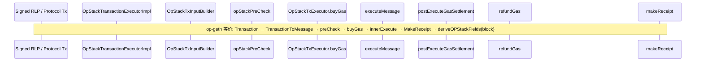

# 普通 L2 交易：RLP → Receipt 全链路对比记录

**日期：** 2026-06-21  
**FB commit：** `52dda0921`  
**op-geth：** v1.101702.2 @ `e8800cffe`  
**范围：** 普通 L2 tx（非 deposit）；type 0/1/2/3/4；Isthmus profile  
**方法：** 按执行阶段逐步对照源码锚点

---

## 0. 链路总览

| 阶段 | op-geth 锚点 | FISCO-BCOS 锚点 |
|------|-------------|-----------------|
| 1 RLP 解码 | `types.Transaction` + `DecodeRLP` / typed tx | `protocol::Transaction` + `extraTransactionBytes` / Web3 解码 |
| 2 Message 构建 | `TransactionToMessage` | `newEVMCMessage` + `OpStackTxInputBuilder` |
| 3 RollupCostData | `tx.RollupCostData()` ← `MarshalBinary()` | `buildRollupCostData` ← `encodeWeb3SignedMarshalBinary` |
| 4 preCheck | `stateTransition.preCheck` | `opStackPreCheck` |
| 5 buyGas | `stateTransition.buyGas` | `OpStackTxExecutor::buyGas` |
| 6 执行 | `innerExecute` → EVM | `executeMessage` → evmone |
| 7 Settlement | `innerExecute` Prague floor + refund | `postExecuteGasSettlement` + `OpStackFloorGas` |
| 8 refundGas | `innerExecute` coinbase + OP vaults | `OpStackTxExecutor::refundGas` |
| 9 Receipt 单笔 | `MakeReceipt` | `makeReceipt`（TE） |
| 10 Receipt OP 字段 | `deriveOPStackFields`（块级） | 执行时 `OpStackReceiptMeta` → `makeReceipt` |

---

## 1. 阶段 1–2：RLP 解码与 Input 构建

### 1.1 交易类型与 RLP 来源

| 字段/步骤 | op-geth | FISCO-BCOS | 状态 |
|-----------|---------|------------|------|
| 类型识别 | `tx.Type()` 0/1/2/3/4 | `tx.type()` + `extraTransactionBytes[0]` / `web3TypedTxKind` | ✅ |
| Legacy (0) | RLP list | Web3 extra 或 legacy 字段 | ✅ |
| EIP-1559 (2) | `DynamicFeeTx` | `maxFeePerGas` / `maxPriorityFeePerGas` → `fillGasCaps` | ✅ |
| EIP-2930 (1) | access list | `resolveWeb3AccessList` | ✅ |
| EIP-4844 (3) | blob hashes + maxFeePerBlobGas | `decodeEip4844BlobFields` `:218-226` | ✅ |
| EIP-7702 (4) | auth list | `decodeEip7702Authorizations` | ✅ |
| Sender | `types.Sender(signer, tx)` | `transaction.sender()` → `m_origin` | ✅ |
| Nonce | `tx.Nonce()` | `hex2u(transaction.nonce())` | ✅ |
| Gas limit | `tx.Gas()` | `computeEffectiveGasLimit(tx, blockGasLimit)` | 🟡 FB 额外 cap 到 block gas |
| To / data / value | `tx.To/Data/Value` | `newEVMCMessage` | ✅ |
| effectiveGasPrice | `TransactionToMessage` tip+baseFee min feeCap | `resolveEffectiveGasPrice`（同公式） | ✅ |

### 1.2 Block context

| 字段 | op-geth | FISCO-BCOS | 状态 |
|------|---------|------------|------|
| baseFee | `header.BaseFee` → `msg.GasPrice` | `resolveOpStackBaseFee(ledgerConfig.gasPrice())` | 🟡 **R3-ORCH-1** 非 header |
| blobBaseFee (执行) | `evm.Context.BlobBaseFee`（块头） | `resolveOpStackBlobBaseFee` L1Block slot 7 | 🟡 **R3-ORCH-2** |
| coinbase | `evm.Context.Coinbase` | `blockInfo.coinbase` from header | ✅ |
| chainId / revision | `ChainConfig.Rules` | `makeIsthmusRevisionConfig()` 固定 Isthmus | 🟡 无运行时 fork 切换 |
| blockHashes | EVM BLOCKHASH | `buildFiscoBlockHashes` | ✅ |
| warm destination | Berlin+ tx warm | `applyDefaultTxProps` | ✅ |

### 1.3 RollupCostData（L1 fee 字节源）

| 项 | op-geth | FISCO-BCOS | 状态 |
|----|---------|------------|------|
| 字节源 | `tx.MarshalBinary()` signed RLP | `encodeWeb3SignedMarshalBinary` | ✅ FIX-05 |
| 空 tx | `NewRollupCostData(data)` | `newRollupCostData` | ✅ |
| deposit | 空 struct | extra 直通（普通 L2 不涉及） | — |

---

## 2. 阶段 3：preCheck

| 规则 | op-geth `preCheck:346-460` | FB `OpStackPreCheck.cpp` | 状态 |
|------|---------------------------|--------------------------|------|
| nonce 精确匹配 | `stNonce == msgNonce` | `stateNonce != input.nonce` → fail | ✅ |
| sender EOA 或 delegation | `ParseDelegation` | `parseDelegationTarget` | ✅ |
| gasFeeCap >= tipCap | ✅ | ✅ `:72-75` | ✅ |
| gasFeeCap >= baseFee | ✅ | ✅ | ✅ |
| Cancun+ blob 门控 | `IsCancun` | `revisionConfig.eip4844` | ✅ |
| blobGasFeeCap >= blobBaseFee | `Context.BlobBaseFee` | `blockInfo.blobBaseFee` | 🟡 来源见 1.2 |
| blob tx 禁止 CREATE | `ErrBlobTxCreate` `:421-422` | `hasBlobTxIntent` + `isCreateKind` → `Malformed` | ✅ **CLOSED (R3-4844-1)** — `OpStackPreCheck4844Test::rejects_blob_create` |
| blob hashes 非空 | `ErrMissingBlobHashes` `:424-425` | type 0x03 / blob intent 拒绝空列表 | ✅ **CLOSED (R3-4844-2)** — `OpStackPreCheck4844Test::rejects_type03_with_empty_hashes` |
| versioned hash KZG 0x01 | `IsValidVersionedHash` `:430-433` | `isValidVersionedHash` 逐 hash 校验 | ✅ **CLOSED (R3-4844-3)** — `OpStackPreCheck4844Test::rejects_invalid_versioned_hash_prefix` |
| 7702 + CREATE 拒绝 | `ErrSetCodeTxCreate`（`SetCodeAuthorizations != nil` + To nil） | 仅 `!authorizations.empty() && CREATE` | 🔴 **R3-7702-1** type-4 解码失败可漏检 |
| auth list present 非空 | `ErrEmptyAuthList` | 仅 decode 成功路径 | 🟡 关联 R3-7702-1 |
| Osaka max blobs | `ErrTooManyBlobs` | N/A Isthmus | ⚪ |
| EIP-7825 gas cap | Osaka | 未实现 | ⚪ |
| gas pool | `buyGas` 内 `gp.SubGas(gasLimit)`；块级共享 | TE `beginBlock`/`endBlock` 共享 `BlockGasPool`；普通 L2 经 `gasPoolSubGasHook`/`returnGasHook` 占/还 pool | ✅ **CLOSED (R3-POOL-1)** — `BlockGasPoolTest`, `TestOpStackTransactionExecutorFixture::second_transaction_rejected_when_block_gas_exhausted` |
| NoBaseFee eth_call 跳过 fee | `skipCheck` when caps=0 | `noBaseFee` 未传入 preCheck | 🟡 **R3-ETHCALL-1** |

**preCheck 后：** op-geth `preCheck` 末尾 inline `buyGas()`；FB 分离调用但顺序一致 ✅

---

## 3. 阶段 4：buyGas（余额预扣）

| 扣款项 | op-geth `buyGas:282-343` | FB `OpStackTxExecutor.cpp:24-100` | 状态 |
|--------|-------------------------|-----------------------------------|------|
| execution gas | `gasLimit × gasPrice`（effective） | `gasLimit × effectiveGasPrice` | ✅ |
| L1 data fee | `L1CostFunc(rollupCostData)` | `m_l1CostFunc` → `l1CostFjord` | ✅ 公式一致 |
| operator fee (Isthmus) | `OperatorCostFunc(gasLimit)` | `operatorCostIsthmus(gasLimit)` | ✅ |
| blob 实际费 | `blobGas × Context.BlobBaseFee` | `blobGas × blockInfo.blobBaseFee` | 🟡 baseFee 来源 |
| tx value | `+ msg.Value` | `+ txValue` | ✅ |
| balanceCheck 上限 | `gasLimit×feeCap + l1 + operator + blobGas×blobFeeCap` | 同结构 `:79-82` | ✅ |
| 扣款账户 | `SubBalance(from, mgval)` | `set_balance(sender, balance - mgval)` | ✅ |
| gas pool | `gp.SubGas(gasLimit)` | TE 块级 `BlockGasPool` via hook（普通 L2 + deposit） | ✅ CLOSED (R3-POOL-1) |
| deposit 豁免 | skip | `m_isDepositTx` skip | — |

**L1 cost 函数选择：**

| op-geth | FB | 状态 |
|---------|-----|------|
| `NewL1CostFunc` Bedrock/Ecotone/Fjord + 首 Ecotone 回退 | 固定 `l1CostFjord` | 🟡 **R3-ORCH-3** Isthmus-only OK |

---

## 4. 阶段 5：Entry checks + 执行

### 4.1 Intrinsic gas + EIP-7623 floor

| 项 | op-geth | FB | 状态 |
|----|---------|-----|------|
| intrinsic gas | `IntrinsicGas(data, accessList, auth, create...)` | `computeTxIntrinsicGas` + `calcAuthTupleIntrinsicGas` | ✅ |
| 7702 intrinsic | 25000×n | `PER_EMPTY_ACCOUNT_COST` × n | ✅ |
| floor data gas | `FloorDataGas` if Prague | `executeEntryFloorDataGasCheck` | ✅ |
| floor vs gasLimit | entry fail `ErrFloorDataGas` | `OutOfGasLimit` | 🟡 错误码 |
| intrinsic 扣除 | 减 `gasRemaining` | 减 `message.gas` | ✅ |
| value transfer check | `CanTransfer` | `canTransfer` | ✅ |

### 4.2 EVM 执行

| 项 | op-geth | FB | 状态 |
|----|---------|-----|------|
| VM | geth `evm.Call/Create` | evmone `executeMessage` | ✅ 同族 |
| gasPrice 传入 | `msg.GasPrice` effective | `txData.m_effectiveGasPrice` | ✅ |
| 7702 apply | pre-Call applyAuthorization | `applyAuthorizations` in executeMessage | ✅ |
| CALL nonce bump | Call 前 +1 | executeMessage / 普通 L2 路径均不 bump | 🟡 nonce 更新在 TE/scheduler 层（bcos-evm 内未见） |
| Host extension | 无（L1Block 走 EVM） | `OpHostExtension` L1Block native | 🟡 deviation |
| precompile | geth | shared `EthPrecompiles` | ✅ |

---

## 5. 阶段 6：Post-execute settlement + refundGas

### 5.1 Gas settlement（EIP-7623 + refund cap）

| 项 | op-geth `innerExecute:644-661` | FB `OpStackPostExecuteGas.h` | 状态 |
|----|-------------------------------|----------------------------|------|
| refund cap 1/5 peak | `calcRefund` | `min(refund, peak/5)` | ✅ |
| floor bump gasUsed | `gasUsed < floorDataGas` → top-up | 同逻辑 `:35-40` | ✅ |
| peakGasUsed / maxUsedGas | 跟踪 peak | `maxUsedGas` | ✅ |
| operator 基于 final gasUsed | `OperatorCostFunc(st.gasUsed())` | `operatorCostFunc(gasUsed)` post-settlement | ✅ |

### 5.2 refundGas / fee 路由

| 路由 | op-geth `innerExecute:691-733` | FB `OpStackTxExecutor.cpp:120-151` | 状态 |
|------|-------------------------------|-------------------------------------|------|
| gasRemaining → sender | `returnGas` × effectiveGasPrice 隐含在 balance | `gasRemaining × effectiveGasPrice` | ✅ |
| tip → coinbase | `gasUsed × effectiveTip` | 同 `:139-142` | ✅ |
| baseFee → 0x420…0019 | `OptimismBaseFeeRecipient` | `m_baseFeeRecipient` | ✅ |
| L1 fee → 0x420…001a | buyGas 已扣；AddBalance vault | `m_l1CostCharged` → vault | ✅ |
| operator refund | `refundIsthmusOperatorCost` limit−used | `refundIsthmusOperatorCost` | ✅ |
| operator spent → 0x420…001b | `OperatorCostFunc(gasUsed)` | `operatorCostFunc(gasUsed)` | ✅ |
| NoBaseFee eth_call 跳过 | ✅ | `call && skip && noBaseFee && caps=0` | ✅ |
| entry 失败路径 | 不进入 innerExecute refund | 仍 settlement+refundGas | 🟡 **R3-7623-1** |

---

## 6. 阶段 7：Receipt 字段对比

### 6.1 执行时写入（单笔 tx）

| Receipt 字段 | op-geth `MakeReceipt:199-244` | FISCO `makeReceipt:216-281` | 状态 |
|--------------|------------------------------|----------------------------|------|
| **Type** | `tx.Type()` | 隐含于 protocol tx version | 🟡 无显式 typed receipt type |
| **Status** | SUCCESS/FAILED from result | `evmcResult.status` | ✅ |
| **GasUsed** | `result.UsedGas`（含 floor） | `m_gasUsed` from settlement | ✅ |
| **CumulativeGasUsed** | `gp.CumulativeUsed()` | **未设置**（块级由 scheduler 负责？） | 🟡 取决于上层 |
| **Logs / Bloom** | `GetLogs` + `CreateBloom` | `m_logs`；Bloom 块级？ | 🟡 |
| **TxHash** | `tx.Hash()` | **makeReceipt 未设** | 🟡 协议层 |
| **ContractAddress** | CREATE 成功时 | `newContractAddress` hex | ✅ |
| **EffectiveGasPrice** | 块级 `DeriveFields`（非 MakeReceipt） | `makeReceipt` `setEffectiveGasPrice` | ✅ |
| **BlobGasUsed** | **MakeReceipt 执行时** type-3 写入；Isthmus 不经 derive 覆盖 | **未写入 receipt** | 🟡 |
| **BlobGasPrice** | **MakeReceipt** 设 `Context.BlobBaseFee` | **未写入 receipt** | 🟡 |
| **DepositNonce** | deposit only | 普通 L2 无 | — |
| **PostState / root** | IntermediateRoot | FB stateDiff 模式 | 🟡 架构不同 |

### 6.2 OP Stack 扩展字段

| 字段 | op-geth 写入时机 | FISCO 写入时机 | 状态 |
|------|-----------------|---------------|------|
| **L1Fee** | **执行时** buyGas 扣 + vault 入账；**块级** `deriveOPStackFields` 填 receipt | 执行时 `m_l1CostCharged` → receipt | 🟡 扣款一致；FB 无块级 derive 展示字段 |
| **L1GasUsed** | deriveOPStackFields 第二返回值 | **未暴露** | 🟡 intentional（Fjord deprecated） |
| **L1GasPrice** | deriveOPStackFields ← L1 attributes | **未写入 receipt** | 🟡 |
| **L1BlobBaseFee** | deriveOPStackFields | **未写入 receipt** | 🟡 |
| **L1BaseFeeScalar** | deriveOPStackFields | **未写入 receipt** | 🟡 |
| **L1BlobBaseFeeScalar** | deriveOPStackFields | **未写入 receipt** | 🟡 |
| **FeeScalar** (legacy) | pre-Ecotone | 未实现 | ⚪ |
| **OperatorFeeScalar** | deriveOPStackFields | `makeReceipt` `setOperatorFeeScalar` | ✅ |
| **OperatorFeeConstant** | deriveOPStackFields | `makeReceipt` `setOperatorFeeConstant` | ✅ |
| **OperatorFee 金额** | **op-geth 无此字段**（客户端自算） | `setOperatorFee(spent amount)` | 🟡 FB 扩展 |
| **DAFootprintGasScalar** | Jovian deriveOPStackFields | 未实现 | ⚪ Isthmus 外 |

**关键架构差异：** op-geth L1 费在**执行时扣款**并在块_finalize 时 `deriveOPStackFields` 批量填 receipt 展示字段（L1GasPrice/scalar 等）；FB 在**单笔执行完成时**写 `m_l1CostCharged` + operator scalar/constant，不复制块级 L1GasPrice/BlobBaseFee 展示字段。

**Review 补充（§7）：** type-3 blob 费在 buyGas 从 sender 扣除，**不退款、不入 vault**（两边一致）；§7 未单独列 blob 行。

---

## 7. 状态变更与余额（普通 L2 成功 tx）

| 账户 | op-geth | FISCO-BCOS | 状态 |
|------|---------|------------|------|
| sender | −buyGas 总额 + refund remaining×price + operator refund | 同 | ✅ |
| coinbase | +gasUsed×tip | 同 | ✅ |
| 0x420…0019 | +gasUsed×baseFee | 同 | ✅ |
| 0x420…001a | +l1CostCharged | 同 | ✅ |
| 0x420…001b | +operatorCost(usedGas) | 同 | ✅ |
| 合约/storage | EVM 状态 diff | `stateDiff` → `applyStateDiff` | ✅ |

---

## 8. 汇总判定

### 8.1 按阶段

| 阶段 | ✅ | 🟡 | 🔴 |
|------|----|----|-----|
| RLP → Input | 12 | 5 | 0 |
| preCheck | 10 | 2 | **1** |
| buyGas | 9 | 2 | 0 |
| Execute | 5 | 3 | 0 |
| Settlement/refund | 8 | 1 | 0 |
| Receipt 字段 | 6 | 14 | 0 |
| **合计** | **49** | **27** | **1** |

### 8.2 共识相关（🔴 + 高优先级 🟡）

| ID | 描述 | 影响 |
|----|------|------|
| ~~R3-4844-1/2/3~~ | ~~blob preCheck 形状~~ | **CLOSED** — `OpStackPreCheck` + `OpStackPreCheck4844Test` |
| **R3-7702-1** | type-4 CREATE 弱于 geth（解码失败可漏检） | 7702+CREATE 畸形 tx |
| ~~R3-POOL-1 / R3-GASPOOL-1~~ | ~~普通 L2 未占 block gas pool~~ | **CLOSED** — 块级 `BlockGasPool` + TE E2E |
| R3-ORCH-1/2 | baseFee / blobBaseFee 来源 | effectiveGasPrice、blob 校验可能偏离 |
| R3-ORCH-3 | Fjord-only L1 cost | Isthmus 生产 OK；历史 fork 不支持 |
| R3-7623-1 | entry 失败仍 refund | receipt gasUsed vs 链上 state 可能不一致 |
| R3-ETHCALL-1 | noBaseFee 未进 preCheck | eth_call 行为偏离 |

### 8.3 非共识 / 展示层（低优先级 🟡）

- Receipt 缺 L1GasPrice、BlobGasUsed、CumulativeGasUsed、TxHash（可能由 scheduler/RPC 补全）
- op-geth 无 OperatorFee 金额字段，FB 有扩展
- L1Block native dispatch vs Solidity

---

## 9. 测试覆盖锚点

| 阶段 | FB 测试 |
|------|---------|
| RollupCost signed RLP | `OpStackTxInputBuilderTest`, `FIX05_signed_rlp_rollup_execute_e2e` |
| L1 Fjord 公式 | `OpStackFeeTest`, `FIX04_FjordL1CostSolidityParity` |
| buyGas/refund 路由 | `OpStackSettlementTest`, `OpStackExecuteViaHostSmokeTest` |
| operator fee TE E2E | `TestOpStackTransactionExecutorFixture` |
| 4844 preCheck | `OpStackPreCheck4844Test`, `BlobGasBalanceTest` |
| block gas pool | `BlockGasPoolTest`, `TestOpStackTransactionExecutorFixture::second_transaction_rejected_when_block_gas_exhausted` |
| Receipt meta | TE fixture `operator_fee_recipient_gets_fee_on_success` |

---

**文档状态：** 初稿 + **三路 sub-agent 交叉 review** @ 2026-06-21；**R3-4844-1/2/3、R3-POOL-1 CLOSED** @ P0 Task 9

### Review 汇总（sub-agent 复查）

| Reviewer | 范围 | CONFIRM | CORRECT/DISPUTE | 关键更正 |
|----------|------|---------|-----------------|----------|
| Agent A | §1–2 RLP/preCheck | 22 | 7702+CREATE 标 ✅→🔴；gas pool 标 🟡→🔴 | **R3-GASPOOL-1** 普通 L2 hook 未 invoke |
| Agent B | §3–5 buyGas/execute | 28 | gas pool×2；nonce ✅→🟡 | **R3-POOL-1** per-tx BlockGasPool 非块级 |
| Agent C | §6–7 receipt/余额 | 多数 | L1Fee 时机表述收紧 | op-geth L1 执行时扣款+块级填 receipt |

**Review 后新增 🔴：** R3-GASPOOL-1 / R3-POOL-1 / R3-7702-1（type-4 CREATE 弱于 geth）
