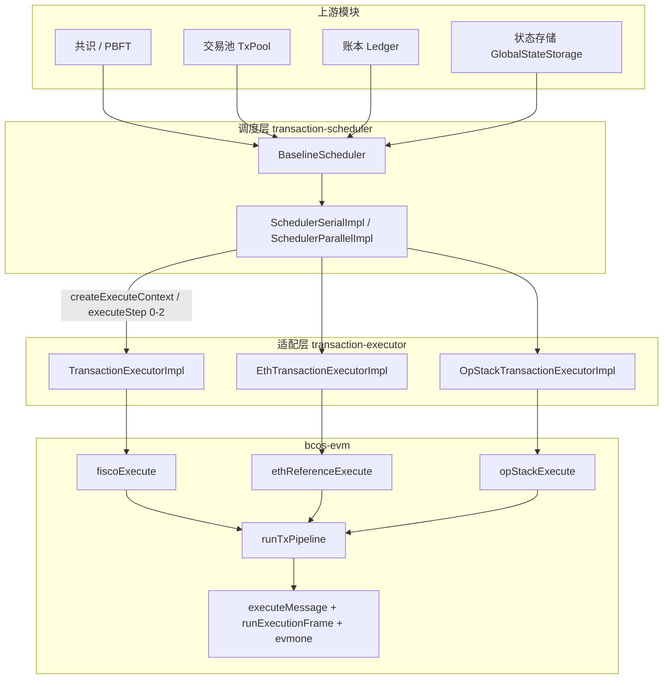

# bcos-evm 模块对接架构梳理（从区块执行开始）

**用途：** 供其他模块开发者理解如何从区块执行入口对接 `bcos-evm`，以及各层边界在哪里。  
**配套：** [architecture-overview.md](architecture-overview.md) · [ADR-001](adr/001-te-baseline-vs-reference-path.md) · [ADR-019](adr/019-orchestration-pipeline.md) · [review-pack.md](review-pack.md)  
**校验：** 2026-06-25（ExecutionFrame PR1–2：`runExecutionFrame` 统一 tx/nested 帧语义）

---

## 1. 总体定位

`bcos-evm` **不是**区块调度入口，而是 **EVM 执行内核 + 三条链编排外壳**。外部模块在正常运行时不直接调用 `executeMessage()`，而是通过 **transaction-executor（TE）** 适配层，在单笔交易粒度上对接。



**关键结论：** 生产路径是 **Baseline Scheduler → TE Executor → bcos-evm Bridge**。旧版 `bcos-scheduler` + `bcos-executor`（`HostContext` / DAG）仍在仓库中，但按 [ADR-001](adr/001-te-baseline-vs-reference-path.md) **不在 bcos-evm 继承契约范围内**。

内核帧执行经 `runExecutionFrame` 统一：`executeMessage` 为 tx 级薄 adapter → `runExecutionFrame(TopLevel)`；evmone 嵌套回调 `EthHost::call` → `runExecutionFrame(Nested)`。详见 [architecture-overview.md §3.1](architecture-overview.md#31-frame-execution-executionframe)。

### 命名对照（ADR-001 历史名 → 当前代码）

| ADR-001 旧名 | 当前入口函数 | 模块路径 |
|---|---|---|
| `executeViaHost` | `fiscoExecute` | `bcos-evm/bcos/ApplyFiscoMessage.h` |
| `executeViaEth` | `ethReferenceExecute` | `bcos-evm/eth/apply/EthMessage.h` |
| `opStackExecuteViaHost` | `opStackExecute` | `bcos-evm/opstack/ApplyOpStackMessage.h` |

---

## 2. 区块执行入口链路

### 2.1 节点启动接线

[`libinitializer/Initializer.cpp`](../../libinitializer/Initializer.cpp) 根据 `executionPath` 配置选择 TE 实现，并注入 Baseline Scheduler：

| `executionPath` | TE 实现 | bcos-evm 入口 | 费用账本 |
|---|---|---|---|
| `Fisco`（默认） | `TransactionExecutorImpl` | `fiscoExecute` | `FiscoTxFeeSettlement` |
| `Eth` | `EthTransactionExecutorImpl` | `ethReferenceExecute` | `EthTxFeeSettlement` |
| `OpStack` | `OpStackTransactionExecutorImpl` | `opStackExecute` | 内置于 `opStackExecute` |

```cpp
// Initializer.cpp L332-350（简化）
switch (m_nodeConfig->executionPath()) {
case tool::ExecutionPath::Eth:
    wireBaselineScheduler(make_shared<EthTransactionExecutorImpl>(receiptFactory, hashImpl));
    break;
case tool::ExecutionPath::OpStack:
    wireBaselineScheduler(make_shared<OpStackTransactionExecutorImpl>(receiptFactory, hashImpl));
    break;
case tool::ExecutionPath::Fisco:
default:
    wireBaselineScheduler(make_shared<TransactionExecutorImpl>(
        receiptFactory, hashImpl, *m_precompiledManager));
    break;
}
```

`wireBaselineScheduler`（L299-330）同时创建：

- **共识路径：** `BaselineSchedulerInitializer::build(...)` → `m_baselineSchedulerHolder`
- **Engine API 路径：** `EngineServiceInitializer::build(...)` → 共享同一 `transactionExecutor` 实例

串行 / 并行由 `baselineSchedulerConfig.parallel` 决定，分别使用 `SchedulerSerialImpl` 或 `SchedulerParallelImpl`。

最终 `MultiVersionScheduler`（L363-367）同时持有：

1. Legacy `SchedulerManager`（Tars 远程 executor 路径）
2. `m_baselineSchedulerHolder()`（对接 bcos-evm 的 baseline 路径）

实际走哪条路由由节点配置和共识模块决定。

### 2.2 区块级执行

[`BaselineScheduler.h`](../../transaction-scheduler/bcos-transaction-scheduler/BaselineScheduler.h) 的 `coExecuteBlock`（L276+）：

1. `m_multiLayerStorage.fork()` 创建可写状态视图
2. 从 TxPool 拉取区块内交易（`getTransactions`）
3. 从 Ledger 读取 `LedgerConfig`（gas limit、features、auth 等）
4. 调用 `m_schedulerImpl.executeBlock(storage, executor, blockHeader, transactions, ledgerConfig)`
5. `finishExecute` 写回 receipts、更新 block header（stateRoot / receiptsRoot 等）

### 2.3 交易级四阶段流水线

[`SchedulerSerialImpl.h`](../../transaction-scheduler/bcos-transaction-scheduler/SchedulerSerialImpl.h) 对每笔交易使用 TBB 四级流水线：

| Stage | 调用 | 对应 TE 阶段 |
|---|---|---|
| 1 | `executor.createExecuteContext(...)` | 构造上下文、初始化 `evmc_message` |
| 2 | `context.executeStep<0>()` | **Prepare** — warm access、revision、blockInfo |
| 3 | `context.executeStep<1>()` | **Execute** — 调 bcos-evm bridge、写 stateDiff |
| 4 | `context.executeStep<2>()` | **Finalize** — 生成 `TransactionReceipt` |

TE 必须满足 [`TransactionExecutor` concept](../../bcos-framework/bcos-framework/transaction-executor/TransactionExecutor.h)：

```cpp
executor.createExecuteContext(storage, blockHeader, transaction, contextID, ledgerConfig, call)
executor.executeTransaction(...)  // 便捷方法：三步串行
```

---

## 3. 单笔交易完整调用链（FISCO 路径示例）

以下是从调度器到内核的**可追踪调用序列**，以默认 FISCO 路径为例。

```text
BaselineScheduler::coExecuteBlock
  └─ SchedulerSerialImpl::executeBlock
       ├─ Stage 1: TransactionExecutorImpl::createExecuteContext
       │    └─ newEVMCMessage(blockNumber, tx, gasLimit, origin)
       ├─ Stage 2: ExecuteContext::executeStep<0>  [Prepare]
       │    ├─ FiscoStateView + State
       │    ├─ buildFiscoBlockInfo(...)
       │    └─ prepareTransaction(...)   // EIP-2929 warm 等（本地 State，不持久化）
       ├─ Stage 3: ExecuteContext::executeStep<1>  [Execute]
       │    ├─ updateNonce()（可选）
       │    ├─ FiscoTxFeeSettlement::buyGas()（fix_gas_precheck 时）
       │    ├─ fiscoExecuteTx()
       │    │    ├─ 组装 FiscoExecutionRequest
       │    │    ├─ ExecutorAuthAdapter / ExecutorPrecompileAdapter 注入 Port
       │    │    └─ fiscoExecute(input)
       │    │         ├─ FiscoVmHostPolicy + FiscoPipelineHookBinder::buildHooks
       │    │         └─ runTxPipeline(ctx, hooks, errorPolicy)
       │    │              └─ executeMessage(input)  // evmone
       │    ├─ applyStateDiff(storage, output.stateDiff)  // EVMC_SUCCESS 时
       │    └─ refundGas() / consumeBalance()
       └─ Stage 4: ExecuteContext::executeStep<2>  [Finalize]
            └─ FiscoTxFeeSettlement::makeReceipt(...)
```

### 3.1 TE 三路径对比

| 维度 | FISCO | ETH 参考 | OP Stack |
|---|---|---|---|
| TE 类 | `TransactionExecutorImpl` | `EthTransactionExecutorImpl` | `OpStackTransactionExecutorImpl` |
| Bridge | `fiscoExecute` | `ethReferenceExecute` | `opStackExecute` |
| 权限 / 预编译 | `AuthPort` + `ChainPrecompilePort` | 无 | 无（L1Block 经 `OpStackVmHostPolicy`） |
| Gas 外圈 | `FiscoTxFeeSettlement` buy/refund | `EthTxFeeSettlement` buy/refund | bridge 内部 + `BlockGasPool` |
| Revision | `FiscoPolicy::computeRevisionConfig` | `EthChainPolicy::computeRevisionConfig` | `makeIsthmusRevisionConfig` 等 |
| 生产角色 | **FISCO 生产默认** | **接线审计 / EEST**（ADR-001） | **OP Stack 生产** |

---

## 4. bcos-evm 内部执行流

### 4.1 三入口 → 共享管线 → 内核

```text
ethReferenceExecute / fiscoExecute / opStackExecute
        │
        ▼
  runTxPipeline(ctx, hooks, errorPolicy)   ← eth/state-transition/TxPipeline.cpp
        │
        ├─ hooks: TxPipelineHooks（链特有 precheck / settlement）
        ├─ errorPolicy: StateTransitionErrorPolicy（链特有异常映射）
        │
        ▼
  executeMessage(input)                    ← eth/ExecuteMessage.cpp
        │
        ├─ evmone VM 执行
        └─ VmHostPolicy* 回调（链行为注入）
```

### 4.2 固定编排步骤（ADR-019，当前 TxPipeline.cpp 实现）

| 步骤 | Hook / 动作 | 说明 |
|---|---|---|
| ① | `validate(vm, hashImpl)` | try/catch 外；缺参抛 `invalid_argument` |
| ② | `txSetupMessage` | 消息派生（CREATE 地址等） |
| ③ | `txCheckTransactionRules` | 规则预检 → `earlyExit` |
| ③½ | `txCheckGasAffordable` | OpStack floor/balance → `earlyExit` |
| ④ | `deductIntrinsicGas` | 修改 `ctx.message.gas` |
| ⑤ | `txCheckBalanceAndValue` | 余额 / 21000 等 |
| ⑥ | `buildExecuteMessageInput` + `txTuneExecutionInput` | 组装内核输入 |
| ⑦ | `executeMessage` | **input.message == ctx.message**（post-debit） |
| ⑧ | `adoptEvmcResult` | 采纳 evmone 结果 |
| ⑨ | `captureSettlementSnapshot` | 仅 Eip7623 模式 |
| ⑩ | `txPatchExecutionResult` | 链特有结果修补 |
| ⑪ | `txFinalizeGasSettlement` | 链特有 gas 结算 |

**编排不变量：** `TxPipelineContext::message` 是 intrinsic gas 扣减的唯一 owner；步骤 ④ 修改后步骤 ⑦ 使用同一引用。

### 4.3 `fiscoExecute` 接线要点

[`ApplyFiscoMessage.cpp`](../bcos/ApplyFiscoMessage.cpp) L125-203：

1. 构造 `TxPipelineContext`（持有 `State`、原始 `message`、`RevisionConfig`）
2. 构造 `FiscoVmHostPolicy`，注入 `authPort` / `chainPrecompilePort` / `persistContractCreateNonce`
3. `FiscoPipelineHookBinder::buildHooks(session)` 绑定 FISCO 特有 hook
4. `runTxPipeline(ctx, hooks, errorPolicy)`
5. 成功时从 `ctx.kernelOutput.stateDiff` 映射到 `FiscoExecutionResult.stateDiff`

---

## 5. 状态存储对接

bcos-evm 通过 **读适配器 + 写回 StateDiff** 与框架存储解耦，不直接操作底层 KV。

### 5.1 读路径

[`FiscoStateView`](../bcos/FiscoStateView.h) 实现 `StateView`：

- 内部通过 lambda 调用 `ledger::account::EVMAccount`
- 读取 balance / nonce / code / codeHash / storage
- 在 TE 的 `fiscoExecuteTx()` 中栈上构造，指针传入 `FiscoExecutionRequest.stateView`
- `executeMessage` 经 `EthHost` 回调使用该 reader

```text
RollbackableStorage
    → FiscoStateView::get_account / get_storage
        → EVMAccount::balance / nonce / code / storage
            → executeMessage / EthHost
```

### 5.2 写路径

[`StateDiffApplier.h`](../bcos/StateDiffApplier.h) 的 `applyStateDiff`：

- TE 在 `executeStep<1>` 且 `EVMC_SUCCESS` 时调用
- 遍历 `StateDiff.accounts`，对每个地址 `EVMAccount::create` + `setBalance` / `setNonce` / `setCode` / `setStorage`
- FISCO 路径仅在 success 时提交 diff；revert 不写回

```text
executeMessage → kernelOutput.stateDiff
    → TE::applyStateDiff(RollbackableStorage, stateDiff, ...)
        → EVMAccount 写操作
```

### 5.3 交易回滚语义

- TE 为每笔交易维护 `m_startSavepoint` / `m_afterBuyGasSavepoint`（`RollbackableStorage`）
- FIB-75：`fix_gas_precheck` 开启时，EVM 失败可回滚状态变更但保留 `buyGas` 预扣余额
- `runTxPipeline` 内异常由 `StateTransitionErrorPolicy::mapException` 处理；内核不拥有 state revert 所有权（ADR-019 Q20）

---

## 6. 扩展点：其他模块如何注入链行为

### 6.1 `VmHostPolicy` — 内核**内部**回调

[`eth/policy/VmHostPolicy.h`](../eth/policy/VmHostPolicy.h) 定义虚方法，在 `executeMessage` / `EthHost` 执行期间回调：

| 方法 | 用途 |
|---|---|
| `tryChainPrecompile` | 链上预编译分发（FISCO `ChainPrecompilePort`；OP L1Block） |
| `skipHostValueTransfer` | 是否跳过 host 层 value 转账 |
| `allowSelfdestruct` | SELFDESTRUCT 门控 |
| `prepareMessage` / `setCallerAddress` | 消息 / 调用方地址修正 |
| `bumpContractCreateNonce` | CREATE 后 nonce 递增 |

| 链 | 实现类 |
|---|---|
| 标准以太坊（默认） | `VmHostPolicy` 基类 |
| FISCO | `FiscoVmHostPolicy` |
| OP Stack | `OpStackVmHostPolicy` |

### 6.2 `TxPipelineHooks` — 编排阶段 hook

[`eth/state-transition/TxPipelineHooks.h`](../eth/state-transition/TxPipelineHooks.h) 通过 `std::function` 注入编排各步骤：

| Hook | 典型用途 |
|---|---|
| `txSetupMessage` | CREATE/CREATE2 地址派生 |
| `txCheckTransactionRules` | nonce、签名类型等规则 |
| `txCheckGasAffordable` | OpStack floor gas / 余额 |
| `txCheckBalanceAndValue` | FISCO 21000、value transfer |
| `txTuneExecutionInput` | 7702 authorizations 等 |
| `txPatchExecutionResult` | included-tx-vmerr 规范化 |
| `txFinalizeGasSettlement` | EIP-1559 / 7623 结算 |

各链通过 `*PipelineHookBinder` 绑定：`FiscoPipelineHookBinder`、`EthPipelineHookBinder`、`OpStackPipelineHookBinder`。

### 6.3 `AuthPort` / `ChainPrecompilePort` — FISCO 专用 Port

仅 FISCO 生产路径使用，定义在 `bcos-evm/bcos/ports/`：

```cpp
// AuthPort.h
virtual std::optional<EVMCResult> checkAuth(evmc_message const& msg);
virtual void createAuthTable(evmc_message const& msg, std::string_view tablePath);

// ChainPrecompilePort.h
virtual std::optional<evmc_result> dispatch(evmc_revision rev, evmc_message const& msg);
```

TE 层通过 adapter 实现并注入（不修改 `eth/` 内核）：

- [`ExecutorAuthAdapter`](../../transaction-executor/bcos-transaction-executor/adapters/ExecutorAuthAdapter.h) → `AuthPort`
- [`ExecutorPrecompileAdapter`](../../transaction-executor/bcos-transaction-executor/adapters/ExecutorPrecompileAdapter.h) → `ChainPrecompilePort`

### 6.4 `RevisionConfig` — EIP 开关位域

在 TE **Prepare** 阶段由链策略计算，传入 bridge request：

- FISCO：`FiscoPolicy::computeRevisionConfig(blockHeader)` → `FiscoRevisionConfig`
- ETH：`EthChainPolicy::computeRevisionConfig(blockHeader)` → `RevisionConfig`
- OP：`makeIsthmusRevisionConfig()` 等

**依赖规则：** `eth/` 永不 include `bcos/` 或 `opstack/`；链差异只能向下注入（ADR-005 Rule 1）。

---

## 7. 对外公共 API 汇总

| 用途 | 头文件 | 说明 |
|---|---|---|
| FISCO 生产执行 | `bcos-evm/bcos/ApplyFiscoMessage.h` | `applyFiscoMessage` |
| ETH 参考执行 | `bcos-evm/eth/apply/EthMessage.h` | `applyEthMessage` |
| ETH 聚合头（外部消费者） | `bcos-evm/include/bcos-evm/eth_executor.hpp` | 转引 `EthMessage.h` |
| OP Stack 执行 | `bcos-evm/opstack/ApplyOpStackMessage.h` | `applyOpStackMessage` |
| 状态读 | `bcos-evm/bcos/FiscoStateView.h` | TE 层构造 |
| 状态写 | `bcos-evm/bcos/StateDiffApplier.h` | `applyStateDiff` |
| TE 概念约束 | `bcos-framework/.../TransactionExecutor.h` | 新 executor 必须实现此 concept |
| 架构总览 | `bcos-evm/docs/architecture-overview.md` | 三层库 + 设计原则 |

**正常区块执行不应绕过 TE 直接调 bridge**；直接调 bridge 仅用于单元测试、`specs-tests`、smoke harness。

---

## 8. 两条调度路径对比

| 维度 | Baseline 路径（对接 bcos-evm） | Legacy 路径（旧 executor） |
|---|---|---|
| 调度器 | `transaction-scheduler` / `BaselineScheduler` | `bcos-scheduler` / `BlockExecutive` |
| 执行器 | `transaction-executor` / `*TransactionExecutorImpl` | `bcos-executor` / `TransactionExecutive` |
| EVM 核心 | `bcos-evm` → `executeMessage` + evmone | `HostContext` + 内嵌 evmc |
| 配置开关 | `executionPath` + `baselineSchedulerConfig` | `executorVersion`、Tars 远程 executor |
| 继承契约 | **在范围内**（ADR-001） | **不在范围内** |

---

## 9. 对接新模块检查清单

1. **确定路径：** FISCO / Eth / OpStack — 对应不同 TE 实现和 bridge
2. **实现 `TransactionExecutor` concept：** `createExecuteContext` + 三阶段 `executeStep<0/1/2>`
3. **状态：** `FiscoStateView` 读、`applyStateDiff` 写；包裹 `RollbackableStorage`
4. **链行为：** `VmHostPolicy` 子类或 `TxPipelineHooks` 注入；FISCO 额外用 Port
5. **Revision：** Prepare 阶段计算并传入 bridge request
6. **费用：** FISCO/Eth 用 `*TxFeeLedger`；OP 多数在 `opStackExecute` 内
7. **测试：** ETH 参考测试通过 ≠ FISCO/OP 生产继承；需走对应 TE 路径 E2E 测试

---

## 10. 推荐阅读顺序

1. [architecture-overview.md](architecture-overview.md) — 三层库 + 执行流
2. [ADR-001](adr/001-te-baseline-vs-reference-path.md) — TE baseline vs 参考路径
3. [ADR-019](adr/019-orchestration-pipeline.md) — `runTxPipeline` 步骤
4. [`Initializer.cpp`](../../libinitializer/Initializer.cpp) L292–367 — 运行时接线
5. [`TransactionExecutorImpl.h`](../../transaction-executor/bcos-transaction-executor/TransactionExecutorImpl.h) — FISCO TE 完整示例
