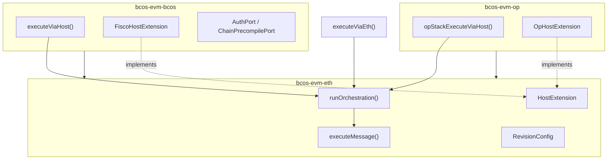

# bcos-evm Review Pack

**用途：** 供外部/跨团队评审者在 30–60 分钟内理解模块设计并开始 code review。  
**分支基准：** `feat-evm-refactor`（2026-06-24 校验）  
**深度参考：** [architecture-overview.md](architecture-overview.md) · [eth-layer-design-review.md](eth-layer-design-review.md) · [capability-matrix.md](../capability-matrix.md)

**校验：** 2026-06-24（与 `runOrchestration` 三路径收敛、ADR-018 dense Isthmus 对齐；companion 文档已同步）

---

## 1. Executive Summary

### 1.1 一句话定位

`bcos-evm` 把**标准以太坊 EVM 执行内核**与**三条链的差异化编排**彻底分层：**一个共享内核 + 三套编排外壳**，通过单向依赖与注入式扩展点保证内核纯净、链定制可插拔，并用**能力矩阵 + ADR + CI 门禁**把契约固化成可回归的工程纪律。

### 1.2 四条设计原则

| 原则 | 含义 |  enforcement |
| --- | --- | --- |
| **单向依赖** | `eth/` 永不 include `bcos/` 或 `opstack/` | ADR-005 Rule 1；CI grep `bcos/Fisco` under `eth/` |
| **注入扩展** | 链差异通过 `HostExtension` / `Port` / `OrchestrationHooks` 注入 | 无反向渗透进内核 |
| **深 module** | 共享编排收敛到 `runOrchestration`；内核收敛到 `executeMessage` | ADR-019 |
| **治理固化** | 能力矩阵 + ADR + CI 强制对账 | `capability-gate.yml` |

### 1.3 三层库结构

`CMakeLists.txt` 切成三个静态库，依赖单向收敛：

```cmake
add_library(bcos-evm-eth  STATIC ...)   # eth/ — 共享内核 + ETH 参考路径
add_library(bcos-evm-bcos STATIC ...)   # bcos/ — FISCO 生产编排
add_library(bcos-evm-op   STATIC ...)   # opstack/ — OP Stack 生产编排
add_library(bcos-evm ALIAS bcos-evm-bcos)
```

| 库 | 目录 | 角色 | 依赖 |
| --- | --- | --- | --- |
| `bcos-evm-eth` | `eth/` | 共享内核 + 以太坊参考路径 | evmone、框架基础库 |
| `bcos-evm-bcos` | `bcos/` | FISCO 生产编排 | → `bcos-evm-eth` |
| `bcos-evm-op` | `opstack/` | OP Stack 生产编排 | → `bcos-evm-eth` |



---

## 2. 执行流全景（ADR-019）

### 2.1 三入口 → 共享管线 → 内核

自 ADR-019 起，三条路径**均已**迁入同步 `runOrchestration`；wrapper 只负责映射输入、填充 hooks、映射输出。

| 入口 | 文件 | 列语义（能力矩阵） |
| --- | --- | --- |
| `executeViaEth` | `eth/ExecuteViaEth.cpp` | ETH = **接线审计 / 契约测试**（非 BCOS/OP 生产继承证明） |
| `executeViaHost` | `bcos/ExecuteViaHost.cpp` | BCOS = **FISCO 生产继承契约** |
| `opStackExecuteViaHost` | `opstack/OpStackExecuteViaHost.cpp` | OPStack = **OP 生产继承契约** |

```text
executeViaEth      ──hooks──► runOrchestration ──► executeMessage
executeViaHost     ──hooks──► runOrchestration ──► executeMessage
opStackExecuteViaHost ─hooks──► runOrchestration ──► executeMessage
                                    ↑
                         OrchestrationContext::message
                         （intrinsic 扣减的唯一可变 owner）
```

**核心不变量：** 步骤 ④ `debitIntrinsicGas` 修改 `ctx.message`；步骤 ⑦ `executeMessage` 使用同一引用。OpStack 曾出现 `txData.m_message` 与 `input.message` 双轨不同步缺陷，已通过 ADR-019 结构性修复（回归：`test/opstack/OpStackIntrinsicGasSyncTest.cpp`）。

### 2.2 固定 12 步管线

实现：`eth/orchestration/OrchestrationPipeline.cpp`

```text
① validate(vm, hashImpl)     — 在 try/catch 外；抛 std::invalid_argument
② hooks.prepareMessage(ctx)
③ hooks.preExecute(ctx)       → earlyExit?
③½ hooks.preDebitEntry(ctx)  → earlyExit?        （OpStack floor/balance）
④ debitIntrinsicGas(ctx.message, intrinsicPolicy) → earlyExit?
⑤ hooks.preKernel(ctx)        — 可 mutate state；失败 via throw
⑥ buildExecuteMessageInput(ctx) + hooks.tuneKernelInput
⑦ executeMessage(input)       — input.message == ctx.message
⑧ adoptEvmcResult(...)
⑨ captureSettlementSnapshot   — 仅 IntrinsicDebitMode::Eip7623
⑩ hooks.postAdopt(ctx)
⑪ hooks.postSettle(ctx)
```

步骤 ②–⑪ 在 `try/catch` 内；异常走 `hooks.mapException`，内核**不**负责 state revert。

### 2.3 OrchestrationContext 所有权

- 构造参数：`StateView`、初始 `evmc_message`、`RevisionConfig`、`gasPrice`
- 显式 `= delete` copy/move；**唯一** `state::State` 与可变 `evmc_message` owner
- `extension` 为 wrapper 预构造后写入的 borrow 指针（无 `buildExtension` hook）
- `originalGasLimit` 在构造时捕获，供 settlement / snapshot 使用

### 2.4 Wrapper 外圈职责（不在 pipeline 内）

| 职责 | 链 | 位置 |
| --- | --- | --- |
| `co_await buyGas` / `refundGas` | OpStack normal | wrapper 前后 |
| `GasPoolReturnGuard` / `gasPoolSubGasHook` | OpStack normal | wrapper |
| deposit mint + checkpoint/commit/revert | OpStack deposit | wrapper |
| L1 fee / operator fee / receipt meta | OpStack normal | wrapper 尾 |
| Eth EIP-1559 caps | Eth | hook `preExecute` |
| Fisco auth / value transfer / 21000 gas | Fisco | hooks + wrapper 尾 |
| 最终 `stateDiff` / `logs` 映射 | 三链 | wrapper（OpStack 必须在 refund 后 `ctx.state.build_diff()`） |

### 2.5 IntrinsicDebitMode（链间顺序差异）

| Mode | 语义 | 使用者 |
| --- | --- | --- |
| `None` | 无 intrinsic/auth 扣减 | Eth/Fisco 非 7623 且无 auth |
| `AuthOnly` | 仅 auth tuple 成本 | Eth 非 7623 + EIP-7702 |
| `Eip7623` | floor + calldata + auth | Eth 7623；Fisco web3+7623 |
| `OpStackEntry` | `availableGas >= intrinsic` 后 subtract | OpStack |

**balance/floor 与 intrinsic 顺序（刻意不统一）：**

| 链 | balance / floor | intrinsic debit |
| --- | --- | --- |
| Eth | ⑤ `preKernel`（`canTransfer`）在 debit **之后** | ④ kernel |
| Fisco | ⑤ `preKernel`（21000、xfer）在 debit **之后** | ④ kernel（条件 7623） |
| OpStack | ③½ `preDebitEntry` 在 debit **之前** | ④ kernel |

---

## 3. 扩展机制

内核行为注入有**三个正交 seam**，评审时不要混为一谈。

### 3.1 HostExtension — 内核**内部**回调

文件：`eth/policy/HostExtension.h`  
默认实现 = 标准以太坊语义；链层只覆写差异。

| 钩子 | 默认 | FISCO | OP Stack |
| --- | --- | --- | --- |
| `allowSelfdestruct` | true | false | 默认 |
| `allowDelegateCallToPrecompile` | true | false | 默认 |
| `skipHostValueTransfer` | false | 视配置 | 默认 |
| `tryChainPrecompile` | nullopt | FISCO precompile 优先级 | L1Block 预部署 |
| `prepareMessage` / `setCallerAddress` | noop | CREATE 地址 / auth | 默认 |
| `bumpContractCreateNonce` | noop | 持久化 CREATE nonce | 默认 |

**时序：** Orchestrator（wrapper + pipeline hooks）在 `executeMessage` **之前**；HostExtension 在**内核调用树内部**触发（CALL/CREATE/precompile 路径）。

### 3.2 Port — 编排层依赖倒置（ADR-017）

文件：`bcos/ports/AuthPort.h`、`bcos/ports/ChainPrecompilePort.h`

- 纯虚接口；实现体在 `transaction-executor/adapters/` + `bcos-executor`
- **CI 强制：** `bcos-evm/` 零 `bcos-executor` include（`capability-gate.yml`）
- 内核 `PrecompileRouter`（builtin 0x01–0x11）与 chain `Port`（FISCO 精编译）**正交**

```text
重构前：bcos-evm ──include──▶ bcos-executor
重构后：bcos-evm 定义 Port ◀──implements── transaction-executor/adapters
        ✓ 单测可 mock Port
        ✓ 内核 PrecompileRouter 与 Port 互不感知
```

**已知张力：** `FiscoPolicy.h` 仍 `#include transaction-executor/.../AuthCheck.h` 与 `PrecompiledManager.h`（在 `bcos/` 层，不违反 eth/ 边界，但与 Port 全生命周期目标不一致 — 见 §7）。

### 3.3 OrchestrationHooks — 管线步骤注入

文件：`eth/orchestration/OrchestrationHooks.h`

| Hook | 典型用途 |
| --- | --- |
| `prepareMessage` | 消息预处理 |
| `preExecute` | Eth 1559 caps；Eth/Fisco precheck |
| `preDebitEntry` | OpStack floor/balance（`OpStackPreDebitEntry`） |
| `preKernel` | Eth `canTransfer`；Fisco 21000 / value xfer |
| `tuneKernelInput` | 微调 `ExecuteMessageInput` |
| `postAdopt` | Eth included-tx vmerr normalize（ADR-015） |
| `postSettle` | OpStack `postExecuteGasSettlement` |
| `mapIntrinsicFailure` / `mapException` | 链特有错误映射 |

**纪律：** `eth/orchestration/` 及 portable headers **不得** `#include bcos/` 或 `opstack/`。链代码通过 hook lambda 在 wrapper 翻译单元注入。

---

## 4. Revision / EIP 门控（ADR-018）

### 4.1 RevisionConfig 结构

文件：`eth/RevisionConfig.h` — **13 个 bool 位域** + `calldata_floor_per_token`

| 类别 | 字段 | 语义 |
| --- | --- | --- |
| **A 类 feature-gated** | `warm_access`, `eip2537`, `eip7212`, `eip7623`, `eip7823`, `eip7702` | FISCO 需显式 `Features::Flag` |
| **B 类 revision-derived** | `eip1153`, `eip4844`, `eip5656`, `eip6780`, `eip1559`, `eip3651`, `prague_post_execution` | 由 `revisionConfigFromRevision(rev)` 推导 |
| **C 类 fork 参数** | `calldata_floor_per_token` | fork 依赖常量 |

`REVISION_CONFIG_BOOL_FIELDS` X-macro + `static_assert(... == 13)` 做漂移检测。

### 4.2 单一推导源（ADR-018）

```text
revisionConfigFromRevision(evmc_revision)     ←  canonical maximal config（eth/RevisionConfig.h）
        │
        ├── EthPolicy          ← 直接使用 derive(rev)
        ├── FiscoPolicy        ← derive(rev) + applyFiscoFeatureGates（X-macro 掩码）
        └── makeIsthmusRevisionConfig ← derive(EVMC_PRAGUE)  【dense，非 sparse】
```

**消费者读 `cfg` bool，不读 `revision >= EVMC_xxx`：**

- `PrecompileActive.h`：`cfg.eip2537`、`cfg.eip7212`
- `EthHost::selfdestruct`：`cfg.eip6780`

CI：`tools/ci/check-revision-single-source.sh` 禁止在 consumer 侧用 `revision >=` 推导 A 类字段。

### 4.3 三套 Policy 对比

| Policy | 门控依据 | 特点 |
| --- | --- | --- |
| `EthPolicy` | 块号 → `evmc_revision` | 以太坊主网时间线 |
| `FiscoPolicy` | `Features::Flag` + `bugfix_*` | `revision >= X && features.get(flag)` 双重门控 |
| `makeIsthmusRevisionConfig` | 固定 Prague dense profile | Isthmus 运行时与 derive(PRAGUE) 对齐 |

### 4.4 Profile-only 字段（评审重点）

以下字段在 Policy 中被赋值，但**部分尚无 TE 编排/内核消费者**（ADR-004）；矩阵标 `feature-gated (profile-only)`：

`warm_access`、`eip1559`、`eip3651`、`prague_post_execution`

运行时 warm 主要走 `evmc_revision` + tx props；长期需决定**接线、删字段或保留作文档**。

---

## 5. 治理契约

### 5.1 能力矩阵

文件：`bcos-evm/capability-matrix.md`（**normative**）

- 每行 = 一个可独立测试的子能力 × 一层（kernel / orchestration / tx input / revision profile）
- 三列：ETH（reference）、BCOS（TE baseline）、OPStack（TE baseline）
- Token 仅允许：`inherited` | `explicit` | `feature-gated` | `unsupported` | `deviation`
- 非 `inherited` 必须写理由；`deviation` 必须有 positive test

**评审提醒：** ETH 列 `inherited` **不等于** BCOS/OP 生产路径通过。baseline-reachable 的 `inherited` 需要 TE 路径测试引用。

### 5.2 ADR 索引（按需深入）

| ADR | 主题 |
| --- | --- |
| 001 | TE baseline vs `executeViaEth` reference |
| 002 | 矩阵 status token |
| 003 | 子能力行粒度 |
| 004 | RevisionConfig profile-only vs 消费者 |
| 005 | 编排域边界 + HostExtension vs orchestrator |
| 006 | BCOS EIP-7702 门控 |
| 007 | TE Web3 decoder 依赖 |
| 008–014 | OP Stack Wave 2 范围与测试 |
| 015 | ETH 7702 auth intrinsic + included-tx vmerr |
| 016 | ETH EIP-1559 settlement |
| 017 | FISCO Precompile Port |
| 018 | Revision 单一推导源 |
| 019 | `runOrchestration` 共享编排管线 |

完整正文：`bcos-evm/docs/adr/`

### 5.3 CI 门禁

文件：`.github/workflows/capability-gate.yml`

| 检查 | 内容 |
| --- | --- |
| Matrix lint | `tools/ci/check-capability-matrix.sh` |
| Revision single-source | `tools/ci/check-revision-single-source.sh` |
| Zero executor include | `bcos-evm/` 不得引用 `bcos-executor` |
| Eth boundary | `bcos-evm/eth/` 不得 include `bcos/Fisco` |
| Matrix co-change | 改 capability surface 必须同 PR 更新矩阵 |
| RevisionConfig co-change | 改 `RevisionConfig.h` 必须同 PR 更新 `RevisionConfigProfileTest` |

---

## 6. Review Checklist

### 6.1 通用门禁（每个 PR）

| # | 问题 | 通过标准 |
| --- | --- | --- |
| G1 | `eth/` 是否新增 `bcos/` 或 `opstack/` include？ | 零 include |
| G2 | 是否改了 `RevisionConfig.h` / `executeMessage.*` / `HostExtension.h`？ | 同 PR 更新矩阵 + 对应测试 |
| G3 | 新 EIP 行为是否三列都有矩阵行？ | 每列有 token + 理由 |
| G4 | 编排逻辑是否在 wrapper 里 duplicate pipeline 步骤？ | 共享步骤必须在 `runOrchestration` 内 |
| G5 | `executeMessage` 收到的 `message.gas` 是否已扣 intrinsic？ | 仅 `ctx.message` 为 owner |

### 6.2 按改动域

**A. 内核 / 帧语义**（`executeMessage`, `EthHost`, `PrecompileRouter`）

- [ ] depth=0 与 depth>0 两条路径是否同步修改？
- [ ] precompile 信封顺序：当前为 transfer → checkpoint → dispatch（与 geth snapshot-first **已知偏差**）
- [ ] 新 precompile 是否同时考虑 warm 集与 dispatch 集？

**B. 编排 / 钩子**

- [ ] 新步骤落在 pipeline 哪一步？try/catch 内外是否正确？
- [ ] intrinsic 失败是否走 `DebitIntrinsicGasOutcome` + `mapIntrinsicFailure`？
- [ ] OpStack 异步 fee 是否仍在 wrapper 外圈？

**C. Revision / Policy**

- [ ] FISCO 新 EIP 是否双重门控？
- [ ] 新消费者是否读 `cfg` bool 而非 `revision >=`？
- [ ] profile-only 字段是否新增了真实消费者？

**D. Port**

- [ ] `bcos-evm` 是否仍零 `bcos-executor` include？
- [ ] Port 实现是否在 adapters 层？
- [ ] 单测是否可用 mock Port？

**E. 链特有**

- [ ] FISCO `deviation` 是否有 positive test（如 21000 gas）？
- [ ] OP deposit 的 checkpoint/commit 是否在 wrapper？
- [ ] 是否误将 ETH 列测试当作 BCOS/OP 继承证明？

### 6.3 Red Flags

1. `eth/orchestration/` 出现 chain include
2. 三份 `executeVia*.cpp` 重复 gas/adopt/buildInput 逻辑
3. `OpStackTxExecutionData.m_message` 与 `ctx.message` 双轨维护
4. 矩阵 `inherited` 但 Test ref 仅 ETH reference 测试
5. consumer 侧新增 `revision >= EVMC_*` 推导 A 类字段

---

## 7. 已知问题与下一杠杆

### 7.1 登记缺口（architecture-known-gaps.md）

| Gap | 摘要 | 状态 |
| --- | --- | --- |
| 36 | Prepare 阶段 warm 未持久化到 Execute | 待产品决策 |
| 37 | profile-only 字段无 TE 消费者 | ADR-004 文档化 |
| 38 | eth/ 无 BCOS/OP include | 审计通过，新增 hook 时重跑 |

### 7.2 架构审查下一刀（2026-06-23）

编排收敛**已完成**。最高 leverage 的 open work 在**内核内部**：

| 优先级 | 候选 | 问题摘要 |
| --- | --- | --- |
| **P0** | ExecutionFrame | depth=0 与 `EthHost::call` 帧语义双轨 |
| **P0** | PrecompileRouter envelope | checkpoint 应在 transfer 之前（stateRoot 风险） |
| **P1** | ActivePrecompileSet | warm 集与 dispatch 集未单源（Gap 37 张力） |
| **P1** | OrchestrationErrorPolicy | 三链错误语义分散在 wrapper lambda |
| **P1** | AuthPort 全生命周期 | `FiscoPolicy` 仍 include TE adapter |
| **P2** | OpStackSettlementContext | `txData` 影子帧与 `ctx` 部分双轨 |

详见：[architecture-review-post-orchestration-2026-06-23.md](architecture-review-post-orchestration-2026-06-23.md)

### 7.3 测试覆盖缺口（摘要）

| 区域 | 缺口 |
| --- | --- |
| 链 profile 快照 | 无三链 orchestration profile 对照测试 |
| OpStack normal 外圈 | earlyExit × refundGas × gas pool 组合少 |
| Fisco/Op error taxonomy | 无 Eth `IncludedTxVmerr` 对称测试 |

---

## 8. 关键文件索引

| 关注点 | 文件 |
| --- | --- |
| 库划分 | `bcos-evm/CMakeLists.txt` |
| 共享编排管线 | `eth/orchestration/OrchestrationPipeline.cpp` |
| 编排上下文 / 钩子 | `eth/orchestration/OrchestrationContext.h`、`OrchestrationHooks.h` |
| intrinsic 扣减 | `eth/orchestration/DebitIntrinsicGas.h` |
| 内核入口 | `eth/ExecuteMessage.h` / `.cpp` |
| 内核扩展点 | `eth/policy/HostExtension.h` |
| EIP 开关位域 | `eth/RevisionConfig.h` |
| 单一 derive | `revisionConfigFromRevision()` in `RevisionConfig.h` |
| ETH 参考路径 | `eth/ExecuteViaEth.cpp` |
| FISCO 编排 | `bcos/ExecuteViaHost.cpp` |
| FISCO 扩展 | `bcos/FiscoHostExtension.h` |
| FISCO Policy | `bcos/FiscoPolicy.h` |
| 依赖倒置端口 | `bcos/ports/AuthPort.h`、`ChainPrecompilePort.h` |
| OP 编排 | `opstack/OpStackExecuteViaHost.cpp` |
| OP pre-debit | `opstack/OpStackPreDebitEntry.cpp` |
| OP 扩展 | `opstack/OpHostExtension.h` |
| 能力契约 | `capability-matrix.md` |
| 已知缺口 | `architecture-known-gaps.md` |
| CI | `.github/workflows/capability-gate.yml` |

### eth/ 子模块 deep-dive

见 [eth-layer-design-review.md](eth-layer-design-review.md)（2026-06-24 已与 ADR-019 同步）。

---

## 9. 文档同步状态

| 文档 | 状态（2026-06-24） |
| --- | --- |
| `review-pack.md` | 当前外部入口，与源码同步 |
| `architecture-overview.md` | 已同步 ADR-018/019（编排管线、dense Isthmus、§4.3 hooks） |
| `eth-layer-design-review.md` | 已同步三路径 pipeline、12 步序、`makeIsthmusRevisionConfig` 生产用途 |
| `capability-matrix.md` | normative，持续维护 |
| `architecture-review-post-orchestration-2026-06-23.md` | 下一杠杆候选（内核帧、warm/dispatch）仍有效 |

---

## 10. 相关文档地图

```text
review-pack.md                    ← 你在这里（外部 reviewer 入口）
├── architecture-overview.md      ← 内部深度参考（部分章节待更新）
├── eth-layer-design-review.md    ← eth/ 源码级 walkthrough
├── architecture-known-gaps.md    ← 技术债台账
├── architecture-review-post-orchestration-2026-06-23.md  ← 下一杠杆
├── capability-matrix.md          ← 能力继承契约（normative）
└── docs/adr/001–019              ← 设计决策全文
```

---

*Last validated against source: 2026-06-24 on `feat-evm-refactor`.*
