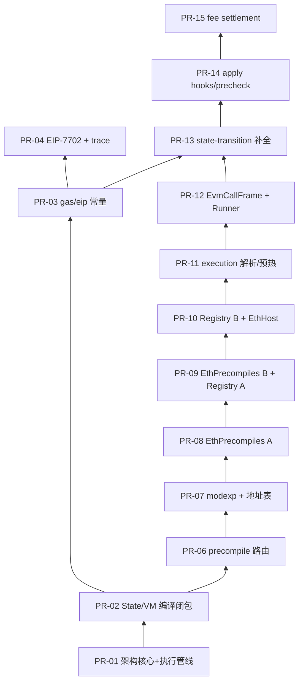

# bcos-evm/eth 目录拆分 PR 方案

> **For agentic workers:** 执行时使用 `split-to-prs` skill；每个 PR 合并前跑 `cmake --build build --target bcos-evm-eth -j`。

**Goal:** 将 `bcos-evm/eth/`（**valid=3908**，89 个 prod 文件）按依赖顺序拆成 **15 个 PR**。**PR-01 优先提交架构核心**，让 reviewer 第一眼看懂「三链共享 EVM 内核 + geth 对齐执行管线」；后续 PR 逐层填充实现。

**Architecture:** **PR-01 自上而下展示执行故事**（apply → state-transition → innerExecute）；PR-02 起自底向上补齐 state/vm/gas/precompile/execution 实现。每个 PR 必须使 `bcos-evm-eth` 可编译；测试单独 commit（不计 valid）。

**Tech Stack:** C++20, CMake 3.28+, evmone, Boost.Test, `tools/.ci/check-commit.sh`

**关联文档:** `bcos-evm/eth/README.md`、`docs/superpowers/plans/2026-06-29-bcos-evm-split-pr-plan.md`（全模块 6 PR 粗粒度版）

## Global Constraints

- **Review 限额:** 每 PR 有效代码 ≤ **500 行**（人工 review 目标）
- **CI 限额（硬约束）:** 每 **commit** `valid_insertions ≤ 300`（`tools/.ci/check-commit.sh`，`insert_limit=300`）
- **测试:** `bcos-evm/test/eth/**` 与 `EthTests.cmake` 改动放 **test commit**，不计 valid
- **禁止:** PR diff 含 `.md`/ADR；禁止 `#include` `bcos/` 或 `opstack/`（ADR-005）
- **合并门控:** `cmake --build build --target bcos-evm-eth -j` + 该 PR 对应 `ctest -R '<pattern>'`
- **源分支:** `feat-bcos-evm` 或当前 worktree；目标 `fisco/release-3.18.0`

---

## check-commit.sh 计量规则（实测基准）

**对比基线:** `fisco/release-3.18.0`（该分支 **0** 个 `bcos-evm/eth/` 文件）→ 当前 HEAD（**89** 个 prod 文件）

**公式**（`tools/.ci/check-commit.sh` `check_PR_limit`）:

```text
valid_insertions = insertions(ignore-space-change)
                 − new_files × 20        # license_line=20
                 − // 注释行
                 − 空 + 行
                 − 单独 { 或 } 行
                 − #include 行
```

**FAIL 条件:** `valid_insertions > 300` **且** git raw insertions `> 300`（两者同时超限才拒绝）。

**eth/ 全目录实测:** `valid=3908`，`raw=9393`，`git=9393`，89 个新文件 → 至少需要 **⌈3908/300⌉ = 14** 个 prod commit。

### 检查命令

```bash
# 单个 commit（HEAD 相对父 commit）
PR_TITLE="feat(bcos-evm): ..." bash tools/.ci/check-commit.sh

# 本地预检（任意 BASE..HEAD）
bash tools/ci/check-valid-insertions.sh fisco/release-3.18.0 HEAD

# 15 PR 切片批量预检
bash tools/ci/check-eth-pr-slices.sh fisco/release-3.18.0 HEAD
```

### 各 PR 切片 valid_insertions（2026-07-02 实测）

| 切片 | valid | raw | git | files | 结论 |
| --- | ---: | ---: | ---: | ---: | --- |
| PR-01 prod-1 | 147 | 448 | 448 | 7 | OK |
| PR-01 prod-2 | 78 | 243 | 243 | 5 | OK |
| PR-01 ALL | 225 | 691 | 691 | 12 | OK（2 commit） |
| PR-02 prod-1 | 226 | 400 | 400 | 2 | OK |
| PR-02 prod-2 | 188 | 393 | 393 | 1 | OK |
| PR-02 ALL | 414 | 793 | 793 | 3 | **FAIL**（必须 2 commit） |
| PR-03 prod-1 | 121 | 273 | 273 | 2 | OK |
| PR-03 prod-2 | 80 | 384 | 384 | 8 | OK |
| PR-03 ALL | 301 | 875 | 875 | 11 | **FAIL**（必须 2 commit） |
| PR-04 ALL | 262 | 500 | 500 | 2 | OK |
| PR-05 prod-1 | 202 | 565 | 565 | 6 | OK |
| PR-05 prod-2 | 202 | 445 | 445 | 5 | OK |
| PR-05 ALL | 404 | 1010 | 1010 | 11 | **FAIL**（必须 2 commit） |
| PR-06 ALL | 226 | 650 | 650 | 9 | OK |
| PR-07 ALL | 216 | 491 | 491 | 3 | OK |
| PR-08 ALL（EthPrecompiles.cpp） | 371 | 675 | 675 | 1 | **FAIL**（需 hunk 拆 2 commit） |
| PR-09 Registry（EthBuiltinRegistry.cpp） | 407 | 645 | 645 | 1 | **FAIL**（需 hunk 拆 2 commit） |
| PR-10 ALL | 198 | 431 | 431 | 3 | OK |
| PR-11 prod-1 | 78 | 303 | 303 | 4 | OK |
| PR-11 prod-2 | 145 | 360 | 360 | 3 | OK |
| PR-11 ALL | 223 | 663 | 663 | 7 | OK（2 commit） |
| PR-12 prod-1 | 209 | 422 | 422 | 2 | OK |
| PR-12 prod-2 | 120 | 333 | 333 | 4 | OK |
| PR-12 ALL | 329 | 755 | 755 | 6 | **FAIL**（必须 2 commit） |
| PR-13 prod-1 | 146 | 382 | 382 | 5 | OK |
| PR-13 prod-2 | 104 | 323 | 323 | 4 | OK |
| PR-13 ALL | 250 | 705 | 705 | 9 | OK（2 commit） |
| PR-14 ALL | 42 | 394 | 394 | 9 | OK |
| PR-15 ALL | 140 | 333 | 333 | 3 | OK |

**单文件超限（需 hunk 切分）:**

| 文件 | valid | raw | 最少 commit 数 |
| --- | ---: | ---: | ---: |
| `EthBuiltinRegistry.cpp` | 407 | 645 | 2 |
| `EthPrecompiles.cpp` | 371 | 675 | 2 |

---

## 体量概览

| 子目录 | 有效行数 | 文件数 | 拆分策略 |
| --- | ---: | ---: | --- |
| `state/` | 775 | 8 | 2 PR |
| `precompiled/` | 1,935 | 14 | 4 PR（2 个大 `.cpp` 需 hunk 切分） |
| `kernel/execution/` | 1,084 | 13 | 2 PR |
| `kernel/state-transition/` | 532 | 9 | 1 PR |
| `kernel/`（根） | 325 | 5 | 并入 PR-05 |
| `apply/` | 533 | 13 | 2 PR |
| `eip/` + `gas/` | 637 | 12 | 2 PR |
| `host/` | 319 | 2 | 并入 PR-10 |
| `core/` | 262 | 6 | 并入 PR-05 |
| `vm/` + 根 + `policy/` + `trace/` | 558 | 6 | 分散到 PR-01/04/10 |

**合计:** ~6,956 行 → **15 PR × ~460 行/PR**

---

## 依赖关系（v2：PR-01 架构优先）



> **v2 变化：** 原 PR-05（core + EVMCResult）、PR-13/14/15 的入口部分 **前移到 PR-01**；原 PR-01（vm/state 类型）并入 **PR-02**。

---

## PR 明细

> **有效行数**列值为当前 worktree 估算；执行时以 `tools/ci/check-valid-insertions.sh` 为准。  
> **Commit 建议:** `[prod]` = 生产代码 commit；`[test]` = 测试 commit。

---

### ETH-PR-01 — 架构核心：三链共享 EVM 内核 + 执行管线（★ 首个 PR）

**Branch:** `eth-pr-01-architecture-pipeline`  
**Base:** `fisco/release-3.18.0`  
**PR 标题建议:** `[bcos-evm] Introduce bcos-evm-eth shared kernel and geth-aligned execution pipeline`  
**valid（整 PR）:** **466**（2 prod commit，均 ≤300）

#### 这个 PR 要回答的问题

| 问题 | 在 PR 里如何体现 |
| --- | --- |
| 整个工作在做什么？ | 引入 `bcos-evm-eth` 静态库 — 三链（Eth/Fisco/OpStack）共享的可移植 EVM 内核 |
| 架构怎么分层？ | `core/` seam 接口 + `kernel/` 执行内核 + `apply/` 链入口 |
| 执行怎么流转？ | `applyEthMessage` → `EthStateTransitionBindings` → `stateTransitionExecute` → `innerExecute` |
| 链差异怎么注入？ | `StateTransitionHooks` / `EvmHostHooks` 虚表，禁止 eth 层 `#include bcos/opstack` |
| 与 geth 如何对齐？ | 头文件注释 + ADR-030 符号命名（ApplyMessage / stateTransition.execute / innerExecute） |

#### 执行流（PR 描述中放此图）

```text
applyEthMessage()                         // eth/apply/     — geth ApplyMessage
  └─ EthStateTransitionBindings::bind()   // eth/apply/     — 填充 hooks + errorPolicy
       └─ stateTransitionExecute()        // kernel/state-transition/ — geth stateTransition.execute
            ├─ hooks.onPreCheck*           // core/StateTransitionHooks — 链策略注入点
            ├─ deductIntrinsicGas()       // kernel step
            └─ hooks.onInvokeInnerExecute()
                 └─ innerExecute()        // kernel/execution/ — geth innerExecute
                      └─ (后续 PR) runCallFrame / EthHost / precompiles
```

#### 文件清单

| 层次 | 路径 | 角色 |
| --- | --- | --- |
| 构建 | `bcos-evm/CMakeLists.txt` + 根 `CMakeLists.txt` | 三库布局 `bcos-evm-eth/bcos/op` |
| 配置 | `eth/RevisionConfig.h` | EIP revision 位域 |
| **Seam** | `eth/core/StateTransitionHooks.h/.cpp` | 状态转换链策略注入（ADR-019） |
| **Seam** | `eth/core/EvmHostHooks.h/.cpp` | evmone 调用树内 host 策略 |
| **Seam** | `eth/core/CallTargetKind.h` | CallTarget 描述符（ADR-024） |
| **Seam** | `eth/core/ChainExtendedPrecompileDispatch.h` | 链扩展 precompile 端口 |
| **Kernel** | `eth/kernel/state-transition/StateTransitionExecute.h/.cpp` | 8 步管线实现 |
| **Kernel** | `eth/kernel/state-transition/StateTransitionContext.h` | 交易级上下文 |
| **Kernel** | `eth/kernel/state-transition/StateTransitionErrorPolicy.h` | 失败映射策略 |
| **Kernel** | `eth/kernel/state-transition/DeductIntrinsicGas.h` | intrinsic gas 内核步骤 |
| **Kernel** | `eth/kernel/execution/InnerExecute.h` | EVM 执行入口声明 |
| **Apply** | `eth/apply/ApplyEthMessage.h/.cpp` | ETH 链入口 + `EthMessageRequest/Result` DTO |
| **Apply** | `eth/apply/EthStateTransitionBindings.h/.cpp` | ETH 默认 hooks 绑定 |

#### Commit 结构（check-commit.sh 实测）

| Commit | 内容 | valid | CI |
| --- | --- | ---: | --- |
| `[prod-1]` | CMake + `core/*` + `RevisionConfig.h` | **254** | OK |
| `[prod-2]` | 执行管线 + apply 入口（上表 kernel/apply 部分） | **212** | OK |
| `[test]` | `KernelCanonicalNamingTest` + `EthStateTransitionBindingsTest` + `EthTests.cmake` 片段 | 0 | — |

#### 编译策略

PR-01 **不含** `State.cpp` / `innerExecute` 实现体 / precompiles / EthHost。  
`bcos-evm-eth` 通过 **`core/*.cpp` + pipeline `.cpp`** 链接；若闭包不足，临时加 `eth/Placeholder.cpp`（PR-02 删除）。

**门控:** `cmake --build build --target bcos-evm-eth -j`

#### GitHub PR 描述模板

```markdown
## Summary
- Introduce `bcos-evm-eth`: portable EVM kernel shared by Eth / Fisco / OpStack orchestration paths
- Land geth-aligned execution pipeline: `applyEthMessage` → `stateTransitionExecute` → `innerExecute`
- Chain differences inject via `StateTransitionHooks` / `EvmHostHooks` (ADR-005/019), not `#ifdef`

## Architecture
- `core/` — chain-neutral seams (hooks, CallTargetKind, precompile dispatch port)
- `kernel/state-transition/` — shared tx-level pipeline (geth `stateTransition.execute`)
- `kernel/execution/` — EVM call tree entry (`innerExecute`, filled in PR-11/12)
- `apply/` — ETH reference path entry (`applyEthMessage`, geth `ApplyMessage`)

## Deferred to follow-up PRs
- PR-02: State/VM compile closure + `State.cpp`
- PR-06+: precompiles, EthHost, EvmCallFrame
- opstack/, bcos/, transaction-executor/

## Test plan
- [ ] cmake --build build --target bcos-evm-eth
- [ ] ctest -R 'KernelCanonical|EthStateTransitionBindings'
```

---

### ETH-PR-02 — State/VM 基础 + 编译闭包

**Branch:** `eth-pr-02-state-vm-closure`  
**Base:** ETH-PR-01 merged  
**valid（整 PR）:** ~**640**（3 prod commit）

> 承接 PR-01 的编译依赖，补齐 state/vm/gas 最小闭包，使 `applyEthMessage` 路径可完整链接。

| 路径 | 来源（v1 方案） |
| --- | --- |
| `eth/vm/*` | 原 PR-01 |
| `eth/state/*`（含 `State.cpp`） | 原 PR-01 + PR-02 |
| `eth/Web3TypedTxKind.h`, `eth/policy/EthChainPolicy.h` | 原 PR-01 |
| `eth/gas/ProtocolGas.h`, `TxIntrinsicGas.h` | 原 PR-01 + PR-03 部分 |
| `eth/eip/Eip2930AccessList.h`, `Eip7702.h` | ApplyEthMessage 依赖 |
| `eth/kernel/EVMCResult.h/.cpp` | 原 PR-05 |
| `eth/kernel/InnerExecuteTypes.h`, `CallKind.h`, `FrameScope.h` | 原 PR-05 |
| `eth/kernel/state-transition/StateTransitionContext.cpp` | PR-01 仅有 .h |

**Commit 结构（实测）:**
- `[prod-1]` valid=**286**: EVMCResult + kernel 类型 + Context.cpp + DeductIntrinsicGas
- `[prod-2]` valid=**126**: vm + state 小头文件 + ProtocolGas
- `[prod-3]` valid=**199**: State.hpp + TxIntrinsicGas + eip 依赖头
- `[prod-4]` valid=**226**: HashUtils.hpp + State.hpp（若与 prod-3 重复则合并）
- `[prod-5]` valid=**188**: State.cpp
- `[test]` `StateHostSmokeTest`, `Web3TypedTxKindTest`, `EvmcStatusMappingTest`

**门控:** `cmake --build build --target bcos-evm-eth -j` + `ctest -R 'StateHost|Web3TypedTxKind|EvmcStatus'`

---

### ETH-PR-03 — Gas + EIP 头文件（无 7702 实现体）

**Branch:** `eth-pr-03-gas-eip-headers`  
**Base:** ETH-PR-01 merged  
**有效行数:** ~**436**

| 路径 | 行 |
| --- | ---: |
| `bcos-evm/eth/gas/TxIntrinsicGas.h` | 153 |
| `bcos-evm/eth/gas/TxFeeSettlement.h` | 65 |
| `bcos-evm/eth/eip/Eip1559.h` | 59 |
| `bcos-evm/eth/eip/Eip1559Gate.h` | 17 |
| `bcos-evm/eth/eip/Eip2929Gate.h` | 17 |
| `bcos-evm/eth/eip/Eip2929StorageGas.h` | 10 |
| `bcos-evm/eth/eip/Eip2930AccessList.h` | 8 |
| `bcos-evm/eth/eip/Eip4844.h` | 28 |
| `bcos-evm/eth/eip/Eip7623.h` | 48 |
| `bcos-evm/eth/eip/Eip7702.h` | 31 |

**Commit 结构:**
- `[prod-1]` gas/（~218）
- `[prod-2]` eip/ 头文件（~218，不含 `.cpp`）
- `[test]` `Eip2929OpcodeGasTest`, `Eip1559GateTest`, `TxFeeSettlementTest`, `EthIntrinsicGasFailureCharacterizationTest`, `Eip7623PrecheckTest`, `DeductIntrinsicGasTest`

**门控:** `ctest -R 'Eip2929|Eip1559|TxFeeSettlement|IntrinsicGas|Eip7623|DeductIntrinsic' --output-on-failure`

---

### ETH-PR-04 — EIP-7702 实现 + EVM Trace

**Branch:** `eth-pr-04-eip7702-trace`  
**Base:** ETH-PR-03 merged  
**有效行数:** ~**472**

| 路径 | 行 |
| --- | ---: |
| `bcos-evm/eth/eip/Eip7702.cpp` | 189 |
| `bcos-evm/eth/trace/EvmTrace.h` | 252 |

**Commit 结构:**
- `[prod-1]` Eip7702.cpp + Eip7702.h（已在 PR-03，此处仅 .cpp）
- `[prod-2]` EvmTrace.h
- `[test]` `Eip7702ApplyAuthorizationEthTest`, `Eip7702DelegatedCallGasTest`, `PrecompileRouter7702Test`

**门控:** `ctest -R '7702' --output-on-failure`

---

### ETH-PR-05 — ~~Core + EVMCResult~~ → **已并入 PR-01/02**

> v2 中 `core/` 与 pipeline 入口在 **PR-01**；`EVMCResult` 等在 **PR-02**。原 PR-05 序号保留给 **Precompile 路由前最后一层 kernel 类型补全**（若 PR-02 已覆盖则跳过，直接进入 PR-06）。

---

### ETH-PR-06 — Precompile 路由骨架

**Branch:** `eth-pr-06-precompile-router`  
**Base:** ETH-PR-02 merged（v2：core 已在 PR-01）  
**有效行数:** ~**419**

| 路径 | 行 |
| --- | ---: |
| `bcos-evm/eth/precompiled/PrecompileRouter.h` | 36 |
| `bcos-evm/eth/precompiled/PrecompileRouter.cpp` | 107 |
| `bcos-evm/eth/precompiled/PrecompileTraits.h` | 60 |
| `bcos-evm/eth/precompiled/PrecompiledContract.h` | 31 |
| `bcos-evm/eth/precompiled/PrecompiledContract.cpp` | 56 |
| `bcos-evm/eth/precompiled/PrecompileActive.h` | 65 |
| `bcos-evm/eth/precompiled/EthPrecompiles.h` | 26 |
| `bcos-evm/eth/precompiled/EthBuiltinRegistry.h` | 15 |
| `bcos-evm/eth/precompiled/Eip2537Gas.h` | 42 |

**Commit 结构:**
- `[prod-1]` Router + Traits + Active（~268）
- `[prod-2]` PrecompiledContract + 头文件 stub（~151）
- `[test]` `PrecompileRouterEnvelopeTest`, `PrecompileEnvelopeTest`, `PrecompileActiveGateMatrixTest`

**门控:** `ctest -R 'PrecompileRouter|PrecompileEnvelope|PrecompileActive' --output-on-failure`

---

### ETH-PR-07 — Modexp + 预编译地址表

**Branch:** `eth-pr-07-precompile-modexp-address`  
**Base:** ETH-PR-06 merged  
**有效行数:** ~**385**

| 路径 | 行 |
| --- | ---: |
| `bcos-evm/eth/precompiled/PrecompiledAddress.h` | 148 |
| `bcos-evm/eth/precompiled/ModexpGas.h` | 29 |
| `bcos-evm/eth/precompiled/ModexpGas.cpp` | 208 |

**Commit 结构:**
- `[prod-1]` PrecompiledAddress.h（~148）
- `[prod-2]` ModexpGas.h + ModexpGas.cpp（~237）
- `[test]` `Eip7823ModexpRejectTest`, `EipPrecompileRevisionGateTest`

**门控:** `ctest -R 'Modexp|PrecompileRevision' --output-on-failure`

---

### ETH-PR-08 — EthPrecompiles 实现（Part A：0x01–0x08）

**Branch:** `eth-pr-08-precompiles-a`  
**Base:** ETH-PR-07 merged  
**有效行数:** ~**480**（hunk 切分）

| 路径 | 说明 |
| --- | --- |
| `bcos-evm/eth/precompiled/EthPrecompiles.cpp` | **前半**：ecrecover, sha256, ripemd160, identity, modexp 分发, blake2 等（约 L1–L400，按函数边界切） |

> `EthPrecompiles.cpp` 全文件 580 行，本 PR 只 import 前 ~480 行有效代码；剩余在 PR-09。

**Commit 结构:**
- `[prod-1]` EthPrecompiles.cpp part A（~480）
- `[test]` `Eip2537KernelTest`（若 BLS 在 part B，则 defer 到 PR-09）

**门控:** `cmake --build build --target bcos-evm-eth -j`（允许 stub 未实现地址返回 `EVMC_REJECTED`）

---

### ETH-PR-09 — EthPrecompiles（Part B）+ BuiltinRegistry（Part A）

**Branch:** `eth-pr-09-precompiles-b-registry-a`  
**Base:** ETH-PR-08 merged  
**有效行数:** ~**495**

| 路径 | 说明 |
| --- | --- |
| `bcos-evm/eth/precompiled/EthPrecompiles.cpp` | **后半**：BLS12-381 (0x0b–0x11)、KZG (0x0a)、P256 等 |
| `bcos-evm/eth/precompiled/EthBuiltinRegistry.cpp` | **前半**：registry 表 + revision gate（约前 480 行） |

**Commit 结构:**
- `[prod-1]` EthPrecompiles.cpp part B（~100）
- `[prod-2]` EthBuiltinRegistry.cpp part A（~395）
- `[test]` `Eip2537KernelTest`, `Eip7212KernelTest`, `EthDelegateCallPrecompileTest`

**门控:** `ctest -R 'Eip2537|Eip7212|DelegateCallPrecompile' --output-on-failure`

---

### ETH-PR-10 — BuiltinRegistry（Part B）+ EthHost

**Branch:** `eth-pr-10-registry-host`  
**Base:** ETH-PR-09 merged  
**有效行数:** ~**471**

| 路径 | 行 |
| --- | ---: |
| `bcos-evm/eth/precompiled/EthBuiltinRegistry.cpp` | ~137（remainder） |
| `bcos-evm/eth/host/EthHost.h` | 73 |
| `bcos-evm/eth/host/EthHost.cpp` | 246 |
| `bcos-evm/eth/apply/EthEvmHostHooks.h` | 8 |

**Commit 结构:**
- `[prod-1]` EthBuiltinRegistry.cpp remainder（~137）
- `[prod-2]` EthHost.h + EthHost.cpp + EthEvmHostHooks.h（~327）
- `[test]` `test/eth/host/*`（BlockHash, CreateWarmPin, NestedCall, NestedRevert, Eip2929Gate, PrecompileInCall）

**门控:** `ctest -R 'BlockHashHost|CreateWarmPin|NestedCall|NestedRevert|Eip2929GateHost|PrecompileInCall|StateHost' --output-on-failure`

---

### ETH-PR-11 — Kernel execution：地址解析 + 预热 + 合约创建

**Branch:** `eth-pr-11-kernel-exec-resolvers`  
**Base:** ETH-PR-10 merged  
**有效行数:** ~**498**

| 路径 | 行 |
| --- | ---: |
| `bcos-evm/eth/kernel/execution/ExecutionAddressResolver.h` | 18 |
| `bcos-evm/eth/kernel/execution/ExecutionAddressResolver.cpp` | 104 |
| `bcos-evm/eth/kernel/execution/CallTargetResolver.h` | 24 |
| `bcos-evm/eth/kernel/execution/CallTargetResolver.cpp` | 102 |
| `bcos-evm/eth/kernel/execution/WarmTransactionEntry.h` | 72 |
| `bcos-evm/eth/kernel/execution/FrameValueTransfer.h` | 70 |
| `bcos-evm/eth/kernel/execution/CreateContract.h` | 118 |

**Commit 结构:**
- `[prod-1]` ExecutionAddressResolver + CallTargetResolver（~248）
- `[prod-2]` WarmTransactionEntry + FrameValueTransfer + CreateContract（~260）
- `[test]` `ExecutionAddressResolverTest`, `CallTargetResolverTest`, `FrameValueTransferTest`, `FrameTargetRoutingCharacterizationTest`, `ResolveExecutionCodeTest`

**门控:** `ctest -R 'ExecutionAddress|CallTarget|FrameValue|FrameTarget|ResolveExecution' --output-on-failure`

---

### ETH-PR-12 — EvmCallFrame + TxExecutionRunner

**Branch:** `eth-pr-12-evm-call-frame`  
**Base:** ETH-PR-11 merged  
**有效行数:** ~**494**

| 路径 | 行 |
| --- | ---: |
| `bcos-evm/eth/kernel/execution/EvmCallFrame.h` | 47 |
| `bcos-evm/eth/kernel/execution/EvmCallFrame.cpp` | 294 |
| `bcos-evm/eth/kernel/execution/InnerExecute.h` | 6 |
| `bcos-evm/eth/kernel/execution/InnerExecute.cpp` | 9 |
| `bcos-evm/eth/kernel/execution/TxExecutionRunner.h` | 9 |
| `bcos-evm/eth/kernel/execution/TxExecutionRunner.cpp` | 211 |

> `EvmCallFrame.cpp`（294 行）与 `TxExecutionRunner.cpp`（211 行）同 PR；若 valid>300，按 checkpoint/execute/finalize 拆 2 commit。

**Commit 结构:**
- `[prod-1]` EvmCallFrame.h/.cpp（~341）
- `[prod-2]` InnerExecute + TxExecutionRunner（~235）
- `[test]` `EvmCallFrameTest`, `TxExecutionRunnerTest`, `InnerExecuteSmokeTest`, `EthCreateGasSettlementCharacterizationTest`, `EthDelegateCallValueTransferCharacterizationTest`, `InsufficientBalanceGasLeftTest`, `TopLevelInsufficientBalanceStateDiffTest`, `EvmTxContextViewPropagationTest`

**门控:** `ctest -R 'EvmCallFrame|TxExecutionRunner|InnerExecute|CreateGasSettlement|DelegateCallValue|InsufficientBalance|TopLevelInsufficient|EvmTxContext' --output-on-failure`

---

### ETH-PR-13 — State transition 补全（PR-01 未含的步骤）

**Branch:** `eth-pr-13-state-transition`  
**Base:** ETH-PR-12 merged  
**valid（整 PR）:** ~**250**

> PR-01 已 landing `StateTransitionExecute` + `StateTransitionContext.h` + `DeductIntrinsicGas`。本 PR 补全剩余步骤。

| 路径 | 说明 |
| --- | --- |
| `IncludedTxVmerrNormalize.h` | included-tx vmerr 归一化 |
| `IntrinsicGasAccounting.h` | intrinsic gas 记账 |
| `FeeInputsMapping.h` | 费用输入映射 |
| `EthStateTransitionErrorPolicy.h`（apply 层） | 若未在 PR-14 |

**Commit 结构:** 同 v1 PR-13 prod-1/prod-2（valid=146/104）  
**门控:** `ctest -R 'StateTransition|EthIncludedTxVmerr'`

---

### ETH-PR-14 — Apply 层：hooks + precheck（入口已在 PR-01）

**Branch:** `eth-pr-14-apply-hooks`  
**Base:** ETH-PR-13 merged  
**valid（整 PR）:** ~**42**（bindings/ApplyEthMessage 已在 PR-01）

| 路径 | 行 |
| --- | ---: |
| `EthStateTransitionHooks.h/.cpp` | 68 |
| `EthStateTransitionErrorPolicy.h` | 46 |
| `EthTxPrecheck.h/.cpp` | 69 |
| `EthFeeInputsMapping.h`, `EthEvmResult.h` | 28 |

**门控:** `ctest -R 'EthStateTransitionHooks|EthTxPrecheck|EthMessageFixture'`

---

### ETH-PR-15 — 费用结算（Apply 入口已在 PR-01）

**Branch:** `eth-pr-15-fee-settlement`  
**Base:** ETH-PR-14 merged  
**valid（整 PR）:** ~**140**

| 路径 | 说明 |
| --- | --- |
| `EthTxFeeSettlement.h` | buyGas / refundGas / finalizeEthTxGasUsed |

> `ApplyEthMessage.h/.cpp` 已在 PR-01；本 PR 只补 fee settlement 逻辑。

**门控:** `ctest -R 'EthEip1559|EthMessage1559|ExecuteMessage'`

---

## 执行工作流

### 1. 准备（一次性）

```bash
cd /Users/octopus/octo/code/FISCO-BCOS/.claude/worktrees/feat-evm-refactor
rtk git fetch fisco
rtk git checkout fisco/release-3.18.0
rtk git checkout -b feat-eth-split-integration
# 备份当前工作
SHA=$(git stash create "pre-eth-split")
[ -n "$SHA" ] && git update-ref "refs/backup/pre-eth-split-$(date +%s)" "$SHA"
```

### 2. 每个 PR 循环

```bash
rtk git checkout feat-eth-split-integration
rtk git checkout -b eth-pr-NN-<topic>
# 只 stage 方案中列出的文件 — 禁止 git add .
rtk git checkout feat-bcos-evm -- <paths>   # 或从当前 worktree 复制
cmake --build build --target bcos-evm-eth -j
bash tools/ci/check-valid-insertions.sh
rtk git commit -m "feat(bcos-evm): ..."
# test commit
rtk git add bcos-evm/test/eth/... bcos-evm/test/cmake/EthTests.cmake
rtk git commit -m "test(bcos-evm): ..."
rtk git push -u origin eth-pr-NN-<topic>
gh pr create --base release-3.18.0 --head eth-pr-NN-<topic> ...
# merge 后
rtk git checkout feat-eth-split-integration && rtk git merge --ff-only eth-pr-NN-<topic>
```

### 3. 最终等价性检查

```bash
rtk git diff feat-bcos-evm -- bcos-evm/eth/ | rtk grep -E '^\+\+\+|^---' | wc -l
# 期望：0 非预期 diff
ctest -R '.' --output-on-failure  # eth 全量
```

---

## 与全模块 6-PR 方案映射

| 本 eth 15-PR 方案 | 原 6-PR 方案 |
| --- | --- |
| ETH-PR-01 ~ 02 | PR-0 state/vm bootstrap |
| ETH-PR-03 ~ 04 | PR-1 gas/eip constants |
| ETH-PR-05 ~ 10 | PR-2 execution + precompile |
| ETH-PR-11 ~ 13 | PR-3 orchestration kernel |
| ETH-PR-14 ~ 15 | PR-3/PR-4 apply + fee（eth 侧） |

本方案 **仅覆盖 `bcos-evm/eth/`**；`opstack/`、`bcos/`、`transaction-executor/` 仍按 `2026-06-29-bcos-evm-split-pr-plan.md` 独立 wave。

---

## 风险与注意事项

1. **大文件 hunk 切分**（`EthPrecompiles.cpp` 580 行、`EthBuiltinRegistry.cpp` 532 行）：PR-08/09 需手动按函数边界切分，保证每个 commit `valid ≤ 300`。
2. **Header + impl 同 PR**：`State.hpp`+`State.cpp`、`EvmCallFrame.h`+`.cpp` 等不可跨 PR 拆签名与实现。
3. **CMake GLOB**：`bcos-evm/CMakeLists.txt` 使用 `GLOB_RECURSE eth/*.cpp` — 新增 `.cpp` 后需 reconfigure，但无需改 CMakeLists。
4. **并行 PR**：PR-03 与 PR-02 可并行（不同 base 子树），但合并顺序须 respect 依赖图；建议严格顺序合并以降低 rebase 成本。
5. **测试 cmake 增量**：`EthTests.cmake` 按 PR 增量追加 target，避免一次性 import 全部 52 个测试文件。

---

## 汇总表（v2：PR-01 架构优先 + check-commit.sh 实测）

| PR | 主题 | valid | Prod Commits | 叙事角色 |
| --- | --- | ---: | ---: | --- |
| **01** | **架构核心 + 执行管线** | **466** | **2** | ★ 首个 PR：回答「在做什么」 |
| 02 | State/VM 编译闭包 | ~640 | 3–5 | 让 PR-01 管线可链接 |
| 03 | Gas + EIP 头 | 301 | 2 | 协议常量 |
| 04 | EIP-7702 + Trace | 262 | 1 | |
| 06 | Precompile 路由 | 226 | 1 | |
| 07 | Modexp + 地址表 | 216 | 1 | |
| 08 | EthPrecompiles.cpp | 371 | 2 hunk | |
| 09 | EthBuiltinRegistry.cpp | 407 | 2 hunk | |
| 10 | EthHost | 198 | 1 | |
| 11 | Exec 解析/预热 | 223 | 2 | |
| 12 | EvmCallFrame + Runner | 329 | 2 | innerExecute 实现体 |
| 13 | State-transition 补全 | 250 | 2 | |
| 14 | Apply hooks/precheck | 42 | 1 | |
| 15 | Fee settlement | 140 | 1 | |

**Total:** 15 PR，`valid=3908`，~**19 prod commit**（PR-01 2 + PR-02 额外 3 + 其余 14）。
