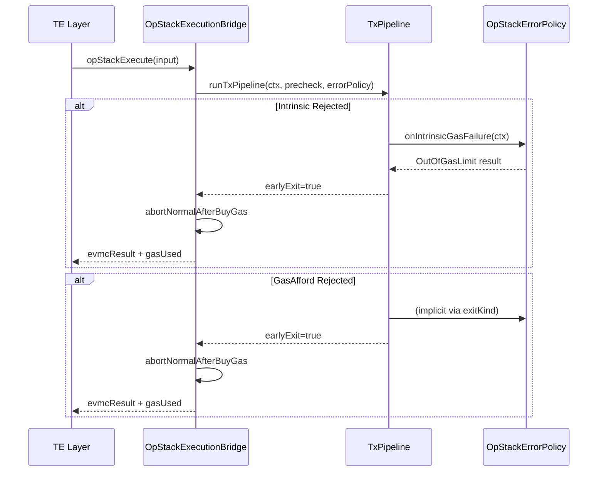
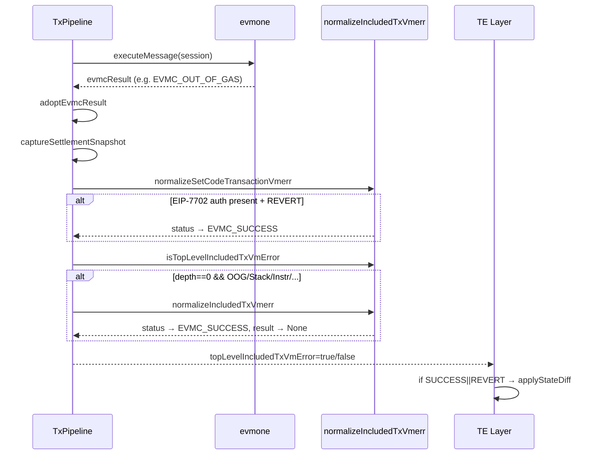
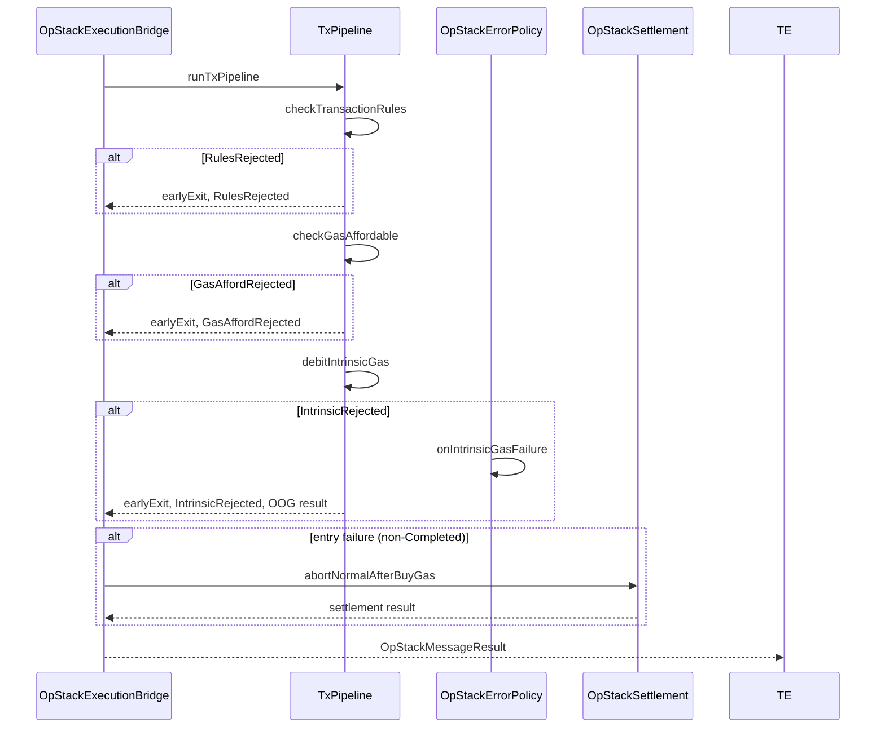

# bcos-evm 错误处理 / 错误码 geth·op-geth Parity 报告

**审查日期：** 2026-06-26  
**审查类型：** 只读审查，不改代码  
**审查范围：** `bcos-evm/eth/` + `bcos-evm/opstack/` + `transaction-executor/` 错误链路 vs geth / op-geth  
**排除：** `bcos/` FISCO 扩展语义（仅附录标注有意偏离）

---

## Executive Summary

### P0 — 共识/费用错误（必须修）

1. **GAP-001** (`EthOrchestrationErrorPolicy`): ETH 参考路径 intrinsic gas failure 和 OOG exception 映射到 `OutOfGasLimit`，而 geth 在 preCheck/intrinsic gas 失败时 **reject tx**（不产生 receipt、state 不改变）。ETH 路径 `onIntrinsicGasFailure` 中 `gas_left=0` 可能产生负 `gasUsed`。
   - **我方:** `bcos-evm/eth/reference/EthOrchestrationErrorPolicy.h:15-21` → `OutOfGasLimit` + `gas_left=0`
   - **GETH:** `core/state_transition.go:550-552` → `return nil, err` (reject tx)
   - **状态:** 需 characterization 测试验证

2. **GAP-002** (`OpStackOrchestrationErrorPolicy`): OpStack 路径 `onIntrinsicGasFailure` 产生 `EVMC_OUT_OF_GAS` + `gas_left=0` 而非 reject tx。op-geth 对应入口的 `innerExecute` 返回 `err` 并在 `execute()` 外层处理 deposit/revert。
   - **我方:** `bcos-evm/opstack/OpStackOrchestrationErrorPolicy.h:11-15`
   - **OPGETH:** `core/state_transition.go:527-529` (innerExecute preCheck 返回 err)

3. **GAP-003** (ETH 路径 `onPipelineException`): `UnknownEVMCStatus` 异常（catch-all `std::exception&`）映射到 `EVMC_INTERNAL_ERROR` + `TransactionStatus::Unknown`。geth 的 `TransitionDb` 不应有对应路径——如果 `execute()` 返回 err，tx 被 reject。
   - **我方:** `bcos-evm/eth/reference/EthOrchestrationErrorPolicy.h:36-42`
   - **GETH:** `core/state_transition.go:538-540` — `execute()` 外部 err 表示 reject

### P1 — 参考路径 parity gap

4. **GAP-004** (ETH 路径 `applyStateDiff` 条件): `EthTransactionExecutorImpl` 仅在 `EVMC_SUCCESS || EVMC_REVERT` 时 apply state diff，这与 ETH 参考路径 included-tx-vmerr 设计一致。但 `EVMC_INSUFFICIENT_BALANCE` 也应该是 included-tx 的 vmerr（geth top-level `InsufficientBalance` 发生在 EVM 内，tx 仍 included）。我方 `isTopLevelIncludedTxVmError` 正确排除了 `EVMC_INSUFFICIENT_BALANCE`。
   - **我方:** `transaction-executor/bcos-transaction-executor/EthTransactionExecutorImpl.h:179-188`
   - **GETH:** `core/vm/errors.go:30` — `ErrInsufficientBalance` 是 vmerr（tx included）
   - **状态:** ⚠️ 需 characterization 测试验证：我方 `ExecutionFrame` 中嵌套 CALL 的 InsufficientBalance 和 top-level 是否区分

5. **GAP-005** (`EVMC_RESERVED`/未映射 status): 我方 `evmcStatusToTransactionStatus` 对未映射 status（如未来 EVMC 新增）抛 `UnknownEVMCStatus` 异常。geth 的 `VMErrorCodeUnknown`（`math.MaxInt - 1`）是安全 fallback。
   - **我方:** `bcos-evm/eth/EVMCResult.cpp:97-119`
   - **GETH:** `core/vm/errors.go:205` — `VMErrorCodeUnknown`

### P2 — 文档/测试缺口

6. **GAP-006**: OpStack 路径 `checkBalanceAndValue` 失败后 `exitKind` 可能为 `GasAffordRejected`（`TxPipeline.cpp:89-101`），但 `OpStackOrchestrationErrorPolicy` 无专门处理——等同于路径 `onPipelineException`（未触发）或隐式行为。需明确文档。
7. **GAP-007**: geth 的 `preCheck()` 失败走 `buyGas()` 内部（`state_transition.go:525`），但 op-geth 增加 deposit tx / system tx 分支（`state_transition.go:347-361`）。我方 OpStack `checkTransactionRules` 需逐个对比。
8. **GAP-008**: geth EIP-3529 refund cap（`gasUsed / 5`）和 EIP-7623 floor data gas 结算路径缺少 characterization 测试。

### Accepted — 有意偏离

9. **ACCEPTED-001**: FISCO 路径 `NotFoundCodeError` → `EVMC_REVERT`（FISCO 专有语义），不适用 geth 对比。
10. **ACCEPTED-002**: FISCO `fix_error_handling` / `fix_revert_logs` / `BALANCE_TRANSFER_GAS=21000` 都是 FISCO 产品层差异。

---

## 环境

- **GETH commit:** `117e067f0f0bae1a17082321f224dedb6765b10f`
- **OPGETH commit:** `e8800cffe53d459cde8a07c8e8f1de9d86e79e07`
- **WORKSPACE branch:** `worktree-feat-evm-refactor`

---

## §1 Taxonomy 对照总表

| 维度 | geth | op-geth | bcos-evm (ETH) | bcos-evm (OpStack) | bcos-evm (FISCO) |
|------|------|---------|----------------|---------------------|------------------|
| 交易未进入 EVM（precheck/intrinsic/buyGas） | `TransitionDb.execute()` 返回 `(nil, err)`, tx **reject** | 同 geth + deposit tx / system tx 分支 (`preCheck`) | `TxPipeline` early-exit (`RulesRejected`/`IntrinsicRejected`/`GasAffordRejected`) 产生 evmcResult, **非 reject** | 同 ETH 参考 (`IntrinsicRejected`/`GasAffordRejected`), `abortNormalAfterBuyGas` | `RulesRejected`/`IntrinsicRejected`/`GasAffordRejected` |
| Top-level EVM vmerr 但 tx 仍 included | `execute()` 返回 `(&result, nil)`, `result.Err` 非 nil (`vm.Error`) | 同 geth + deposit 失败状态回滚 (`execute()` revert+补充 nonce) | `topLevelIncludedTxVmError = true` → `normalizeIncludedTxVmerr` → `EVMC_SUCCESS` | OpStack 无 included-vmerr normalize（deposit 除外） | N/A（FISCO 有自己规则） |
| Top-level REVERT | `result.Err == ErrExecutionReverted`, state 变更保留 | 同 geth | `EVMC_REVERT` → `RevertInstruction`, state diff 保留 | 同 | 同（`fix_revert_logs` 可能清 logs） |
| Nested CALL/CREATE 失败 | `evm.Call()` 内部 revert snapshot, consume gas (非 REVERT 则 exhaust) | 同 geth | `ExecutionFrame::finalizeFrame` → `state.revert()` | 同 | 同 |
| INSUFFICIENT_BALANCE（value transfer） | Top-level: `ErrInsufficientFundsForTransfer` → 进入 EVM 前 reject; Nested: vmerr `ErrInsufficientBalance` → included | 同 | `ExecutionFrame::transferOrFail` → `EVMC_INSUFFICIENT_BALANCE`, gas_left=0 | 同 | 同 |
| OUT_OF_GAS（intrinsic vs execution） | intrinsic: `ErrIntrinsicGas` → reject tx; execution: `ErrOutOfGas` → vmerr | 同 | intrinsic: early-exit (`IntrinsicRejected`) → `OutOfGasLimit`/`OutOfGas`; execution: `EVMC_OUT_OF_GAS` | intrinsic: `makeOutOfGasLimitResult`; execution: `EVMC_OUT_OF_GAS` | intrinsic: `OutOfGas` + errorInfo |
| INTERNAL_ERROR / 未映射异常 | `VMErrorCodeUnknown` (fallback) | 同 | `EVMC_INTERNAL_ERROR` → `UnknownEVMCStatus` 异常或 `TransactionStatus::Unknown` | `makeInternalErrorResult` → `EVMC_INTERNAL_ERROR` + `Unknown` | `EVMC_INTERNAL_ERROR` → `Unknown`/`OutOfGas`（含 `fix_error_handling`） |

**关键差异：**
- **geth reject vs bcos early-exit:** geth 在 preCheck/intrinsic/buyGas 失败时，`execute()` 返回 `(nil, err)`，调用方不产生 receipt，state 不改变。bcos 产生 EVMC result（`OutOfGasLimit`/`OutOfGas`），TE 层据此产生 receipt。**这是设计差异，非 bug**，但 ETH 参考路径需要确保 TE 层正确处理（Task 8）。

---

## §2 Status 映射矩阵

| evmc_status_code | bcos TransactionStatus | geth vm.Error / TransitionDb | receipt 语义 | 备注 |
|---|---|---|---|---|
| `EVMC_SUCCESS` | `None` | `err == nil` | 成功 | 一致 |
| `EVMC_REVERT` | `RevertInstruction` | `ErrExecutionReverted` | 失败（revert） | 一致 |
| `EVMC_OUT_OF_GAS` | `OutOfGas` / `OutOfGasLimit` | `ErrOutOfGas` | 失败（OOG） | ETH: `OutOfGasLimit` (ErrorPolicy); FISCO: `OutOfGas` (evmcStatusToTransactionStatus) |
| `EVMC_INSUFFICIENT_BALANCE` | `NotEnoughCash` | `ErrInsufficientBalance`（vmerr） | 失败（balance） | 一致 |
| `EVMC_STACK_OVERFLOW` | `OutOfStack` | `ErrStackOverflow`（动态 checked） | 失败 | 一致 |
| `EVMC_STACK_UNDERFLOW` | `StackUnderflow` | `ErrStackUnderflow`（动态 checked） | 失败 | 一致 |
| `EVMC_INVALID_INSTRUCTION` | `BadInstruction` | `ErrInvalidOpCode`（动态 checked） | 失败 | 一致 |
| `EVMC_UNDEFINED_INSTRUCTION` | `BadInstruction` | `ErrInvalidOpCode`（动态 checked） | 失败 | 一致 |
| `EVMC_BAD_JUMP_DESTINATION` | `BadJumpDestination` | `ErrInvalidJump` | 失败 | 一致（仅在 `evmcStatusToErrorMessage` 映射） |
| `EVMC_INVALID_MEMORY_ACCESS` | `StackUnderflow` | geth 无此错误（evmone 专有） | 失败 | **命名不一致**: 映射到 `StackUnderflow` 而非独立语义 |
| `EVMC_STATIC_MODE_VIOLATION` | `Unknown` | `ErrWriteProtection` | 失败 | **状态码不一致**: 映射到 `Unknown` 而非专用 code |
| `EVMC_INTERNAL_ERROR` | `Unknown` | `VMErrorCodeUnknown` | 未知失败 | 一致（fallback） |
| 未映射/新 status | `UnknownEVMCStatus` 异常（`EVMCResult.cpp:117`） | `VMErrorCodeUnknown` | 失败（异常 vs fallback） | **GAP**: bcos 抛异常，geth 安全 fallback |

**GAP 详述：**

- `EVMC_INVALID_MEMORY_ACCESS` → `StackUnderflow`：语义不准确。应该映射到独立 `InvalidMemoryAccess` 或在文档中标注。
- `EVMC_STATIC_MODE_VIOLATION` → `Unknown`：应该映射到专用 `StaticModeViolation`（如果有）或至少 `BadInstruction`。
- `UnknownEVMCStatus` 异常：geth `VMErrorCodeUnknown` 是安全 fallback，不会崩溃。我方抛异常可能导致整个管线崩溃。

---

## §3 分路径差异详表

### 3.1 ETH Reference (`ethReferenceExecute`)

**入口链路（TxPipeline → EthReferenceBridge → TE）：**

| 步骤 | 我方（文件:行号） | GETH（文件:行号） | 结论 |
|------|-------------------|-------------------|------|
| 1. setupMessage | `EthPrecheckPolicy::setupMessage` (EthPrecheckPolicy.cpp) | `TransactionToMessage` (state_transition.go:240-299) | **PASS** — EIP-1559 fields 填充逻辑基本对应 |
| 2. checkTransactionRules | `EthPrecheckPolicy::checkTransactionRules` (EthPrecheckPolicy.cpp) | `StateTransition.preCheck()` (state_transition.go:433-526) | **GAP**: 见 Task 4 |
| 3. checkGasAffordable | `EthPrecheckPolicy::checkGasAffordable` (EthPrecheckPolicy.cpp) | `StateTransition.buyGas()` (state_transition.go:367-431) | **GAP**: 见 Task 4 |
| 4. debitIntrinsicGas | `TxPipeline.cpp:68-80` → `debitIntrinsicGas` (DebitIntrinsicGas.h) | `IntrinsicGas()` (state_transition.go:561-568) | **PASS** — EIP-7623 token pricing 一致 |
| 5. checkBalanceAndValue | `TxPipeline.cpp:89-101` | `state_transition.go:591-598` | **PASS** |
| 6. runEvmExecution | `TxPipeline.cpp:110-117` | `evm.Call()` / `evm.Create()` (state_transition.go:616-641) | **PASS** — EVM 执行相同 |
| 7. normalizeIncludedTxVmerr | `EthOrchestrationErrorPolicy::onPostExecuteNormalize` (EthOrchestrationErrorPolicy.h:50-57) | `TransitionDb` top-level vmerr 语义 (state_transition.go:704-710) | **PASS** — 设计一致 |
| 8. Exception mapping | `EthOrchestrationErrorPolicy::onPipelineException` (EthOrchestrationErrorPolicy.h:23-48) | 不存在；std::exception 路径无 geth 对应 | **GAP-001**: C++ exception → `EVMC_INTERNAL_ERROR` |

**EthOrchestrationErrorPolicy 详析：**

```14:21:bcos-evm/eth/reference/EthOrchestrationErrorPolicy.h
    void onIntrinsicGasFailure(
        TxPipelineContext& ctx, IntrinsicDebitFailure /*failure*/) const override
    {
        evmc_result failResult{};
        failResult.status_code = EVMC_OUT_OF_GAS;
        failResult.gas_left = 0;
        ctx.evmcResult = EVMCResult(failResult, protocol::TransactionStatus::OutOfGasLimit);
    }
```

- **我方**: intrinsic gas 不足 → `EVMC_OUT_OF_GAS` + `OutOfGasLimit` + `gas_left=0`，管线继续产生 receipt
- **GETH** (`state_transition.go:565-568`): intrinsic gas 不足 → `return nil, ErrIntrinsicGas`，tx **reject**
- **影响**: 如果 TE 层对 `OutOfGasLimit` 产生 receipt 且没有拒绝交易，则行为与 geth 不同。需 characterization 测试验证 TE 层是否区分 reject vs included-vmerr。

### 3.2 OpStack (`opStackExecute`)

**OpStack 特有错误路径：**

| 路径 | 我方（文件:行号） | OPGETH（文件:行号） | 结论 |
|------|-------------------|---------------------|------|
| Deposit tx preCheck | `OpStackPrecheckPolicy::checkTransactionRules` (OpStackPrecheckPolicy.cpp) | `state_transition.go:347-361` | **PASS** — deposit 跳过 nonce/fees |
| System tx | 无专门 system tx 分支 | `state_transition.go:353-358` | **GAP**: 我方无 `IsSystemTx` 语义？需确认对方是否需要 |
| entry reject (ADR-025) | `OpStackOrchestrationErrorPolicy::onIntrinsicGasFailure` (OpStackOrchestrationErrorPolicy.h:11-15) | `innerExecute` return err → `execute()` 处理 deposit 状态回滚 (state_transition.go:486-511) | **GAP-002**: 我方产生 evmcResult vs op-geth revert |
| operator fee refund (Isthmus) | `OpStackSettlement::settleNormal` (OpStackSettlement.cpp) | `refundIsthmusOperatorCost` (state_transition.go:836-846) | 需 characterization 测试验证 |
| phantom l1Fee / operatorFee | `OpStackNormalFeeSettlement.cpp` | `state_transition.go:287-297` | 需 characterization 测试验证 |

**OpStack 管线 entry failure 时序（ADR-025）：**



### 3.3 FISCO 附录（有意偏离）

详见 §Task 9。

---

## §4 错误路径时序

### ETH Included-tx Vmerr Flow



### OpStack Entry Reject Flow



---

## §5 测试覆盖 gap + 建议 characterization 用例

### 已有测试覆盖

| 测试文件 | 覆盖范围 | 状态 |
|----------|----------|------|
| `test/eth/EthIncludedTxVmerrTest.cpp` | included-tx vmerr normalize | 已有 |
| `test/eth/OrchestrationErrorPolicyTest.cpp` | ETH ErrorPolicy 映射 | 已有 |
| `test/opstack/OpStackOrchestrationErrorPolicyTest.cpp` | OpStack ErrorPolicy 映射 | 已有 |
| `test/opstack/OpStackTxLifecycleCharacterizationTest.cpp` | Tx lifecycle characterization | 已有 |
| `test/opstack/OpStackSettleAsyncTest.cpp` | 异步 settlement | 已有 |
| `test/opstack/OpStackSettlementTest.cpp` | settlement 路径 | 已有 |
| `test/opstack/OpStackSettleCharacterizationTest.cpp` | settlement characterization | 已有 |

### 建议新增 characterization 用例

| 优先级 | 用例 | 对应 GAP | 预期行为 |
|--------|------|----------|----------|
| **P0** | `EthIntrinsicGasFailureRejectBehavior` | GAP-001 | 确认 TE 层对 `OutOfGasLimit` 是否产生 receipt 且 state 不改变（应拒绝） |
| **P0** | `OpStackEntryFailureAbortNormal` | GAP-002 | 确认 `abortNormalAfterBuyGas` 的 state 回滚 + gas 结算正确 |
| **P1** | `EvmcStatusMappingCompleteness` | GAP-005 | 对所有 evmc_status_code 枚举值测试 `evmcStatusToTransactionStatus` |
| **P1** | `NestedCallInsufficientBalanceGasLeft` | GAP-004 | 嵌套 CALL InsufficientBalance 后 gas_left 是否保留（geth 保留） |
| **P1** | `Eip3529RefundCap` | GAP-008 | EIP-3529 refund cap（`gasUsed / 5`）正确结算 |
| **P2** | `EvmcInvalidMemoryAccessSemantics` | §2 | `EVMC_INVALID_MEMORY_ACCESS` → `StackUnderflow` 语义偏差 |
| **P2** | `EvmcStaticModeViolationSemantics` | §2 | `EVMC_STATIC_MODE_VIOLATION` → `Unknown`（应映射到更精准 code） |
| **P2** | `OpStackSystemTxPath` | GAP（§3.2） | 确认我方是否需要 system tx 分支（对比 op-geth） |

---

## §6 与已有 ADR/Plan 的交叉引用

| 项 | ADR/Plan | 状态（已解决 / 仍 open） |
|----|----------|-------------------------|
| included-tx vmerr normalize | ADR-015 (`bcos-evm/docs/adr/015-eth-reference-7702-gas-and-included-tx-vmerr.md`) | **已解决** — `normalizeIncludedTxVmerr` 正确实现 |
| OpStack entry reject | ADR-025 (`bcos-evm/docs/adr/025-opstack-entry-failure-early-return.md`) | **仍 open** — intrinsic OOG 仍产生 evmcResult 而非 reject（GAP-002） |
| CallTarget resolver deepening | ADR-024 (`bcos-evm/docs/adr/024-call-target-resolver-deepening.md`) | N/A（不涉及错误处理） |
| Tx fee settlement deepening | ADR-026 (`bcos-evm/docs/adr/026-tx-fee-settlement-deepening.md`) | N/A（不涉及错误处理） |
| Execution session injection | ADR-027 | N/A（不涉及错误处理） |
| ETH error handling parity plan | `docs/superpowers/plans/2026-06-23-eth-evm-error-handling-parity.md` | **仍 open** — 本报告确认和补充了若干 gap |
| 全量 parity 审查 | `docs/superpowers/reviews/eth-opstack-geth-parity-review-tasks.md` | **交叉引用** — 本文档是其错误处理子集 |

---

## §7 逐 Task 补充细节

### Task 3: ETH included-tx vmerr 详析

**我方实现（`normalizeIncludedTxVmerr.h`）：**

```27:35:bcos-evm/eth/pipeline/normalizeIncludedTxVmerr.h
inline void normalizeIncludedTxVmerr(EVMCResult& result, int32_t depth) noexcept
{
    if (!isTopLevelIncludedTxVmError(result.status_code, depth))
    {
        return;
    }
    result.status_code = EVMC_SUCCESS;
    result.status = protocol::TransactionStatus::None;
}
```

- `isTopLevelIncludedTxVmError` 排除了 `EVMC_SUCCESS`, `EVMC_REVERT`, `EVMC_INSUFFICIENT_BALANCE`, `EVMC_INTERNAL_ERROR`
- geth 对应语义：`TransitionDb.execute()` 返回 `(&result, nil)` 时，`result.Err` 可能是 vmerr（如 `ErrOutOfGas`），但 tx **仍 included**
- **PASS**: 设计正确，语义对应

**`normalizeSetCodeTransactionVmerr`：**

```39:48:bcos-evm/eth/pipeline/normalizeIncludedTxVmerr.h
inline void normalizeSetCodeTransactionVmerr(
    EVMCResult& result, int32_t depth, bool authorizationListPresent) noexcept
{
    if (depth != 0 || !authorizationListPresent || result.status_code != EVMC_REVERT)
    {
        return;
    }
    result.status_code = EVMC_SUCCESS;
    result.status = protocol::TransactionStatus::None;
}
```

- EIP-7702 authorization 在 REVERT 时也保留 delegation code 变更
- geth 对应：`applyAuthorization` 在 `evm.Call()` 之前执行，state snapshot 包含 auth 变更（`state_transition.go:623-627`）
- **PASS**: 设计正确

### Task 4: Precheck 错误对照

| Precheck 项 | 我方 | GETH (state_transition.go) | 结论 |
|-------------|------|---------------------------|------|
| Nonce check | `EthPrecheckPolicy::checkTransactionRules` | `preCheck()` line 436-449 | **PASS** |
| EOA check | 同上 | `preCheck()` line 452-463 | **PASS** |
| GasFeeCap ≥ GasTipCap | 同上 | `preCheck()` line 464-480 | **PASS** |
| GasFeeCap ≥ BaseFee | 同上 | `preCheck()` line 473-478 | **PASS** |
| Blob hash checks | 同上 | `preCheck()` line 482-500 | **PASS** |
| Blob fee cap check | 同上 | `preCheck()` line 502-515 | **PASS** |
| 7702 auth list checks | 同上 | `preCheck()` line 517-524 | **PASS** |
| buyGas balance check | `checkGasAffordable` | `buyGas()` line 367-421 | **PASS** |
| GasPool.SubGas | `checkGasAffordable` (GasPoolHooks) | `buyGas()` line 419-421 | **PASS** |
| Blob gas in buyGas | `checkGasAffordable` | `buyGas()` line 386-415 | **PASS** |
| EIP-7825 MaxTxGas | `checkTransactionRules` | `preCheck()` line 452-456 | **PASS** |
| EIP-7623 FloorDataGas | `debitIntrinsicGas` (DebitIntrinsicGas.h) | `FloorDataGas()` line 144-196 | **PASS** |
| Amsterdam access list pricing | IntrinsicGas (calldata per token) | `IntrinsicGas()` line 122-136 (isAmsterdam) | 需 characterization 测试 |

### Task 5: 嵌套 Frame 错误

**我方 `ExecutionFrame::finalizeFrame`：**

```199:273:bcos-evm/eth/execution/ExecutionFrame.cpp
FrameResult finalizeFrame(FrameWork& work, FrameScope scope, evmc::Result result)
{
    // ... CREATE code deposit gas check ...
    if (result.status_code == EVMC_SUCCESS)
    {
        state::installCreatedContractCode(...);
        // ...
        work.ctx.state.commit();
    }
    else
    {
        work.ctx.state.revert();
    }
    return FrameResult{.result = std::move(result)};
}
```

- **PASS**: 非 SUCCESS 状态 → `state.revert()`，gas_left 由 evmone 决定
- geth 对应 `evm.Call()`：非 REVERT 错误 → `gas.Exhaust()`（`evm.go:319-323`），REVERT → 保留 gas
- **PASS**: 我方 `ExecutionFrame` REVERT 时 `gas_left` 由 evmone 保留（EVM 层级不 exhaust）

**`transferOrFail`：**

```147:156:bcos-evm/eth/execution/ExecutionFrame.cpp
std::optional<FrameResult> transferOrFail(FrameWork& work, FrameScope scope)
{
    if (!transferFrameValue(...))
    {
        work.ctx.state.revert();
        return FrameResult{.result = makeFrameResult(EVMC_INSUFFICIENT_BALANCE, 0)};
    }
    return std::nullopt;
}
```

- **GAP-004**: `transferOrFail` 设置 `gas_left=0`。geth `evm.Call()` 对 insufficient balance 保留 gas（`return nil, gas, ErrInsufficientBalance`，不调用 `gas.Exhaust()`）。
- ⚠️ 需 characterization 测试验证：嵌套 CALL 的 InsufficientBalance 是否应该保留 gas_left。

### Task 6: OpStack entry failure (ADR-025)

**我方 `OpStackOrchestrationErrorPolicy`：**

```11:15:bcos-evm/opstack/OpStackOrchestrationErrorPolicy.h
    void onIntrinsicGasFailure(
        TxPipelineContext& ctx, IntrinsicDebitFailure /*failure*/) const override
    {
        ctx.evmcResult = makeOutOfGasLimitResult();
    }
```

**OPGETH `innerExecute` early return：**

```527:529:core/state_transition.go
    if err := st.preCheck(); err != nil {
        return nil, err
    }
```

**OPGETH deposit failure 处理：**

```486:511:core/state_transition.go
    if err != nil && !errors.Is(err, ErrSystemTxNotSupported) && err != ErrGasLimitReached && st.msg.IsDepositTx {
        // ... revert state, increment nonce, record all gas used
        st.state.RevertToSnapshot(snap)
        st.state.SetNonce(...)
        // ...
        result = &ExecutionResult{UsedGas: gasUsed, Err: fmt.Errorf("failed deposit: %w", err)}
        err = nil
    }
```

- **GAP-002**: 我方 `onIntrinsicGasFailure` 产生 `OutOfGasLimit` evmcResult，然后 `abortNormalAfterBuyGas` 处理 settlement。但 deposit tx failure 应如 op-geth：revert state 但 increment nonce + gasUsed = gasLimit（pre-Regolith）或 actual（Regolith）。
- 需 characterization 测试验证 deposit entry failure 的 state diff 和 gasUsed。

### Task 7: OpStack settlement 错误

**op-geth settlement 路径：**

1. pre-Regolith deposit: `state_transition.go:627-642` — no refund, no coinbase, gasUsed = gasLimit
2. Regolith deposit: `state_transition.go:681-689` — refund applied, gasUsed = actual, no coinbase
3. Normal tx settlement: `state_transition.go:691-744` — coinbase tip + base fee + L1 fee + operator fee

**我方对应：**
- `OpStackSettlement::settleNormal` / `settleDeposit` (OpStackSettlement.cpp)
- `OpStackNormalFeeSettlement.cpp` — L1 fee + operator fee

**潜在 GAP：**
- Isthmus operator fee refund（`refundIsthmusOperatorCost`）需 characterization 测试验证
- phantom fee 泄漏路径需确认（Task 6.1）

### Task 8: TE 层错误契约

**ETH TE (`EthTransactionExecutorImpl`)：**

```179:188:transaction-executor/bcos-transaction-executor/EthTransactionExecutorImpl.h
                if (m_data->m_evmcResult->status_code == EVMC_SUCCESS ||
                    m_data->m_evmcResult->status_code == EVMC_REVERT)
                {
                    if (!output.stateDiff.accounts.empty())
                    {
                        co_await state::applyStateDiff(...);
                    }
                }
```

- `applyStateDiff` 仅在 `EVMC_SUCCESS || EVMC_REVERT` 时执行
- 符合 ADR-015 设计：included-tx vmerr 已 normalize 为 SUCCESS
- `settleGasUsedFromEvmResult`: 使用 `gas::settleTopLevelTransactionGas`（EIP-7623 路径）或 `gasLimit - gas_left`（非 7623 路径）

**OpStack TE (`OpStackTransactionExecutorImpl`)：**

```178:184:transaction-executor/bcos-transaction-executor/OpStackTransactionExecutorImpl.h
                if (m_data->m_evmcResult->status_code == EVMC_SUCCESS ||
                    m_data->m_evmcResult->status_code == EVMC_REVERT)
                {
                    co_await state::applyStateDiff(...);
                }
```

- 相同条件：仅 SUCCESS || REVERT 应用 state diff
- deposit 路径：entry failure 不产生 stateDiff（仅有 evmcResult）

**makeReceipt:**

```245:246:transaction-executor/bcos-transaction-executor/OpStackTransactionExecutorImpl.h
            auto receiptStatus = static_cast<int32_t>(evmcResult.status);
```

- receipt status 直接使用 `TransactionStatus` 枚举值
- `OutOfGasLimit` (0) 和 `RevertInstruction` (16) 等映射正确

### Task 9: FISCO 有意偏离

| 偏离项 | FISCO 行为 | geth 行为 | 说明 |
|--------|-----------|-----------|------|
| `NotFoundCodeError` | `STATIC`/`DELEGATECALL` → `EVMC_SUCCESS`; 其他 → `EVMC_REVERT` | 无此异常（CallTargetResolver 决定） | FISCO 专有语义 |
| `fix_error_handling` | `gas_left=0` for OOG, INTERNAL_ERROR, exception | 不适用 | FISCO feature flag |
| `fix_revert_logs` | status != SUCCESS → 清空 logs | geth REVERT/错误不自动清 logs | FISCO 产品层差异 |
| `BALANCE_TRANSFER_GAS=21000` | auth table / balance transfer 21000 gas | 无此概念 | FISCO 专有 |
| `FiscoOrchestrationErrorPolicy::onPipelineComplete` | `gas_left < 0` → `OutOfGas` clamp | 不适用 | FISCO feature flag，共识兼容 |
| `OutOfGas` vs `OutOfGasLimit` | FISCO 使用 `OutOfGas`；ETH/OpStack 使用 `OutOfGasLimit` | geth `ErrOutOfGas` | 命名差异，非语义差异 |

---

## Appendix：文件索引

### 我方关键文件

| 文件 | 行数 | 用途 |
|------|------|------|
| `bcos-evm/eth/pipeline/TxPipeline.cpp` | 141 | 管线主入口 + 错误出口 |
| `bcos-evm/eth/pipeline/StateTransitionContext.h` | 109 | 管线上下文（exitKind, evmcResult 等） |
| `bcos-evm/eth/pipeline/OrchestrationErrorPolicy.h` | 30 | 错误策略基类 |
| `bcos-evm/eth/pipeline/DebitIntrinsicGas.h` | 135 | intrinsic gas debit 逻辑 + Failure 枚举 |
| `bcos-evm/eth/pipeline/normalizeIncludedTxVmerr.h` | 51 | included-tx vmerr normalize |
| `bcos-evm/eth/EVMCResult.h` | 61 | EVMCResult 类 + status 映射声明 |
| `bcos-evm/eth/EVMCResult.cpp` | 243 | evmcStatusToTransactionStatus + makeErrorEVMCResult |
| `bcos-evm/eth/execution/ExecutionFrame.cpp` | 359 | Frame 执行 + 错误处理（transferOrFail, finalizeFrame） |
| `bcos-evm/eth/state/EthHost.cpp` | 407 | EthHost::call + storage status |
| `bcos-evm/eth/reference/EthOrchestrationErrorPolicy.h` | 61 | ETH 错误策略实现 |
| `bcos-evm/opstack/OpStackOrchestrationErrorPolicy.h` | 30 | OpStack 错误策略实现 |
| `bcos-evm/opstack/OpStackPipelineInternals.h` | 44 | makeOutOfGasLimitResult / makeInternalErrorResult |
| `bcos-evm/bcos/FiscoOrchestrationErrorPolicy.h` | 115 | FISCO 错误策略（含 fix_error_handling / fix_revert_logs） |
| `transaction-executor/bcos-transaction-executor/EthTransactionExecutorImpl.h` | 295 | ETH TE 入口（applyStateDiff 条件） |
| `transaction-executor/bcos-transaction-executor/OpStackTransactionExecutorImpl.h` | 327 | OpStack TE 入口（makeReceipt） |

### GETH/OPGETH 锚点

| 文件 | 关键区域 | 用途 |
|------|----------|------|
| `go-ethereum/core/state_transition.go` | `stateTransition.execute()` (line 538+) | 主错误流 |
| `go-ethereum/core/state_transition.go` | `stateTransition.preCheck()` (line 433-526) | 交易层检查 |
| `go-ethereum/core/state_transition.go` | `stateTransition.buyGas()` (line 367-431) | 购买 gas |
| `go-ethereum/core/state_transition.go` | `IntrinsicGas()` (line 71-141) | intrinsic gas 计算 |
| `go-ethereum/core/vm/errors.go` | `VMError` / `VMErrorCode*` (line 107-207) | EVM 错误码 |
| `go-ethereum/core/error.go` | `ErrNonceTooLow` 等 (line 44-155) | 交易层错误 |
| `go-ethereum/core/vm/evm.go` | `evm.Call()` (line 248-330) | 嵌套调用错误 |
| `op-geth/core/state_transition.go` | `stateTransition.execute()` (line 473-513) | deposit tx error handling |
| `op-geth/core/state_transition.go` | `innerExecute()` (line 515-745) | OpStack 特有逻辑 |
| `op-geth/core/state_transition.go` | `buyGas()` (line 282-344) | L1 fee + operator fee |
| `op-geth/core/error.go` | `ErrSystemTxNotSupported` (line 153) | OpStack 特有错误 |

---

*报告结束。审查日期：2026-06-26 | 审查员：AI Parity Agent | 状态：只读审查*
