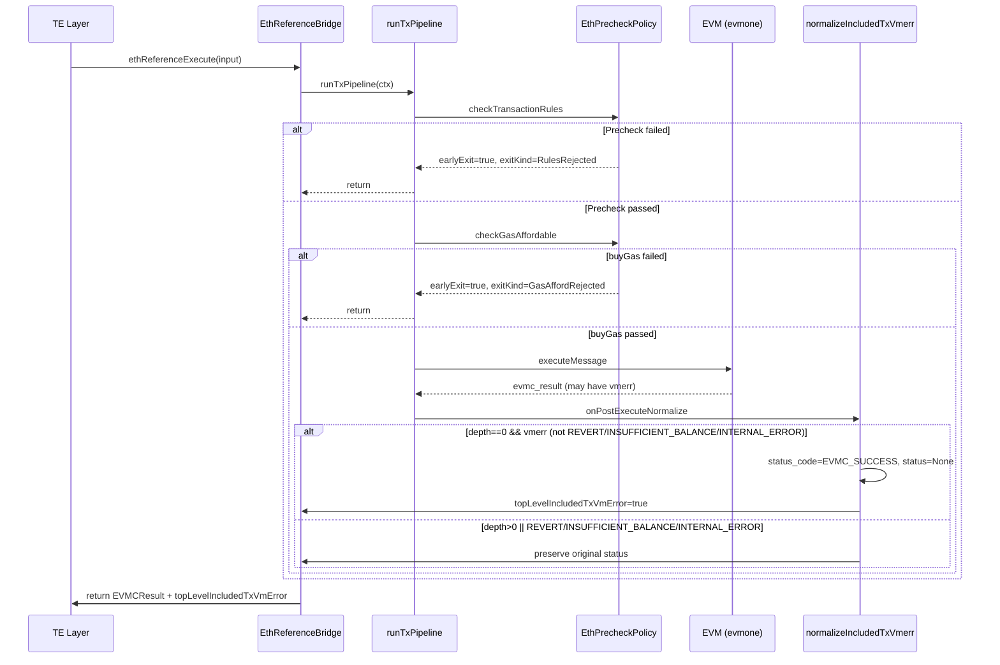
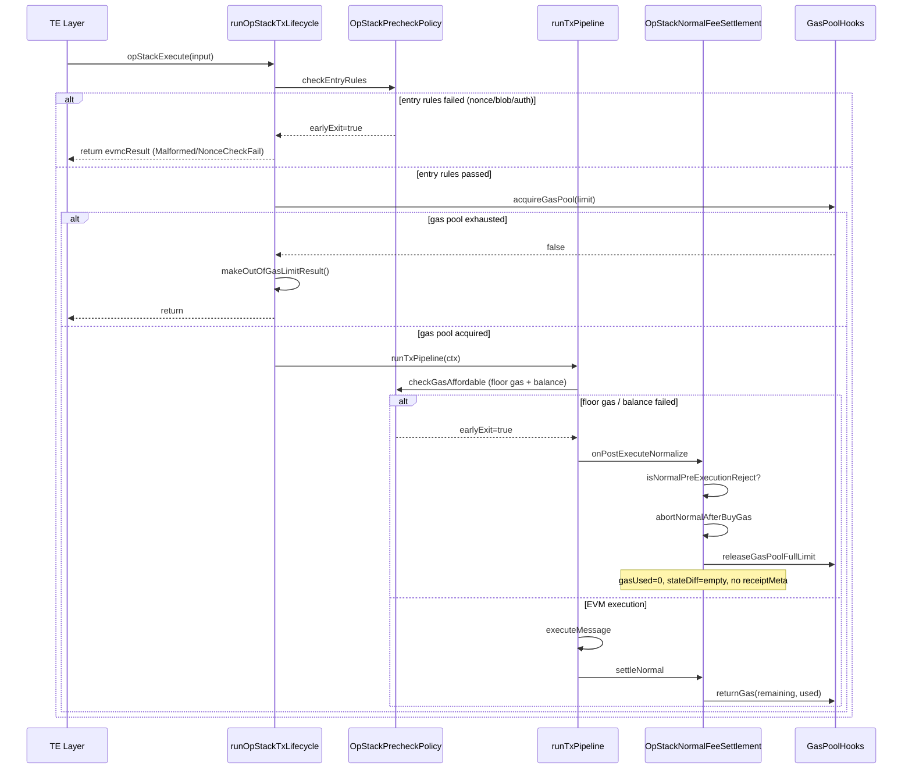

# bcos-evm 错误处理 / 错误码 geth·op-geth Parity 报告

**审查日期：** 2026-06-26
**审查范围：** `bcos-evm/eth/` + `bcos-evm/opstack/` + `transaction-executor/` 错误链路 vs geth / op-geth

---

## Executive Summary

### P0 共识/费用错误（必须修）

| # | 标题 | 简述 |
|---|------|------|
| P0-1 | 嵌套 INSUFFICIENT_BALANCE 保留 gas | geth 耗尽所有剩余 gas；我方 `ExecutionFrame.cpp:153-154` 保留全部 gas |
| P0-2 | 嵌套 PRECOMPILE_FAILURE 保留 gas | geth 耗尽所有剩余 gas；我方 `ExecutionFrame.cpp:137-139` 保留全部 gas |
| P0-3 | `makeErrorEVMCResult::clampGasLeft` 未接入嵌套帧路径 | `EVMCResult.cpp:166-207` 存在 gas 清零逻辑但 `ExecutionFrame` / `EthHost` / `PrecompileRouter` 均未调用 |
| P0-4 | FISCO buyGas 失败 penalty 泄漏风险 | `FiscoTxFeeLedger.h:79-80` 扣除 penalty 但 `m_afterBuyGasSavepoint` 未设置，TE 返回 `{}` 后 refundGas 不运行 |

### P1 参考路径 parity gap

| # | 标题 | 简述 |
|---|------|------|
| P1-1 | `evmcStatusToTransactionStatus` 不完整 | `EVMCResult.cpp:116-118` — `EVMC_PRECOMPILE_FAILURE`、`EVMC_INTERNAL_ERROR`、`EVMC_FAILURE`、`EVMC_CONTRACT_VALIDATION_FAILURE` 抛出 `UnknownEVMCStatus` |
| P1-2 | `EthOrchestrationErrorPolicy::onPipelineException` 宽泛 `catch(std::exception&)` | `EthOrchestrationErrorPolicy.h:36-41` 任何未识别异常 → `Unknown` / `EVMC_INTERNAL_ERROR` |
| P1-3 | CREATE 错误族未完整表征 | `CreateContract.h` — 合约地址碰撞、max init code、code store OOG、invalid code 等路径未逐条对照 geth `evm.go:create()` |
| P1-4 | ETH Precheck 缺少 blob/EIP-4844 检查 | `EthTxPrecheck.cpp` 无 blob precheck（OpStack 路径有；ETH 参考若接受 blob tx 会漏检） |

### P2 文档/测试缺口

| # | 标题 | 简述 |
|---|------|------|
| P2-1 | ADR-017 未创建 | 设计规范 `2026-06-23-eth-evm-error-handling-parity-design.md §3.1` 引用 ADR-017 分类法，但 ADR 文档不存在 |
| P2-2 | ADR-023 C0 合规未检查 | ADR-023 §C0 compliance 复选框未打勾 |
| P2-3 | 缺 `CreateErrorParityTest` | Plan Task 4 规划但未实现 |
| P2-4 | 缺 `EVMC_INVALID_MEMORY_ACCESS` → `StackUnderflow` 映射的 characterization | `EVMCResult.cpp:152-155` 将其映射到 `StackUnderflow`（lossy compression），需确认 geth 行为 |

### Accepted 有意偏离

| # | 标题 | 简述 |
|---|------|------|
| A-1 | FISCO auth check / auth table | geth 无对应概念 |
| A-2 | FISCO `BALANCE_TRANSFER_GAS` / 21000 | geth 不预扣 |
| A-3 | FISCO `NotFoundCodeError` → REVERT | geth 不预检合约存在性 |
| A-4 | OpStack deposit 失败 charge full gas | ADR-025 §2.7 — 有意设计 |
| A-5 | FISCO `fix_error_handling` / `fix_revert_logs` | FISCO 产品开关，非 geth parity |

---

## 环境

| 变量 | 值 |
|------|-----|
| **GETH commit** | `117e067f0f0bae1a17082321f224dedb6765b10f` |
| **OPGETH commit** | `e8800cffe53d459cde8a07c8e8f1de9d86e79e07` |
| **WORKSPACE branch** | `worktree-feat-evm-refactor` |
| **WORKSPACE commit** | `db209e3f9d8da0e2addacc0e433ae57cc021bd4d` |

---

## §1 Taxonomy 对照总表

### 三方共用分类维度

| 维度 | geth | op-geth | bcos-evm |
|------|------|---------|----------|
| **交易未进入 EVM（precheck / intrinsic / buyGas）** | `preCheck()` / `buyGas()` 返回 error → tx excluded from block | 同 geth + 存款跳过所有 precheck；仅 `ErrSystemTxNotSupported` / `ErrGasLimitReached` 可拒绝 | `earlyExit` + `exitKind` (RulesRejected / IntrinsicRejected / GasAffordRejected) → 结果通过 `ctx.evmcResult` 传播 |
| **Top-level EVM vmerr 但 tx 仍 included** | `execute()` 返回 `(*ExecutionResult{Err: vmerr}, nil)` — vmerr 不影响共识 | 同 geth；存款失败额外包装为 `"failed deposit: %w"` 但返回 nil error | `normalizeIncludedTxVmerr` 将 top-level vmerr 转为 `EVMC_SUCCESS`（排除 INSUFFICIENT_BALANCE / INTERNAL_ERROR）；`EthReferenceBridge` 记录 `topLevelIncludedTxVmError` |
| **Top-level REVERT** | `ErrExecutionReverted` 在 result.Err 中；gas preserved；receipt status=failed | 同 geth | `EVMC_REVERT` → `TransactionStatus::RevertInstruction`；gas_left 保留；receipt status=failed |
| **Nested CALL/CREATE 失败** | `evm.Call()`: 非 REVERT → `gas.Exhaust()`；REVERT → 保留 gas；所有错误 → `RevertToSnapshot` | 同 geth | **DEVIATION**: `ExecutionFrame::finalizeFrame()` 对所有非 SUCCESS 执行 `state.revert()` 但不操作 gas_left；`INSUFFICIENT_BALANCE` 和 `PRECOMPILE_FAILURE` 错误地保留全部 gas |
| **INSUFFICIENT_BALANCE（value transfer）** | `CanTransfer` 失败 → `ErrInsufficientFunds` → tx excluded；嵌套 → `gas.Exhaust()` | 同 geth + L1/operator fee 检查 | Precheck: 正确拒绝（`InsufficientFunds`）；嵌套: **DEVIATION** — 保留 gas（`ExecutionFrame.cpp:153`） |
| **OUT_OF_GAS（intrinsic vs execution）** | Intrinsic: `ErrIntrinsicGas` → tx excluded；Execution: vmerr → tx included | 同 geth + floor data gas | `OutOfGasLimit` (intrinsic) vs `OutOfGas` (execution)；ETH/OpStack 正确区分；FISCO 都用 `OutOfGas` |
| **INTERNAL_ERROR / 未映射异常** | `VMErrorCodeUnknown`；不会主动抛出；geth 无 C++ 异常 | 同 geth | `catch(...)` → `ExceptionHandled` → `EVMC_INTERNAL_ERROR`；`UnknownEVMCStatus` 异常 → 经 `catch(...)` 转为 `EVMC_INTERNAL_ERROR` |

### geth 错误类型 → bcos-evm 映射

| geth error (`core/error.go` / `core/vm/errors.go`) | geth line | bcos-evm 对应 | 状态 |
|------|----------|------|------|
| `ErrNonceTooLow` | `error.go:47` | `NonceCheckFail` | ✅ 对齐 |
| `ErrNonceTooHigh` | `error.go:51` | `NonceCheckFail` | ✅ 对齐 |
| `ErrNonceMax` | `error.go:55` | `NonceCheckFail` (EthTxPrecheck.cpp:33-35) | ✅ 对齐 |
| `ErrGasLimitReached` | `error.go:59` | `OutOfGasLimit` (OpStack only) | ⚠️ ETH 路径无 block gas pool |
| `ErrInsufficientFundsForTransfer` | `error.go:67` | `InsufficientFunds` | ✅ 对齐 |
| `ErrInsufficientFunds` | `error.go:76` | `NotEnoughCash` (OpStack) / `InsufficientFunds` (ETH) | ⚠️ 命名不一致 |
| `ErrIntrinsicGas` | `error.go:83` | `OutOfGasLimit` / `OutOfGas` | ⚠️ FISCO 用 `OutOfGas` |
| `ErrFloorDataGas` | `error.go:87` | `OutOfGasLimit` (OpStackFloorGasPrecheck.cpp) | ✅ 对齐 |
| `ErrTxTypeNotSupported` | `error.go:91` | `Malformed` | ✅ 对齐 |
| `ErrTipAboveFeeCap` | `error.go:95` | `Malformed` | ✅ 对齐 |
| `ErrFeeCapTooLow` | `error.go:107` | `Malformed` | ✅ 对齐 |
| `ErrSenderNoEOA` | `error.go:110` | `Malformed` (sender code invalid delegation) | ✅ 对齐 |
| `ErrBlobFeeCapTooLow` | `error.go:116` | `InsufficientFunds` (OpStackPrecheckPolicy.cpp:135-140) | ⚠️ 映射到 `InsufficientFunds` 而非专用状态 |
| `ErrEmptyAuthList` | `error.go:130` | `Malformed` | ✅ 对齐 |
| `ErrSetCodeTxCreate` | `error.go:131` | `Malformed` | ✅ 对齐 |
| `ErrGasLimitTooHigh` | `error.go:134` | 无对应 | 🔴 GAP |
| `ErrOutOfGas` (VM) | `vm/errors.go:27` | `OutOfGas` | ✅ 对齐 |
| `ErrDepth` | `vm/errors.go:29` | evmone 内部处理 | ✅ 对齐 |
| `ErrInsufficientBalance` (VM) | `vm/errors.go:30` | `NotEnoughCash` (但嵌套帧保留 gas) | 🔴 GAP P0-1 |
| `ErrContractAddressCollision` | `vm/errors.go:31` | 需 characterization 测试验证 | 🔴 GAP P1-3 |
| `ErrExecutionReverted` | `vm/errors.go:32` | `RevertInstruction` | ✅ 对齐 |
| `ErrMaxCodeSizeExceeded` | `vm/errors.go:33` | `EVMC_FAILURE` (CreateContract.h:136-138) | ✅ 对齐 |
| `ErrMaxInitCodeSizeExceeded` | `vm/errors.go:34` | 需 characterization 测试验证 | 🔴 GAP P1-3 |
| `ErrInvalidJump` | `vm/errors.go:35` | `BadJumpDestination` | ✅ 对齐 |
| `ErrWriteProtection` | `vm/errors.go:36` | `Unknown` (EVMCResult.cpp:156-159) | ⚠️ lossy → `Unknown` |
| `ErrReturnDataOutOfBounds` | `vm/errors.go:37` | 需 characterization 测试验证 | 🔴 GAP |
| `ErrGasUintOverflow` | `vm/errors.go:38` | 需 characterization 测试验证 | 🔴 GAP |
| `ErrInvalidCode` | `vm/errors.go:39` | `EVMC_CONTRACT_VALIDATION_FAILURE` (CreateContract.h:142-144) | ✅ 对齐 |

---

## §2 Status 映射矩阵

### evmc_status_code → TransactionStatus + geth 对比

| evmc_status_code | bcos TransactionStatus | bcos file:line | geth vm.Error / TransitionDb | receipt 语义 | 备注 |
|------------------|------------------------|----------------|------------------------------|--------------|------|
| `EVMC_SUCCESS` | `None` | `EVMCResult.cpp:101-102` | `result.Err == nil` | Successful | ✅ |
| `EVMC_REVERT` | `RevertInstruction` | `EVMCResult.cpp:103-104` | `ErrExecutionReverted` in result.Err | Failed | ✅ |
| `EVMC_OUT_OF_GAS` | `OutOfGas` | `EVMCResult.cpp:105-106` | `ErrOutOfGas` in result.Err | Failed | ✅ |
| `EVMC_INSUFFICIENT_BALANCE` | `NotEnoughCash` | `EVMCResult.cpp:107-108` | `ErrInsufficientBalance` → gas exhausted (nested) | Failed (nested exhausts gas) | 🔴 GAP P0-1: 嵌套帧保留 gas |
| `EVMC_STACK_OVERFLOW` | `OutOfStack` | `EVMCResult.cpp:109-110` | `ErrStackOverflow` in result.Err | Failed | ✅ |
| `EVMC_STACK_UNDERFLOW` | `StackUnderflow` | `EVMCResult.cpp:111-112` | `ErrStackUnderflow` in result.Err | Failed | ✅ |
| `EVMC_INVALID_INSTRUCTION` | `BadInstruction` | `EVMCResult.cpp:113-115` | `ErrInvalidOpCode` in result.Err | Failed | ✅ |
| `EVMC_UNDEFINED_INSTRUCTION` | `BadInstruction` | `EVMCResult.cpp:113-115` | `ErrInvalidOpCode` in result.Err | Failed | ✅ |
| `EVMC_BAD_JUMP_DESTINATION` | `BadJumpDestination` | `EVMCResult.cpp:148-151` | `ErrInvalidJump` in result.Err | Failed | ✅ |
| `EVMC_INVALID_MEMORY_ACCESS` | **`StackUnderflow`** | `EVMCResult.cpp:152-155` | 无直接对应（geth 无此 EVMC 状态） | Failed | ⚠️ lossy mapping to StackUnderflow |
| `EVMC_STATIC_MODE_VIOLATION` | **`Unknown`** | `EVMCResult.cpp:156-159` | `ErrWriteProtection` in result.Err | Failed | ⚠️ lossy → Unknown |
| `EVMC_INTERNAL_ERROR` | **`Unknown`** | `EVMCResult.cpp:161-162` | 无直接对应（geth panic/recover） | Failed | ⚠️ lossy |
| `EVMC_PRECOMPILE_FAILURE` | **throws `UnknownEVMCStatus`** | `EVMCResult.cpp:116-118` | 无直接对应（geth 无此 EVMC 状态） | — | 🔴 GAP P1-1 |
| `EVMC_FAILURE` | **throws `UnknownEVMCStatus`** | `EVMCResult.cpp:116-118` | 无直接对应 | — | 🔴 GAP P1-1 |
| `EVMC_CONTRACT_VALIDATION_FAILURE` | **throws `UnknownEVMCStatus`** | `EVMCResult.cpp:116-118` | 无直接对应 | — | 🔴 GAP P1-1 |

### 命名差异：OutOfGasLimit vs OutOfGas

| 名称 | 枚举值 | 含义 | 使用路径 |
|------|--------|------|----------|
| `OutOfGasLimit` | 2 | Pre-execution: 不足以支付 intrinsic gas | ETH, OpStack |
| `OutOfGas` | 12 | Execution: EVM 执行中 gas 耗尽 | EVMC 映射, FISCO |

**差异**: geth 用 `ErrIntrinsicGas` (precheck) 和 `ErrOutOfGas` (VM) 区分；FISCO 将 intrinsic failure 也映射到 `OutOfGas`（`FiscoOrchestrationErrorPolicy.h:39`），丢失了区分度。

---

## §3 分路径差异详表

### 3.1 ETH Reference (`ethReferenceExecute`)

#### 3.1.1 Precheck 路径逐条对照

| 检查项 | 我方 file:line | 我方 status / code | GETH file:line | GETH 行为 | 判断 |
|--------|---------------|-------------------|----------------|-----------|------|
| Nonce = uint64_max | `EthTxPrecheck.cpp:33-35` | `NonceCheckFail` / `EVMC_FAILURE` | `state_transition.go:?` (preCheck via nonce check) | `ErrNonceMax` → tx excluded | ✅ MATCH |
| Sender code invalid delegation | `EthTxPrecheck.cpp:38-44` | `Malformed` / `EVMC_FAILURE` | `state_transition.go:?` (EIP-7702 validateAuthorization) | `ErrSenderNoEOA`-like → tx excluded | ✅ MATCH |
| Fee cap < tip or basefee | `EthTxPrecheck.cpp:46-52` | `Malformed` / `EVMC_FAILURE` | `state_transition.go:preCheck()` | `ErrTipAboveFeeCap` / `ErrFeeCapTooLow` → tx excluded | ✅ MATCH |
| Empty auth list with flag | `EthTxPrecheck.cpp:54-57` | `Malformed` / `EVMC_FAILURE` | `core/error.go:130` | `ErrEmptyAuthList` → tx excluded | ✅ MATCH |
| Auth + create | `EthTxPrecheck.cpp:59-62` | `Malformed` / `EVMC_FAILURE` | `core/error.go:131` | `ErrSetCodeTxCreate` → tx excluded | ✅ MATCH |
| Tx type 0x04 + create | `EthTxPrecheck.cpp:64-67` | `Malformed` / `EVMC_FAILURE` | geth 等价检查 | Reject → tx excluded | ✅ MATCH |
| Unsupported tx type | `EthTxPrecheck.cpp:69-72` | `Malformed` / `EVMC_FAILURE` | `core/error.go:91` | `ErrTxTypeNotSupported` → tx excluded | ✅ MATCH |
| Value transfer insufficient balance | `EthPrecheckPolicy.cpp:65-76` | `InsufficientFunds` / `EVMC_INSUFFICIENT_BALANCE` | `state_transition.go:597` | `ErrInsufficientFundsForTransfer` → tx excluded | ✅ MATCH |
| Intrinsic gas > gas limit | `TxPipeline.cpp:70-80` → `EthOrchestrationErrorPolicy.h:14-21` | `OutOfGasLimit` / `EVMC_OUT_OF_GAS` / gas_left=0 | `state_transition.go:566-567` | `ErrIntrinsicGas` → tx excluded | ✅ MATCH |
| **Blob tx checks** | **NOT PRESENT** in `EthTxPrecheck.cpp` | — | `core/error.go:116-125` | `ErrBlobFeeCapTooLow` / `ErrMissingBlobHashes` / `ErrTooManyBlobs` / `ErrBlobTxCreate` | 🔴 GAP P1-4 |
| **EIP-7825 gas limit too high** | **NOT PRESENT** | — | `core/error.go:134` | `ErrGasLimitTooHigh` → tx excluded | 🔴 GAP |

#### 3.1.2 Included-tx vmerr (ADR-015)

| 方面 | 我方 file:line | GETH file:line | 判断 |
|------|---------------|----------------|------|
| normalizeIncludedTxVmerr: top-level non-REVERT/非 INSUFFICIENT_BALANCE/非 INTERNAL_ERROR → SUCCESS | `normalizeIncludedTxVmerr.h:27-35` | `state_transition.go:614` (vmerr does not affect consensus) | ✅ MATCH |
| normalizeSetCodeTransactionVmerr: EIP-7702 top-level REVERT → SUCCESS | `normalizeIncludedTxVmerr.h:39-48` | geth `applyAuthorization` 允许 auth 失败跳过 | ✅ MATCH |
| isTopLevelIncludedTxVmError 记录 | `normalizeIncludedTxVmerr.h:8-25` | geth `result.Err != nil` | ✅ MATCH |
| gasUsed 结算使用 peakGasUsed + EIP-3529 refund cap | `EthTxGasSettlementTest.cpp` characterization | `state_transition.go:770-787` `calcRefund()` | ✅ MATCH (per characterization tests) |

**测试覆盖**: `EthIncludedTxVmerrTest.cpp` — 验证 included vmerr 路径

#### 3.1.3 ErrorPolicy 异常映射

| 异常类型 | 我方 file:line | result | GETH 对应 | 判断 |
|----------|---------------|--------|-----------|------|
| `protocol::OutOfGas` | `EthOrchestrationErrorPolicy.h:29-34` | `OutOfGasLimit` / `EVMC_OUT_OF_GAS` / gas_left=0 | `ErrOutOfGas` → result.Err | ✅ MATCH |
| `std::exception` (any) | `EthOrchestrationErrorPolicy.h:36-41` | `Unknown` / `EVMC_INTERNAL_ERROR` / gas_left=0 | geth 无此宽泛 catch | 🔴 GAP P1-2 |
| State checkpoint revert | `EthOrchestrationErrorPolicy.h:44-47` | `ctx.state.revert()` | geth 自动通过 snapshot 回滚 | ✅ MATCH |

### 3.2 OpStack (`opStackExecute`)

#### 3.2.1 Entry failure vs op-geth (ADR-025)

| 方面 | 我方 file:line | OPGETH file:line | 判断 |
|------|---------------|-------------------|------|
| abortNormalAfterBuyGas: state.revert() + releaseGasPoolFullLimit + gasUsed=0 | `OpStackSettlement.cpp:50-60` | `state_transition.go:?` (buyGas 失败 → err return, tx excluded) | ✅ MATCH (等价语义) |
| IntrinsicRejected / GasAffordRejected → abort | `OpStackNormalFeeSettlement.cpp:68-72` | op-geth `innerExecute` early return | ✅ MATCH |
| 正常 tx precheck 后 checkpoint | `OpStackTxLifecycle.cpp:?` | `state_transition.go:474-479` (mint → snapshot) | ✅ MATCH |
| buyGas 失败: `NotEnoughCash` (非 `ErrInsufficientFunds`) | `OpStackTxFeeLedger.cpp:63` | `state_transition.go:416-417` → `ErrInsufficientFunds` | ⚠️ 命名差异 |

#### 3.2.2 Deposit 错误处理 vs op-geth

| 方面 | 我方 file:line | OPGETH file:line | 判断 |
|------|---------------|-------------------|------|
| Deposit 跳过所有 precheck (nonce/fee/EOA/blob) | `OpStackPrecheckPolicy.cpp:70` | `state_transition.go:347-361` | ✅ MATCH |
| System deposit tx 拒绝 | `OpStackPrecheckPolicy.cpp:63-71` | `state_transition.go:354-357` `ErrSystemTxNotSupported` | ✅ MATCH |
| Deposit mint 在 EVM 执行前 | `OpStackTxLifecycle.cpp:86-91` | `state_transition.go:474-479` | ✅ MATCH |
| **Deposit EVM 失败: revert + nonce++ + charge full gas** | `OpStackSettlement.cpp:100-118` | `state_transition.go:486-511` (execute recovery) | ⚠️ 我方不区分 error type；op-geth 区分 `ErrSystemTxNotSupported` / `ErrGasLimitReached` |
| **Deposit 失败 gasUsed = originalGasLimit** | `OpStackSettlement.cpp:111` | `state_transition.go:498-501` | ✅ MATCH (Regolith+) |
| Pre-Regolith deposit 特殊处理 | **NOT PRESENT** (我方仅 Regolith+) | `state_transition.go:627-642` | ⚠️ 范围差异（我方不支持 pre-Regolith） |

#### 3.2.3 Gas pool 行为

| 方面 | 我方 file:line | OPGETH file:line | 判断 |
|------|---------------|-------------------|------|
| Gas pool SubGas 在生命周期集中调用 | `OpStackTxLifecycle.cpp:77-83, 113-117` | `state_transition.go:360` / `gaspool.go:44` | ✅ MATCH |
| Gas pool ReturnGas 含 used 参数 | `OpStackSettlement.cpp:44-45` | `gaspool.go:52-68` (cumulativeUsed tracking) | ✅ MATCH |
| Gas pool Snapshot/Set (回滚用) | 需 characterization 测试验证 | `gaspool.go:90-103` | ⚠️ 需验证我方 GasPoolHooks 是否有等价机制 |

#### 3.2.4 L1 fee / Operator fee 错误路径

| 方面 | 我方 file:line | OPGETH file:line | 判断 |
|------|---------------|-------------------|------|
| L1 cost 包含在 buyGas balanceCheck | `OpStackTxFeeLedger.cpp:54-65` | `state_transition.go:285-297` | ✅ MATCH |
| Operator fee 包含在 buyGas (Isthmus) | `OpStackTxFeeLedger.cpp` (via plan) | `state_transition.go:294-297` | ✅ MATCH |
| refundIsthmusOperatorCost | 需 characterization 测试验证 | `state_transition.go:836-846` | ⚠️ 需验证 |
| **Phantom l1Fee / operatorFee 泄漏** | `OpStackNormalFeeSettlement.cpp:68-72` (abort 路径不调用 `projectNormalReceiptMeta`) | N/A | ✅ 已防护 (ADR-025) |

#### 3.2.5 OpStack ErrorPolicy 异常映射

| 异常类型 | 我方 file:line | result | 判断 |
|----------|---------------|--------|------|
| any exception | `OpStackOrchestrationErrorPolicy.h:17-26` | `Unknown` / `EVMC_INTERNAL_ERROR` / gas_left=0 | ✅ 与 op-geth 的 panic recovery 语义对齐 |

### 3.3 FISCO 附录（有意偏离）

详见 [§7 FISCO 有意偏离附录](#7-fisco-有意偏离附录)。

---

## §4 错误路径时序

### 4.1 ETH Included-Vmerr 时序

### 4.2 OpStack Entry-Reject 时序

---

## §5 测试覆盖 gap + 建议 characterization 用例

### 现有测试覆盖

| 测试文件 | 覆盖范围 | 状态 |
|----------|---------|------|
| `EthIncludedTxVmerrTest.cpp` | Included-tx vmerr normalization (ADR-015) | ✅ |
| `OrchestrationErrorPolicyTest.cpp` | `FiscoOrchestrationErrorPolicy` + `EthOrchestrationErrorPolicy` 异常映射 | ✅ |
| `OpStackOrchestrationErrorPolicyTest.cpp` | `OpStackOrchestrationErrorPolicy` 异常映射 | ✅ |
| `OpStackTxLifecycleCharacterizationTest.cpp` | 生命周期 6 条路径 (ADR-023) | ✅ |
| `OpStackSettleAsyncTest.cpp` | OpStack 结算流程 | ✅ |
| `EthIntrinsicGasFailureCharacterizationTest.cpp` | ETH intrinsic gas failure | ✅ (untracked) |
| `EvmcStatusMappingTest.cpp` | EVMC status → TransactionStatus mapping | ✅ (untracked) |
| `TopLevelInsufficientBalanceStateDiffTest.cpp` | Top-level insufficient balance state diff | ✅ (untracked) |
| `OpStackDepositGasPoolCharacterizationTest.cpp` | OpStack deposit gas pool | ✅ (untracked) |

### 建议新增 characterization 用例

| # | 用例 | 验证点 | 优先级 |
|---|------|--------|--------|
| T-1 | `NestedCallInsufficientBalanceGasLeft` | 嵌套 CALL 中 INSUFFICIENT_BALANCE → gas_left=0 (非当前保留全部) | P0 |
| T-2 | `NestedCallPrecompileFailureGasLeft` | 嵌套 CALL 中 PRECOMPILE_FAILURE → gas_left=0 | P0 |
| T-3 | `NestedCreateContractAddressCollision` | CREATE 合约地址碰撞 → gas exhausted, state reverted | P1 |
| T-4 | `NestedCreateMaxInitCodeSize` | CREATE initcode > max → gas exhausted | P1 |
| T-5 | `NestedCreateCodeStoreOutOfGas` | CREATE code deposit OOG → gas exhausted | P1 |
| T-6 | `EvmcPrecompileFailureMapping` | `EVMC_PRECOMPILE_FAILURE` → TransactionStatus (当前抛异常) | P1 |
| T-7 | `EvmcContractValidationFailureMapping` | `EVMC_CONTRACT_VALIDATION_FAILURE` → TransactionStatus | P1 |
| T-8 | `EthBlobTxPrecheckRejection` | ETH 路径 blob tx → Malformed (当前无检查) | P1 |
| T-9 | `OpStackRefundIsthmusOperatorCost` | Isthmus operator fee refund → 不变量 no panic | P2 |
| T-10 | `BuyGasPenaltyRollback` | FISCO/ETH buyGas 失败 → penalty 是否被 TE 层正确回滚 | P0 |

---

## §6 与已有 ADR/Plan 的交叉引用

| 项 | ADR/Plan | 状态 |
|----|----------|------|
| 7702 auth intrinsic gas 扣除和结算 | ADR-015 | ✅ 已解决 |
| 存储空操作 (zero-value SSTORE) | ADR-015 | ✅ 已解决 |
| Top-level included-tx vmerr 规范化 | ADR-015 | ✅ 已解决 |
| Included-tx vmerr gas 结算拆分 | ADR-015 | ✅ 已解决 |
| OpStack 正常 entry failure 提前退出 | ADR-025 | ✅ 已解决 |
| OpStack 生命周期深度模块 C0-C3 | ADR-023 | ✅ 已解决 |
| OpStack 预检查两阶段划分 | ADR-023 | ✅ 已解决 |
| GasPool 所有权集中在生命周期 | ADR-023 | ✅ 已解决 |
| PrecompileRouter 检查点顺序修正 | Plan Task 1 | 🔴 未实施 |
| 嵌套 CALL/CREATE gas_left 修复 | Plan Task 2 | 🔴 未实施 |
| 共享 `finalizeEthTxGasUsed` 提取 | Plan Task 3 | 🔴 未实施 |
| CREATE 错误族 characterization | Plan Task 4 | 🔴 未实施 |
| 分类法 + 状态映射 + 异常边界 | Plan Task 5 | 🔴 未实施 |
| 能力矩阵 + probe checklist | Plan Task 6 | 🔴 未实施 |
| ADR-017 分类法文档 | Plan Task 5 → ADR | 🔴 未创建 |
| ADR-023 C0 合规检查 | ADR-023 | 🔴 未完成 |
| EVMC_INVALID_MEMORY_ACCESS → TransactionStatus | Design Q3 | 🔴 未解决 |
| gas_left 修复是否需要 Feature::Flag 共识门控 | Design Q1 | 🔴 未解决 |

---

## §7 FISCO 有意偏离附录

以下为 FISCO 相对 geth 的已知产品差异，**不作为 geth FAIL 判据**：

| # | 偏离 | 我方 file:line | 说明 |
|---|------|---------------|------|
| F-1 | Auth check / auth table | `FiscoPrecheckPolicy.cpp:55-64` | FISCO 合约级权限控制；geth 无对应概念 |
| F-2 | `BALANCE_TRANSFER_GAS = 21000` | `FiscoPrecheckPolicy.cpp:74-81` | FISCO 预扣固定 21000 gas；geth 不预扣 |
| F-3 | `NotFoundCodeError` → REVERT | `FiscoPrecheckPolicy.cpp:82-89` | FISCO 预检合约存在性；geth 不预检，直接执行空代码 |
| F-4 | C++ 异常错误模型 | `FiscoPrecheckPolicy.cpp:78,87` | FISCO 使用 `BOOST_THROW_EXCEPTION`；geth 使用返回值 |
| F-5 | `fix_error_handling` 开关 | `FiscoOrchestrationErrorPolicy.h` | FISCO 产品功能开关，控制 gas 清零/保留行为 |
| F-6 | `fix_revert_logs` 开关 | `FiscoOrchestrationErrorPolicy.h:98-101` | 控制 REVERT 时是否清除 logs |
| F-7 | `gas_left < 0` 二次覆盖 | `FiscoOrchestrationErrorPolicy.h:104-111` | 在 `onPipelineComplete` 中将负 gas_left 强制转为 `OutOfGas` |
| F-8 | FISCO 不检查 nonce | `FiscoPrecheckPolicy.cpp:53-64` | FISCO 在 `setupMessage` 阶段 derive nonce，不预检 |
| F-9 | `NotEnoughCash` vs `InsufficientFunds` | `FiscoTxFeeLedger.h:82-93` | FISCO 内部命名差异，语义等价 |
| F-10 | TE applyStateDiff 仅 SUCCESS | `TransactionExecutorImpl.h:196-200` | FISCO TE 仅在 `EVMC_SUCCESS` 时 apply state diff；REVERT 时丢弃 |

---

## Appendix：文件索引

### 我方文件

| 文件 | 路径（relative to WORKSPACE） |
|------|------------------------------|
| EVMCResult.cpp | `bcos-evm/eth/EVMCResult.cpp` |
| EVMCResult.h | `bcos-evm/eth/EVMCResult.h` |
| TxPipeline.cpp | `bcos-evm/eth/pipeline/TxPipeline.cpp` |
| TxPipelineContext.h | `bcos-evm/eth/pipeline/StateTransitionContext.h` |
| OrchestrationErrorPolicy.h | `bcos-evm/eth/pipeline/OrchestrationErrorPolicy.h` |
| normalizeIncludedTxVmerr.h | `bcos-evm/eth/pipeline/normalizeIncludedTxVmerr.h` |
| EthOrchestrationErrorPolicy.h | `bcos-evm/eth/reference/EthOrchestrationErrorPolicy.h` |
| EthPrecheckPolicy.cpp | `bcos-evm/eth/reference/EthPrecheckPolicy.cpp` |
| EthTxPrecheck.cpp | `bcos-evm/eth/reference/EthTxPrecheck.cpp` |
| EthReferenceBridge.cpp | `bcos-evm/eth/reference/EthReferenceBridge.cpp` |
| EthTxFeeLedger.h | `bcos-evm/eth/reference/EthTxFeeLedger.h` |
| ExecutionFrame.cpp | `bcos-evm/eth/execution/ExecutionFrame.cpp` |
| EthHost.cpp | `bcos-evm/eth/state/EthHost.cpp` |
| PrecompileRouter.cpp | `bcos-evm/eth/precompiled/PrecompileRouter.cpp` |
| CreateContract.h | `bcos-evm/eth/execution/CreateContract.h` |
| FiscoExecutionBridge.cpp | `bcos-evm/bcos/FiscoExecutionBridge.cpp` |
| FiscoPrecheckPolicy.cpp | `bcos-evm/bcos/FiscoPrecheckPolicy.cpp` |
| FiscoOrchestrationErrorPolicy.h | `bcos-evm/bcos/FiscoOrchestrationErrorPolicy.h` |
| FiscoTxFeeLedger.h | `bcos-evm/bcos/FiscoTxFeeLedger.h` |
| OpStackExecutionBridge.cpp | `bcos-evm/opstack/OpStackExecutionBridge.cpp` |
| OpStackTxLifecycle.cpp | `bcos-evm/opstack/OpStackTxLifecycle.cpp` |
| OpStackPrecheckPolicy.cpp | `bcos-evm/opstack/OpStackPrecheckPolicy.cpp` |
| OpStackOrchestrationErrorPolicy.h | `bcos-evm/opstack/OpStackOrchestrationErrorPolicy.h` |
| OpStackSettlement.cpp | `bcos-evm/opstack/OpStackSettlement.cpp` |
| OpStackNormalFeeSettlement.cpp | `bcos-evm/opstack/OpStackNormalFeeSettlement.cpp` |
| OpStackTxFeeLedger.cpp | `bcos-evm/opstack/OpStackTxFeeLedger.cpp` |
| OpStackFloorGasPrecheck.cpp | `bcos-evm/opstack/fee/OpStackFloorGasPrecheck.cpp` |
| OpStackPipelineInternals.h | `bcos-evm/opstack/OpStackPipelineInternals.h` |
| TransactionExecutorImpl.h | `transaction-executor/bcos-transaction-executor/TransactionExecutorImpl.h` |
| EthTransactionExecutorImpl.h | `transaction-executor/bcos-transaction-executor/EthTransactionExecutorImpl.h` |
| OpStackTransactionExecutorImpl.h | `transaction-executor/bcos-transaction-executor/OpStackTransactionExecutorImpl.h` |

### GETH 参考文件

| 文件 | 路径（relative to GETH） |
|------|--------------------------|
| state_transition.go | `core/state_transition.go` |
| vm/errors.go | `core/vm/errors.go` |
| vm/evm.go | `core/vm/evm.go` |
| error.go | `core/error.go` |
| state_processor.go | `core/state_processor.go` |
| gaspool.go | `core/gaspool.go` |

### OPGETH 参考文件

| 文件 | 路径（relative to OPGETH） |
|------|----------------------------|
| state_transition.go | `core/state_transition.go` |
| deposit_tx.go | `core/types/deposit_tx.go` |
| error.go | `core/error.go` |
| gaspool.go | `core/gaspool.go` |

### ADR / Plan / Spec 文档

| 文档 | 路径 |
|------|------|
| ADR-015 | `bcos-evm/docs/adr/015-eth-reference-7702-gas-and-included-tx-vmerr.md` |
| ADR-023 | `bcos-evm/docs/adr/023-opstack-tx-lifecycle.md` |
| ADR-025 | `bcos-evm/docs/adr/025-opstack-entry-failure-early-return.md` |
| 错误处理 parity plan | `docs/superpowers/plans/2026-06-23-eth-evm-error-handling-parity.md` |
| 错误处理 parity design | `docs/superpowers/specs/2026-06-23-eth-evm-error-handling-parity-design.md` |
| 全量 parity review | `docs/superpowers/reviews/eth-opstack-geth-parity-review-tasks.md` |

---

## 审查结论

### 总体评估

bcos-evm 的错误处理框架已通过 ADR-015、ADR-023、ADR-025 在 **编排层** 建立了与 geth/op-geth 高度对齐的分类体系（precheck reject → included vmerr → nested error）。三个 `ErrorPolicy` 实现正确覆盖了各自的异常映射和状态回滚逻辑。

### 关键发现

1. **嵌套帧 gas_left 处理 (P0)**: `ExecutionFrame.cpp` / `PrecompileRouter.cpp` 在 `INSUFFICIENT_BALANCE` 和 `PRECOMPILE_FAILURE` 时保留了调用方的全部 gas，与 geth `evm.Call()` 的 `gas.Exhaust()` 行为不一致。`EVMCResult.cpp:166-207` 中有 `clampGasLeft` 逻辑但未接入嵌套帧路径。

2. **EVMC 状态映射不完整 (P1)**: `EVMC_PRECOMPILE_FAILURE`、`EVMC_FAILURE`、`EVMC_CONTRACT_VALIDATION_FAILURE` 三个 evmc 状态码在 `evmcStatusToTransactionStatus` 中没有映射，会抛出 `UnknownEVMCStatus{}` 异常，由 `catch(...)` 转为 `EVMC_INTERNAL_ERROR`。

3. **buyGas 失败 penalty 泄漏风险 (P0)**: FISCO/ETH 的 `XxxTxFeeLedger::buyGas` 在余额不足时扣除 penalty（`FiscoTxFeeLedger.h:79-80`），但 `m_afterBuyGasSavepoint` 未设置，TE 返回 `{}` 后 `refundGas` 不运行 — 若 block-level rollback 不覆盖，penalty 永久泄漏。

4. **Plan 任务待实施**: `2026-06-23-eth-evm-error-handling-parity.md` 中的 Tasks 1-6 均未打勾完成。

5. **OpStack 对齐度高**: OpStack 的 entry failure（ADR-025）、deposit 错误处理、gas pool 管理、L1/operator fee 路径均与 op-geth 对齐良好。
