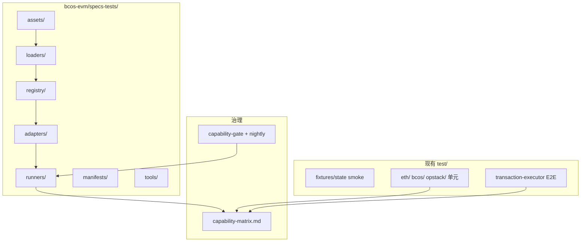

# bcos-evm 测试体系设计规格

**日期：** 2026-06-21  
**状态：** 待评审（v2，已吸收 subagent 审查意见）  
**类型：** 长期测试基础设施（非一次性审计）  
**相关：** ADR-001、`capability-matrix.md`、`capability-gate.yml`、geth `tests/`、op-geth `core/types/*_test.go`

---

## 1. 背景与目标

### 1.1 背景

`bcos-evm` 采用三路径模型（ADR-001）：

| 路径 | 编排入口 | 金标准 |
|------|----------|--------|
| ETH (reference) | `executeViaEth` | geth + ethereum/tests + EEST |
| BCOS (TE baseline) | `executeViaHost` | 共享 kernel + documented deviation |
| OPStack (TE baseline) | `opStackExecuteViaHost` | 共享 kernel + op-geth literal |

当前测试以 hand-crafted JSON smoke（`test/fixtures/state/`）、按 EIP 单元测试（`test/eth/`、`test/opstack/`）和 TE E2E fixture 为主。**尚未**接入 geth 使用的 GeneralStateTests / execution-spec-tests（EEST），OPStack literal 部分靠手工移植，存在 drift 风险。

### 1.2 设计决策摘要（brainstorming 冻结）

| 项 | 决策 |
|----|------|
| 成功标准 | **向量合规**（GST/EEST）+ **capability-matrix 治理** |
| CI | PR 不设时间上限；**nightly 跑全量** GST/EEST |
| Revision 范围 | **Cancun + Prague + Osaka**；架构须可扩展后续 fork |
| Osaka 路径 | **Phase 1** 仅 `executeViaEth`；**Phase 2** 扩 BCOS baseline |
| 架构选型 | **统一 Runner + 多 PathAdapter**；OPStack literal 用 **op-geth golden 自动导出** |
| 目录 | **独立顶层模块 `bcos-evm/specs-tests/`**（见 §4） |
| 实施顺序 | **先 Ethereum/geth 向量迁移，再 OPStack/op-geth golden** |

### 1.3 目标

1. `executeViaEth` 与 geth 在 GST/EEST 向量上行为一致（最终断言 `expectException + state root + logs hash`）。
2. OPStack 编排层与 op-geth 在 rollup cost、receipt、deposit 等 literal 上一致。
3. BCOS/OPStack baseline 按 capability-matrix 行逐步补测；deviation 有专项正向断言。
4. 新 fork（Amsterdam、Jovian、BPO…）通过 **Registry 插件** 扩展，不重写 runner 核心。

### 1.4 非目标

- legacy `bcos-executor` / DAG / `HostContext`（ADR-001 out of scope）
- 深度审计 evmone 内部 opcode（仅审 revision 传递与 Host 边界）
- Phase 1 不要求 EEST、OPStack golden、BCOS/OPStack baseline adapter 或 BlockchainTests 全量
- 不以 Go differential 作为唯一合规手段（仅 OPStack golden 辅助）

---

## 2. 参考：geth / op-geth 测试体系

### 2.1 geth 分层

| 层 | 机制 | 入口 |
|----|------|------|
| 官方 JSON | `tests/testdata/` submodule | `TestState`, `TestBlockchain`, `TestTransaction` |
| EEST | `tests/spec-tests/` CI 下载 | `TestExecutionSpecState` 等 |
| Fork 映射 | `tests/init.go` `Forks` map | 每个 `post.<fork>` → `ChainConfig` |
| 过滤 | `testMatcher` skip/slow | `init_test.go` |
| VM 单元 | `core/vm/contracts_test.go` + JSON | 预编译向量 |

### 2.2 op-geth 增量

继承 geth `tests/` 包，并增加：

| 文件 | 内容 |
|------|------|
| `core/types/rollup_cost_test.go` | L1 cost / operator fee literal |
| `core/types/receipt_opstack_test.go` | deposit / Isthmus receipt RLP |
| `core/txpool/legacypool/legacypool_opstack_test.go` | rollup 余额扣款 |
| `params/config_test.go` | `PragueTime == IsthmusTime` 等 |

bcos-evm 对应：**GST runner** 对齐 geth；**golden JSON** 对齐 op-geth 单元测试 literal。

---

## 2.3 Upstream Pins

所有外部测试资产必须可复现，禁止在 CMake configure 阶段隐式联网下载。

| 资产 | 获取方式 | Pin 元数据 |
|------|----------|------------|
| geth reference | 只读本地路径或 tag/commit 记录 | tag、commit、路径 |
| op-geth reference | 只读本地路径或 tag/commit 记录 | tag、commit、路径 |
| `ethereum/tests` | `specs-tests/assets/ethereum-tests` submodule 或 `ETHEREUM_TESTS_ROOT` 覆盖 | submodule commit |
| EEST | CI 下载 release fixture tarball 到 `specs-tests/assets/eest` 或 `EEST_ROOT` 覆盖 | release version、URL、SHA256 |
| op-geth golden | committed JSON + metadata | op-geth commit、source file、source test、generator version |

建议 pin 文件：

```
bcos-evm/specs-tests/assets/upstream-pins.json
```

nightly 只执行 `--check` 验证资产与 pin/golden 一致；升级上游必须走单独 PR，包含 pin diff、golden diff 与 matrix 影响说明。

---

## 3. 总体架构



**库边界：** `bcos-evm-specs-tests-core` 静态库承载 loader、registry、assert schema、manifest 与 golden loader；路径 adapter 拆为 `bcos-evm-specs-tests-eth`、`bcos-specs-tests-bcos`、`bcos-specs-tests-opstack`，runner 只链接对应 adapter。

---

## 3.1 证据语义（必须区分）

同一套上游向量可以复用 loader，但**不能复用证明语义**。所有 runner、manifest 与 matrix Test ref 必须标注以下证据类型之一：

| Evidence kind | 路径 | 含义 | 可证明 |
|---------------|------|------|--------|
| `ReferenceParity` | `executeViaEth` | 与 geth / EEST reference 行为一致 | ETH reference 合规 |
| `BaselineReachability` | `executeViaHost` / `opStackExecuteViaHost` | 对应 TE baseline 能触达共享 kernel 或编排能力 | BCOS/OPStack baseline 可达 |
| `DeviationAssertion` | BCOS/OPStack documented deviation | 正向断言本项目有意偏离 | matrix `deviation` 行 |
| `UpstreamLiteralParity` | OPStack golden | 与 op-geth 单元测试 literal / behavior 一致 | OPStack 编排 literal parity |

**禁止规则：** `ReferenceParity` 不能作为 BCOS/OPStack baseline 证明；baseline 证据必须由对应 PathAdapter 或 TE E2E 产生。

---

## 4. 独立目录：`bcos-evm/specs-tests/`

### 4.1 为何独立顶层目录

- **可识别**：与 `eth/`、`opstack/`、`bcos/` 并列，一眼可知「对齐 geth / op-geth 参考测试资产的基础设施」。
- **可扩展**：新 fork、新向量源、新 PathAdapter 只在本树内增文件；不污染 `test/` 里既有 smoke/单元测试。
- **可打包**：未来可单独 `add_subdirectory(specs-tests)` 或在 CI 只构建 reference-test 目标。

### 4.2 目录树（规范）

```
bcos-evm/specs-tests/
├── README.md                 # 模块说明、扩展 fork 操作指南
├── CMakeLists.txt            # bcos-specs-tests-* 库 + runners
├── assets/
│   ├── upstream-pins.json    # geth/op-geth/ethereum-tests/EEST pin 元数据
│   ├── ethereum-tests/       # git submodule → github.com/ethereum/tests
│   ├── eest/                 # CI 下载 execution-spec-tests（版本 pin）
│   └── op-geth-golden/       # 从 op-geth 测试导出的 JSON literal
├── include/bcos-evm/specs-tests/
│   ├── GeneralStateTestLoader.h
│   ├── EestStateTestLoader.h
│   ├── ForkRegistry.h
│   ├── StateTestMatcher.h
│   ├── StateTestAssert.h
│   ├── PathAdapter.h
│   ├── ExecuteViaEthAdapter.h
│   ├── ExecuteViaHostAdapter.h      # P4
│   └── OpStackAdapter.h             # P6
├── src/                      # 上述头文件实现
│   ├── GeneralStateTestLoader.cpp
│   ├── ForkProfileRegistry.cpp
│   └── ...
├── runners/                  # ctest 可执行入口（薄包装）
│   ├── EthGeneralStateTests.cpp
│   ├── EthExecutionSpecTests.cpp    # P3
│   ├── BcosGeneralStateTests.cpp    # P4
│   └── OpStackGeneralStateTests.cpp # P6
├── manifests/                # curated/full evidence 列表（按 fork/EIP/path）
│   ├── schema.json
│   ├── eth-gst-cancun-smoke.json
│   ├── eth-gst-prague-smoke.json
│   ├── eth-gst-osaka-smoke.json
│   └── expectations.json     # skip / known_diff / deviation / quarantine
└── tools/
    ├── manifest_lint.py
    ├── export_opgeth_golden.go
    └── regenerate_golden.sh
```

### 4.3 与 `bcos-evm/test/` 的分工

| 位置 | 职责 |
|------|------|
| **`bcos-evm/specs-tests/`** | 对外向量 runner、fork registry、path adapter、golden、manifest |
| **`bcos-evm/test/`** | 现有 smoke fixture、按 EIP 单元测试、Host/State 细粒度测试 |
| **`transaction-executor/tests/`** | TE 级 E2E（OPStack 全流程） |

**迁移原则：** `ExecuteViaEthFixtureTest` 等价状态向量被 GST 覆盖后可降为 `smoke` label；但保留最小 reference wiring smoke / input-contract suite，用来审计 `ExecuteMessageInput` 字段传递。**不**在 `test/fixtures/` 复制官方 GST JSON。

### 4.4 CMake 集成

```cmake
# bcos-evm/CMakeLists.txt
option(BCOS_EVM_SPECS_TESTS "Build EVM reference test runners" OFF)
if(TESTS AND BCOS_EVM_SPECS_TESTS)
    add_subdirectory(specs-tests)
endif()

# bcos-evm/specs-tests/CMakeLists.txt
add_library(bcos-evm-specs-tests-core STATIC ...)
add_library(bcos-evm-specs-tests-eth STATIC ...)
target_link_libraries(bcos-evm-specs-tests-eth PRIVATE
    bcos-evm-specs-tests-core bcos-evm-eth ...)
# runners → add_test with LABELS
```

根 `ctest` 可通过 `ctest -L specs-tests` 只跑参考测试套件。

规则：

- 默认构建不启用 `specs-tests`。
- CMake configure 阶段不下载 GST/EEST/op-geth 资产；CI 或开发者先准备路径。
- smoke/full 必须是不同 `add_test` 入口，例如 `EthGSTSmoke --manifest ...` 与 `EthGSTFull --root ...`，不能只靠 runner 内部开关。

---

## 5. 核心组件

### 5.1 GeneralStateTestLoader

- 解析 **官方** GST JSON（`env`, `pre`, `transaction`, `post.<fork>[]`）。
- 输出 `StateTestCase` + `StateSubtest{fork, dataIndex, gasIndex, valueIndex}`。
- 与现有 `EthStateFixtureLoader`（简化 smoke 格式）**并存**，不合并解析器。

### 5.2 ForkProfileRegistry（fork 扩展点）

Registry 不只是 fork 名到 `RevisionConfig` 的映射，而是 **fork/profile/capability/path** 的结构化元数据。它对照 geth `tests/init.go` `Forks` map，同时允许 OPStack profile 映射（如 Prague → Isthmus）。

```cpp
struct ForkProfile {
    std::string profileId;                     // "eth-prague", "eth-osaka", "op-isthmus"
    std::string canonicalName;                 // "Prague", "Osaka", "Isthmus"
    std::vector<std::string> aliases;          // upstream transition fork / OP mapping
    std::string upstreamForkName;              // GST/EEST post.<fork> 名
    bcos::evm_standard::RevisionConfig revision;
    std::vector<std::string> activatedEips;    // "EIP-7702", "EIP-7823", ...
    std::vector<std::string> capabilityRows;   // capabilityRowId
    std::vector<PathProfile> pathProfiles;      // 按 path/capability 开启，不按整 fork 全开
};
```

`PathProfile` 必须表达证据语义：

| 字段 | 示例 | 说明 |
|------|------|------|
| `path` | `Reference` | ADR-001 路径 |
| `evidenceKind` | `ReferenceParity` | 见 §3.1 |
| `enabledCapabilityRows` | `["eip7702-auth-apply"]` | 按 capability row 打开 |
| `unsupportedReason` | `OPStack Isthmus does not enable Osaka` | 未启用原因 |

**新增 fork 检查清单（写进 `specs-tests/README.md`）：**

1. 在 `ForkProfileRegistry.cpp` 增加 `ForkProfile`
2. 更新 `RevisionConfigProfileTest`，验证 Registry 中对应 profile
3. 增加或更新 `manifests/*.json`
4. 更新 `capability-matrix.md` 相关行 Test ref / `capabilityRowId`
5. 如需 skip/known_diff/deviation，更新 `manifests/expectations.json` 并绑定 ADR/issue
6. 运行 `manifest_lint.py` 校验 matrix ↔ manifest ↔ registry

Phase 1 注册：**eth-cancun、eth-prague、eth-osaka**。`eth-osaka` 仅启用 `ReferenceParity`；Phase 2 才为 BCOS baseline 增加 Osaka capability path profile。

### 5.3 StateTestMatcher

移植 geth `initMatcher` / `state_test.go` 中 skip 规则，但不能 silent skip。所有 skip、known diff、deviation、quarantine 都必须进入 `manifests/expectations.json`，并绑定来源与责任。

- `^stEOF/`、`RevertInCreateInInit`、`InitCollisionParis`
- `^stTimeConsuming/`、超大 memory case
- evmone 已知差异 case → `known_diff`（字段级、case 级、path 级）

`expectations.json` 结构示例：

```json
{
  "caseId": "gst:GeneralStateTests/stExample/...:Prague:0",
  "expectationKind": "known_diff",
  "reasonClass": "evmone-gas-delta",
  "affectedFields": ["gasUsed"],
  "paths": ["Reference"],
  "capabilityRows": ["eip2929-runtime-warm"],
  "source": "local",
  "issueOrAdr": "ADR-001",
  "reviewBy": "2026-09-01"
}
```

规则：

- 禁止没有 `reasonClass` / `issueOrAdr` / `reviewBy` 的 skip。
- `known_diff` 不得掩盖 `status` 差异；`status` 差异只能是 `DeviationAssertion` 或失败。
- `deviation` 必须有正向断言 evidence，不能只靠跳过 GST。

### 5.3.1 Manifest Evidence Model

Manifest 使用 JSON 而不是纯 txt。每条 evidence 必须具备稳定 ID：

| 字段 | 说明 |
|------|------|
| `evidenceId` | 稳定证据 ID，如 `eth.gst.prague.eip7702.call_delegation` |
| `sourceSuite` | `ethereum-tests` / `eest` / `op-geth-golden` / `unit` / `te-e2e` |
| `sourceCommit` | 上游 commit 或 release checksum |
| `casePath` | 上游 fixture 路径或 source test 名 |
| `forkProfileId` | `eth-prague` / `eth-osaka` / `op-isthmus` |
| `path` | `Reference` / `BcosBaseline` / `OpStackBaseline` |
| `evidenceKind` | `ReferenceParity` / `BaselineReachability` / `DeviationAssertion` / `UpstreamLiteralParity` |
| `capabilityRowIds` | 对应 matrix 行 |
| `assertLevels` | `expectException`、`stateRoot`、`logsHash`、`receiptMeta` 等 |

### 5.4 PathAdapter

```cpp
enum class ExecutionPath { Reference, BcosBaseline, OpStackBaseline };

struct ExecutionResult {
    evmc_status_code status{};
    int64_t gasUsed{0};
    bytes output;
    state::StateDiff stateDiff;
    std::optional<std::string> rejectionReason;  // precheck / expectException
};

class PathAdapter {
public:
    virtual ExecutionPath path() const = 0;
    virtual bool supports(ForkProfile const&, std::string_view capabilityRowId) const = 0;
    virtual task::Task<ExecutionResult> execute(
        StateTestCase const&, StateSubtest const&) = 0;
};
```

| Adapter | Phase | 支持 fork |
|---------|-------|-----------|
| `ExecuteViaEthAdapter` | P1/P2 | Cancun, Prague, Osaka |
| `ExecuteViaHostAdapter` | P4 | Cancun, Prague; + Osaka |
| `OpStackAdapter` | P6 | Prague-as-Isthmus kernel 子集 |

Adapter 只能回答某个 `ForkProfile + capabilityRowId` 是否支持，不能按整 fork 粗粒度全开。

### 5.5 StateTestAssert

GST/EEST 的目标断言必须对齐 geth：`expectException`、post state root、logs hash。`status`、`gasUsed`、post account diff 可作为过渡期诊断，但不能单独作为最终合规证据。

| 级别 | 字段 | 证据性质 | Phase |
|------|------|----------|-------|
| Final P0 | `expectException` | 合规证据 | 1 |
| Final P0 | `stateRoot` | 合规证据 | 1/2（若 root 计算需补设施，则 P1 先标过渡） |
| Final P0 | `logsHash` | 合规证据 | 1/2（若 logs hash 需补设施，则 P1 先标过渡） |
| Transitional | `status` / `gasUsed` / post account diff | 诊断或过渡证据 | 1 |
| Deviation | documented deviation 字段 | 正向偏离证据 | 2 |

过渡规则：

- Phase 1 可以先跑 `status + post account diff` 的 curated smoke，但 manifest 必须标 `assertLevels: [\"transitional\"]`。
- 任何 `gasUsed` tolerance 必须 case/path/fork scoped，并写入 `expectations.json`。
- 最终把 matrix 行标为 `inherited` / `explicit` 的合规证据时，必须具备对应 Final P0 断言或明确 ADR 说明为何该字段不适用。

**Deviation：** Registry/manifest 标记 `DeviationAssertion` 的 case 仅在对应 baseline path 跑，断言 BCOS/OPStack documented 行为，不与 geth post root 对比。

### 5.6 OPStack golden（op-geth 对齐）

- 当前未发现 op-geth 现成 golden 导出工具；`tools/export_opgeth_golden.go` 是本项目后续新增的小工具。
- 初期可以手工固化少量 golden JSON，但必须带 metadata，并标明 source test。
- 后续 exporter 应优先以同包 Go 测试/工具方式调用 op-geth API，避免解析 Go 测试源码。
- `tools/export_opgeth_golden.go` 从 op-geth `rollup_cost_test.go`、`receipt_opstack_test.go` 等语义导出 `assets/op-geth-golden/*.json`。
- `test/opstack/OpStackFeeTest.cpp` 等改为读 golden JSON（或通过 `bcos-evm-specs-tests-core` 提供的 `OpGethGoldenLoader`）。
- nightly：`regenerate_golden.sh --check` 确保与 pin 的 op-geth 版本一致。

Golden 分类：

| 类别 | source | Phase |
|------|--------|-------|
| `rollup_cost` | `core/types/rollup_cost_test.go` | P5 |
| `receipt_derivation` | `core/types/receipt_opstack_test.go` | P5 |
| `deposit_tx` | `core/types/deposit_test.go` | P5/P6 |
| `txpool_cost_accounting` | `core/txpool/legacypool/legacypool_opstack_test.go` | P6 |
| `op_config_validity` | `params/config_test.go` | P6 |

---

## 6. ctest Labels 与 CI

### 6.1 Labels

| Label | 目录/目标 | 触发 |
|-------|-----------|------|
| `specs-tests` | `bcos-evm/specs-tests/runners/*` | 所有参考测试 runner |
| `specs-tests-smoke` | `EthGSTSmoke` 等独立 test 入口 + manifest 子集 | PR 快速反馈（可选） |
| `specs-tests-full` | `EthGSTFull` / `EthEESTFull` 等独立 test 入口 | nightly |
| `smoke` | `test/fixtures/state` | PR |
| `eth-kernel` | reference runner + `test/eth` | path 触发 |
| `opstack-unit` | `test/opstack` | capability-gate |
| `opstack-e2e` | TE fixture | capability-gate |
| `deviation` | `test/bcos/*Deviation*` | path 触发 |

### 6.2 CI Jobs（扩展 capability-gate.yml）

建议拆成两个 workflow：

| Workflow / Job | 触发 | 命令 |
|----------------|------|------|
| `capability-gate.yml` / matrix-lint | PR | 已有 |
| `capability-gate.yml` / specs-tests-smoke-job | PR path: `bcos-evm/specs-tests/**`, `bcos-evm/eth/**` | configure with `-DTESTS=ON -DBCOS_EVM_SPECS_TESTS=ON`; `ctest -L specs-tests-smoke` |
| `capability-gate.yml` / opstack-ctest | PR | 已有 OPStack ctest |
| `specs-tests-nightly.yml` / full | schedule + workflow_dispatch | init submodule + download EEST + `ctest -L specs-tests-full` + golden `--check` |

**CI 策略：** PR 不设硬性超时裁剪（用户决策 D）；nightly 跑全量。

CI 不允许在 CMake configure 阶段联网下载；下载与缓存步骤必须在 workflow 中显式出现，并把路径传给测试目标：`ETHEREUM_TESTS_ROOT`、`EEST_ROOT`、`OP_GETH_GOLDEN_ROOT`。

### 6.3 capability-matrix 联动

| 代码变更 | 必须同步 |
|----------|----------|
| `RevisionConfig.h` | `ForkProfileRegistry` + `RevisionConfigProfileTest` |
| 新 kernel EIP | GST/EEST manifest + reference runner + `capabilityRowId` |
| `opstack/*Fee*` | golden regen + OpStackFeeTest |
| orchestrator | PathAdapter + matrix Test ref |
| 新 fork | §5.2 检查清单 |

新增 lint：

| Lint | 规则 |
|------|------|
| `manifest-lint` | `evidenceId` 唯一；所有 evidence 引用的 `capabilityRowId` 存在 |
| `matrix-evidence-lint` | matrix 中 `inherited` / `explicit` / `deviation` 行必须有对应 evidence 或 ADR 标注 |
| `no-silent-skip-lint` | 所有 skip/known_diff/deviation/quarantine 必须有 reason、owner、reviewBy |
| `reference-path-lint` | `ReferenceParity` 不能用于 BCOS/OPStack baseline 行 |

---

## 7. 实施阶段

| Phase | 交付 | 验收 |
|-------|------|------|
| **P1 — Ethereum skeleton** | `specs-tests/` 骨架、CMake/CTest label、assets pin、manifest schema、最小 GST loader、`ForkProfileRegistry` Cancun/Prague、`ExecuteViaEthAdapter`、`EthGSTSmoke` | `ctest -L specs-tests-smoke` 跑通 curated GST smoke；不影响现有 `bcos-evm/test` |
| **P2 — Ethereum GST full** | 扩展 GST loader，补 `stateRoot` / `logsHash` Final P0 断言，注册 Osaka reference，nightly full GST | Cancun/Prague/Osaka `ReferenceParity` nightly 可跑 |
| **P3 — Ethereum EEST** | EEST assets pin/download、`EthExecutionSpecStateTests`，后续 `EthExecutionSpecTransactionTests` | Prague/7702、7623 与 Osaka 子集 nightly 绿 |
| **P4 — BCOS baseline** | `ExecuteViaHostAdapter`，Cancun/Prague baseline 子集，Phase 2 开 Osaka on BCOS；deviation evidence | matrix 中 BCOS baseline 行具备 `BaselineReachability` 或 `DeviationAssertion` |
| **P5 — OPStack golden** | `op-geth-golden` schema，少量手工 golden 起步；后续 Go exporter；`OpStackFeeTest` / receipt literal 读 golden | `UpstreamLiteralParity` evidence 带 op-geth metadata；nightly golden `--check` |
| **P6 — OPStack baseline/TE** | `OpStackAdapter`、Prague-as-Isthmus profile、L1Block/deposit/operator/receipt/TE E2E 扩展 | OPStack `explicit` 行具备 OPStack baseline evidence |
| **P7 — BlockchainTests（可选）** | GST/EEST blockchain runner | 多 tx / 多 block 场景 |

---

## 8. 风险与缓解

| 风险 | 缓解 |
|------|------|
| evmone vs geth VM gas 微差 | 字段级 `known_diff`，必须 path/fork/case scoped；不能掩盖 `status` |
| logs/root 未实现 | Phase 1 过渡 evidence 不能标最终合规；补设施后升级为 Final P0 |
| GST 体量 | nightly 并行；`ctest -L specs-tests-full` |
| 双格式维护 | smoke 仅保留非 GST 等价场景；合规证据只认 `specs-tests` |
| op-geth 版本 drift | pin op-geth tag + golden check |
| matrix 与 manifest 漂移 | `manifest-lint` + `matrix-evidence-lint` |
| silent skip 积累 | `no-silent-skip-lint`，每条例外必须有 owner/reviewBy |

---

## 9. 附录：geth ↔ bcos-evm 映射

| geth / op-geth | bcos-evm |
|----------------|----------|
| `TestState` | `specs-tests/runners/EthGeneralStateTests.cpp` |
| `TestExecutionSpecState` | `specs-tests/runners/EthExecutionSpecTests.cpp` |
| `tests/init.go` Forks | `specs-tests/registry/ForkProfileRegistry.cpp` |
| `initMatcher` | `specs-tests/src/StateTestMatcher.cpp` |
| `rollup_cost_test.go` | `specs-tests/assets/op-geth-golden/` + `OpStackFeeTest` |
| `legacypool_opstack_test.go` | `TestOpStackTransactionExecutorFixture` |
| `test/eth/*.cpp` | 保留；kernel 细粒度补充 |

---

## 10. 文档维护

- 模块入口：`bcos-evm/specs-tests/README.md`（扩展 fork 操作指南）
- 本 spec 路径：`docs/superpowers/specs/2026-06-21-bcos-evm-test-system-design.md`
- 实现计划：`docs/superpowers/plans/2026-06-21-specs-tests-implementation.md`
