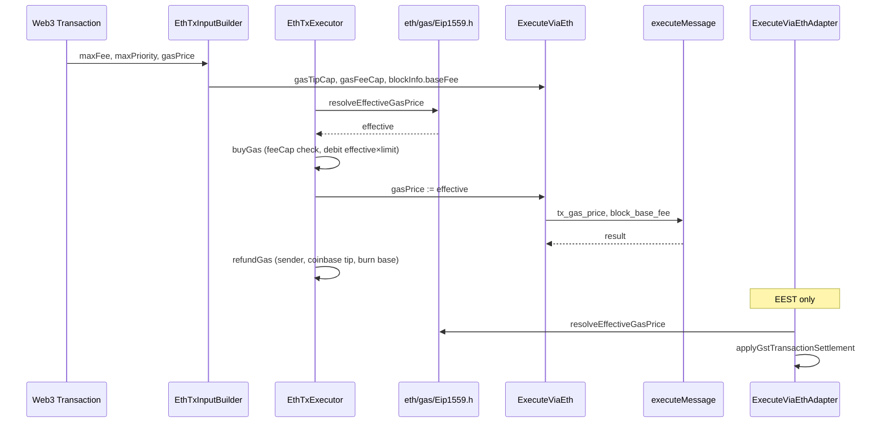

# ETH Reference / TE — EIP-1559 费用市场结算对齐 — 设计规格

**日期：** 2026-06-21  
**状态：** 待评审  
**范围决策：** **方案 B** — shared `eth/gas` 公式 + TE orchestration + EEST adapter 对齐；**不**改 `bcos-framework::effectiveGasPrice()`（方案 C 留后续）  
**前置：** ADR-005（orchestration 边界）、ADR-015（7702/7623 settlement）、`2026-06-21-eth-eest-7702-session-handoff.md`  
**参考实现：** `OpStackTxExecutor::{buyGas,refundGas}`、`ExecuteViaEthAdapter::applyGstTransactionSettlement`

---

## 1. 背景

`bcos-evm/eth/` 当前对 EIP-1559 的处理呈 **三层分裂**：

| 层级 | 现状 | geth 差距 |
|------|------|-----------|
| EVM 运行时 | `block_base_fee` 已注入 `evmc_tx_context`；`BASEFEE` opcode 可用 | ✅ |
| Precheck | `ExecuteViaEthPreCheck` 校验 `gasFeeCap ≥ gasTipCap` 且 `≥ baseFee`（W4） | ✅ |
| `GASPRICE` opcode | `executeMessage` 使用调用方传入的 `input.gasPrice`，常为 legacy `gasPrice` 或 `maxFeePerGas` | ❌ 应为 `min(tipCap+baseFee, feeCap)` |
| TE buyGas/refund | `EthTxExecutor` 使用 `protocol::effectiveGasPrice()`（1559 时回退 `maxFeePerGas`，非 effective 公式） | ❌ |
| Coinbase tip / base fee | TE 路径无 tip 路由；base fee 未按 mainnet 销毁语义处理 | ❌ |
| EEST reference | `ExecuteViaEthAdapter` 有局部 `effectiveGasPriceForSettlement`，与 OpStack 重复 | ⚠️ 正确但未共享 |

**影响：**

- **TE 生产路径：** 1559 交易预扣/退还金额与 geth 不一致；miner tip 未入账 coinbase。
- **Reference / EEST：** `GASPRICE` 偏差可能导致合约内 gas 计量与 stateRoot 偏移；GST 结算逻辑与 TE 分叉，维护成本高。

**已闭合（本 spec 不重复）：** W1–W4 precheck（`45c1c6c0f`）；7702 intrinsic / included-tx vmerr（ADR-015）。

---

## 2. 范围决策（已确认）

| 维度 | 选择 |
|------|------|
| 架构方案 | **方案 1** — `eth/gas/Eip1559.h` 共享公式；orchestrator 各自调用；**不**在 `ExecuteViaEth` 内核做 balance settlement |
| 代码范围 | **B** — TE（`EthTxExecutor` + `EthTxInputBuilder`）+ reference（`ExecuteViaEth` 输入 + `ExecuteViaEthAdapter`） |
| Framework | **不改** `protocol::effectiveGasPrice()`；eth 路径显式使用 `resolveEffectiveGasPrice` |
| RevisionConfig | **不改** `eip1559` flag 消费（ADR-004 profile-only）；以 `web3TypedTxKind` / `hasGasFeeCap` 识别 typed tx |
| OpStack | **可选** follow-up：`OpStackTxExecutor` 改 include 共享 header（去重，非阻断） |
| Base fee 去向 | **L1 mainnet 语义：销毁**（不记入任何账户）；与 GST adapter 当前行为一致，**不同于** OpStack vault 路由 |

### 2.1 在范围内

- 新增 `bcos-evm/eth/gas/Eip1559.h`
- `ExecuteViaEth` 入口：effective price 驱动 `input.gasPrice` → `executeMessage`
- `EthTxInputBuilder::fillWeb3Fields`：填充 `gasTipCap` / `gasFeeCap`
- `EthTxExecutor::{buyGas,refundGas}` 1559 对齐
- `ExecuteViaEthAdapter`：删除 duplicate，调用共享 helper
- 单元测试 + capability-matrix 脚注 / 简短 ADR-016 引用

### 2.2 不在范围内

- 块级 base fee **动态调整**算法（假设 `BlockHeader` / GST `env` 已带正确 `baseFee`）
- OpStack L1 fee、operator fee、blob gas 路由
- `bcos-framework` / RPC `maxPriorityFeePerGas` API 实现
- 全量 EEST state full 537 fail  Closure（本 spec 仅覆盖 1559 结算；stateRoot 大桶需单独 wave）
- `RevisionConfig.eip1559` runtime gate

---

## 3. 架构决策

### 3.1 选定方案：共享 gas 公式 + 分层 orchestration（方案 1）

```
eth/gas/Eip1559.h     ← 纯函数：effective price、tip、balance check 金额
        ↑
   ┌────┴────┬──────────────────┐
   │         │                  │
EthTxExecutor  ExecuteViaEthAdapter   (future: OpStackTxExecutor include)
(buyGas/refund) (GST post-settlement)
        ↑
ExecuteViaEth ← 仅设置 gasPrice=effective，不做 State 余额写
        ↓
executeMessage ← tx_gas_price + block_base_fee
```

**拒绝方案 2（在 `ExecuteViaEth` 内 settlement）：** 违反 ADR-005；GST 与 TE 易双重扣款。

**拒绝方案 3（只改 framework helper）：** 无法解决 coinbase tip 与 base fee 销毁。

### 3.2 ADR-005 边界

| 职责 | 层 |
|------|-----|
| `min(tip+base, feeCap)`、`tipPerGas` 公式 | `eth/gas/Eip1559.h` |
| sender 预扣 / 退还、coinbase tip | orchestration（`EthTxExecutor`、adapter） |
| `GASPRICE` / `BASEFEE` opcode 上下文 | `executeMessage`（kernel 边界） |
| Precheck fee cap | `ExecuteViaEthPreCheck`（已有） |

### 3.3 1559 交易识别

```cpp
bool isEip1559GasCapsTx(uint8_t web3TypedTxKind, bool hasGasFeeCap) noexcept;
// true when: web3TypedTxKind == 0x02 (type-2)
//         OR hasGasFeeCap (maxFeePerGas/maxPriorityFeePerGas present on input)
// type-4 (0x04) also carries fee caps → treat as 1559-capable for settlement
```

Legacy（`web3TypedTxKind == 0` 且无 fee caps）：`gasTipCap = gasFeeCap = gasPrice`。

---

## 4. 共享模块设计 — `eth/gas/Eip1559.h`

### 4.1 API

```cpp
namespace bcos::evm::gas {

/// geth: min(gasTipCap + baseFee, gasFeeCap)
bcos::u256 resolveEffectiveGasPrice(
    bcos::u256 const& gasTipCap,
    bcos::u256 const& gasFeeCap,
    bcos::u256 const& baseFee) noexcept;

/// max(effectiveGasPrice - baseFee, 0)
bcos::u256 tipPerGas(
    bcos::u256 const& effectiveGasPrice,
    bcos::u256 const& baseFee) noexcept;

/// Normalize caps for legacy txs (tipCap = feeCap = gasPrice).
struct GasCaps {
    bcos::u256 gasTipCap;
    bcos::u256 gasFeeCap;
    bool isEip1559Caps;
};

GasCaps normalizeGasCaps(
    bcos::u256 gasPrice,
    bcos::u256 gasTipCap,
    bcos::u256 gasFeeCap,
    bool hasExplicitFeeCaps) noexcept;

/// geth buyGas balance check: gasLimit * gasFeeCap (+ value) for 1559;
/// gasLimit * effectiveGasPrice (+ value) for legacy.
bcos::u256 maxBalanceGasDebit(
    int64_t gasLimit,
    GasCaps const& caps,
    bcos::u256 const& baseFee) noexcept;

}  // namespace bcos::evm::gas
```

### 4.2 公式对齐（geth `state_transition.go`）

| 步骤 | geth | 本实现 |
|------|------|--------|
| Effective price | `min(tipCap + baseFee, feeCap)` | `resolveEffectiveGasPrice` |
| Balance check (1559) | `gasLimit * feeCap + value` | `maxBalanceGasDebit` |
| Buy gas debit | `gasLimit * effective` | `EthTxExecutor::buyGas` |
| Refund sender | `gasRemaining * effective` | `EthTxExecutor::refundGas` |
| Tip to coinbase | `gasUsed * (effective - baseFee)` | `refundGas` |
| Base fee | **burned** | 不 credit 任何地址 |

### 4.3 OpStack 去重（非阻断 follow-up）

`OpStackTxExecutor.cpp` 内联的 `resolveEffectiveGasPrice` 可改为：

```cpp
using bcos::evm::gas::resolveEffectiveGasPrice;
```

同 PR 或紧随 PR；若 OpStack 测试全绿可合并。

---

## 5. 组件修改规格

### 5.1 `ExecuteViaEth` — 仅修正 `GASPRICE` 输入

**文件：** `ExecuteViaEth.cpp`、`ExecuteViaEth.h`（已有 `gasTipCap`/`gasFeeCap`）

**行为：**

1. `ethExecuteViaEthPreCheck` 之后、intrinsic gas 之前：
   ```cpp
   auto const caps = gas::normalizeGasCaps(input.gasPrice, input.gasTipCap, input.gasFeeCap,
       /* hasExplicitFeeCaps */ input.gasTipCap != 0 || input.gasFeeCap != 0 || input.web3TypedTxKind >= 0x02);
   input.gasPrice = gas::resolveEffectiveGasPrice(
       caps.gasTipCap, caps.gasFeeCap, input.blockInfo.baseFee);
   ```
2. **不**修改 State 余额；settlement 仍由 TE 或 adapter 负责。

**注意：** TE 路径在 `buyGas` 已预扣后进入 `executeViaEth`；此处改 `gasPrice` 只影响 EVM opcode，不影响 buyGas 金额（buyGas 在 orchestrator 层用同一公式）。

### 5.2 `EthTxInputBuilder::fillWeb3Fields`

**文件：** `transaction-executor/bcos-transaction-executor/EthTxInputBuilder.h`

**新增逻辑：**

```cpp
// After existing web3 / 7702 fill:
if (auto tip = tx.maxPriorityFeePerGas(); !tip.empty())
    input.gasTipCap = u256(tip);
if (auto fee = tx.maxFeePerGas(); !fee.empty()) {
    input.gasFeeCap = u256(fee);
    input.gasPrice = 0; // force orchestrator to use caps
}
// Legacy fallback: gasPrice already on input from EthTransactionExecutorImpl
```

`EthTransactionExecutorImpl::executeViaEthTx` 应传递 caps，且 **buyGas 不再单独依赖** `protocol::effectiveGasPrice()`。

### 5.3 `EthTxExecutor` — buyGas / refundGas

**文件：** `bcos-evm/eth/EthTxExecutor.h`

**`buyGas` 修改：**

1. 从 `Data` 读取 `m_gasTipCap`、`m_gasFeeCap`、`m_hasGasFeeCap`（需在 `ExecuteContext::Data` 增加字段，由 `executeViaEthTx` 或 Prepare 阶段填充）。
2. `baseFee` 来自 `buildEthBlockInfo(...).baseFee`。
3. `effective = resolveEffectiveGasPrice(...)`。
4. `balanceCheck = maxBalanceGasDebit(gasLimit, caps, baseFee) + txValue`。
5. 预扣 `gasLimit * effective`（与 geth 一致）。
6. 存储 `m_effectiveGasPrice` 供 refund / receipt 使用。

**`refundGas` 修改：**

1. `sender += gasRemaining * m_effectiveGasPrice`
2. `coinbase += gasUsed * tipPerGas(m_effectiveGasPrice, baseFee)`
3. **不** credit base fee（burn）
4. EVM 失败路径：保持现有 rollback savepoint 语义；gas 仍按 geth 不退还已 burn 部分（与现 EthTxExecutor 一致）

**`makeReceipt`：** `m_gasPriceStr` = hex(`m_effectiveGasPrice`)。

**Coinbase 地址：** 从 `blockInfo.coinbase`（`buildEthBlockInfo`）读取；需在 `Data` 中缓存 `state::BlockInfo` 或 coinbase 字段。

### 5.4 `ExecuteViaEthAdapter` — 去重 + 对齐

**文件：** `evm-reference-tests/src/ExecuteViaEthAdapter.cpp`

1. 删除 `effectiveGasPriceForSettlement` 本地函数。
2. `#include "bcos-evm/eth/gas/Eip1559.h"`，使用 `resolveEffectiveGasPrice` / `tipPerGas`。
3. `applyGstTransactionSettlement` 保留在 adapter（GST orchestration），内部：
   - `gasCost = effective * gasUsed` 扣 sender
   - `coinbase += tipPerGas(effective, baseFee) * gasUsed`
4. 调用 `executeViaEth` **前** 或依赖 `ExecuteViaEth` 内部 normalization 保证 `GASPRICE` 一致（二选一，推荐 ExecuteViaEth 内统一，adapter 只负责 post settlement）。

### 5.5 `EthFixtureAdapter`

**文件：** `test/fixtures/EthFixtureAdapter.h`

- 对 Prague fixture 若模拟 1559 tx，应设置 `gasTipCap`/`gasFeeCap`；legacy fixture 保持 `gasPrice` 三者相等（已有）。

---

## 6. 数据流（修复后）



---

## 7. 测试策略

### 7.1 单元测试 — `EthEip1559GasTest.cpp`

| Case | 断言 |
|------|------|
| `tip_plus_base_below_fee_cap` | effective = tip + base |
| `tip_plus_base_above_fee_cap` | effective = feeCap |
| `legacy_gas_price` | caps 归一化后 effective = gasPrice |
| `tip_per_gas_zero_when_effective_eq_base` | tip = 0 |
| `max_balance_debit_1559` | gasLimit × feeCap |
| `max_balance_debit_legacy` | gasLimit × gasPrice |

### 7.2 Orchestration — `EthTxExecutor1559Test.cpp`（或扩展现有 smoke）

使用 `InMemoryStateView` + 最小 `ExecuteContext` mock / 直调 `buyGas`/`refundGas`：

| Case | 断言 |
|------|------|
| `buy_gas_debits_effective_times_limit` | sender balance delta |
| `refund_returns_unused_at_effective` | sender 加回 |
| `coinbase_receives_tip_only` | coinbase += used × (eff - base) |
| `base_fee_not_minted` | 总 supply 减少（sender 扣款 > coinbase 入账） |
| `insufficient_balance_fee_cap_check` | 1559：balance < limit×feeCap → reject |

### 7.3 Reference adapter

| Case | 断言 |
|------|------|
| `gst_settlement_matches_shared_formula` | 与 `EthEip1559GasTest` 同输入同 effective/tip |

### 7.4 回归

| 套件 | 期望 |
|------|------|
| `ctest -L evm-reference-tests-smoke` | 13/13 保持 |
| `EthExecuteViaEthPreCheckTest` | 6/6 保持 |
| `EthIncludedTxVmerrTest` | 不退化 |
| 可选 EEST 1559 fixture 子集 | 新增 probe manifest，执行后记录 pass/fail delta |

### 7.5 继承 / BCOS baseline

本 spec **不强制** BCOS `executeViaHost` 1559 结算（BCOS Web3 1559 或仍 feature-gated）。若后续 BCOS 启用 type-2 tx，应复用同一 `eth/gas/Eip1559.h`。

---

## 8. 文档与矩阵

| 产物 | 内容 |
|------|------|
| `bcos-evm/docs/adr/016-eth-eip1559-settlement.md` | 简短 ADR：公式、burn 语义、ADR-005 边界 |
| `capability-matrix.md` | 新增或扩展行：**EIP-1559 effective gas + tip settlement** — ETH reference `explicit`；测试引用 |
| `evm-reference-tests/README.md` | 若 1559 probe 有 baseline delta，更新表 footnote |

---

## 9. 实施顺序（writing-plans 输入）

| Step | 任务 | 验证 |
|------|------|------|
| 1 | `eth/gas/Eip1559.h` + `EthEip1559GasTest` | ctest |
| 2 | `ExecuteViaEth` effective `gasPrice` normalization | 单测或 fixture |
| 3 | `EthTxInputBuilder` caps 填充 + `ExecuteContext::Data` 字段 | 编译 TE |
| 4 | `EthTxExecutor` buyGas/refundGas + coinbase | `EthTxExecutor1559Test` |
| 5 | `ExecuteViaEthAdapter` 去重 | smoke 13/13 |
| 6 | ADR-016 + matrix | 文档 review |
| 7 | 可选：OpStack include 共享 header | opstack ctest 子集 |

---

## 10. 风险与缓解

| 风险 | 缓解 |
|------|------|
| buyGas 预扣从 maxFee → effective，余额不足边界变化 | 1559 仍用 feeCap 做 balance check；补 insufficient balance 单测 |
| TE 与 adapter 双重 settlement | TE 走 State DB；adapter 仅 GST in-memory diff — 路径互斥 |
| type-4 tx 同时有 fee caps + auth list | 按 `web3TypedTxKind==0x04` 仍走 1559 caps 分支 |
| `gasPrice` 字段在 Web3 tx 解码中语义混用 | TE 1559 路径显式读 maxFee/maxPriority，不依赖 gasPrice 字段 |

---

## 11. 验收标准

1. `resolveEffectiveGasPrice` 与 geth / OpStack 现有实现 **比特级一致**（u256 比较）。
2. TE 路径：1559 交易 coinbase 收到 tip；base fee 不 mint。
3. `executeMessage` 中 `tx_gas_price == effectiveGasPrice`（1559 tx）。
4. EEST smoke **不退化**。
5. adapter 无本地 duplicate effective price 函数。
6. ADR-016 + matrix 更新合并同 PR 或紧随 PR。

---

## 12. 参考

- geth `core/state_transition.go` — `buyGas`, `refundGas`, `EffectiveGasTip`
- `bcos-evm/opstack/OpStackTxExecutor.cpp`
- `bcos-evm/evm-reference-tests/src/ExecuteViaEthAdapter.cpp`
- `bcos-evm/eth/ExecuteViaEthPreCheck.cpp`
- ADR-005, ADR-004, ADR-015

---

*Spec 版本：2026-06-21 v1 — 待用户评审后进入 writing-plans。*
