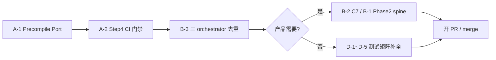

# bcos-evm 剩余架构调整任务清单

**日期：** 2026-06-23  
**状态：** 跟踪中  
**分支：** `worktree-feat-evm-refactor` / `feat-evm-refactor`  
**前置完成：** [PrecompileRouter Phase 1](./2026-06-23-precompile-router-design.md)、TE warmset 修复（`c8aeda88c`）

**依据文档：**

- [2026-06-18-bcos-evm-layer-refactor-design.md](./2026-06-18-bcos-evm-layer-refactor-design.md)（Step 1–4）
- [2026-06-19-eth-kernel-capability-inheritance-design.md](./2026-06-19-eth-kernel-capability-inheritance-design.md)
- `bcos-evm/docs/inheritance-work-tracker.md`
- `bcos-evm/docs/architecture-known-gaps.md`
- `bcos-evm/capability-matrix.md`

---

## 1. 摘要

bcos-evm 分层重构 **Phase α（Step 1–4）骨架已落地**：`EthHost` 递归 call、`executeMessage` 三轨编排、CMake 三库拆分、PrecompileRouter kernel dispatch 统一均已完成。

**当前主要缺口**集中在：

1. **编译边界未 CI 固化**（`bcos/` 仍深依赖 `bcos-executor`）
2. **编排层重复**（三 orchestrator 共享逻辑未提取）
3. **Precompile 产品层债务**（C7 non-empty 不对称、Phase 2 spine 未合并）
4. **测试 / 矩阵 / 远程 CI** 收尾

---

## 2. 已完成（2026-06-23 前）

| 项 | 交付物 | 备注 |
|----|--------|------|
| PrecompileRouter Phase 1 | `eth/precompiled/PrecompileRouter.*` | chain→builtin；双入口；C1–C5 等价测试 |
| TE warmset 修复 | `warmTransactionEntry.h` + executor prewarm | legacy tx 忽略 access list；CompatExecuteViaHost **106/106** |
| 设计 / 计划文档 | spec v1.2 + implementation plan | `2026-06-23-precompile-router-*` |

---

## 3. 任务清单

图例：`[ ]` 未开始 · `[~]` 部分完成 · `[x]` 已完成 · `[—]` 需产品决策

### P0 — 编译边界与耦合（Step 2 未完全验收）

| ID | 任务 | 优先级 | 状态 | 依据 | 现状 / 下一步 |
|----|------|--------|------|------|----------------|
| **A-1** | **Precompile Port** — `bcos/` 解耦 `bcos-executor` | P0 | `[x]` | 架构 review #3；Step 2 §5.1 | `ChainPrecompilePort` / `AuthPort` 已落地，FISCO chain precompile 经 Port 注入编排 |
| **A-2** | **Step 4 编译边界 CI** | P0 | `[x]` | §7.3 | capability-gate 已新增 compile-boundary grep 门禁（`bcos-executor` / `bcos/Fisco`） |
| **A-3** | Web3 decoder 迁移（可选） | P2 | `[—]` | ADR-007 deferred | TE builder 仍依赖 `bcos-executor/Web3AccessListResolver` |

**Step 2 验收命令（当前未全绿）：**

```bash
! rtk grep -r 'bcos-executor' bcos-evm/
! rtk grep -rE 'bcos/Fisco' bcos-evm/eth/
```

**推荐顺序：** A-1 Precompile Port → A-2 CI 门禁固化。

---

### P1 — Kernel / 编排层收敛

| ID | 任务 | 优先级 | 状态 | 依据 | 现状 / 下一步 |
|----|------|--------|------|------|----------------|
| **B-1** | PrecompileRouter **Phase 2 — Spine 合并** | P1 | `[ ]` | PrecompileRouter spec §2.3（Phase 1 排除） | 顶层仍走 `executeMessage` 独立 spine；嵌套走 `EthHost::call` |
| **B-2** | **C7 不对称修复** — non-empty `[PRECOMPILED]` | P1 | `[—]` | C7 characterization | depth=0 走 EVM；depth>0 走 chain hook；**产品确认后再 spec** |
| **B-3** | **三 orchestrator 去重** | P1 | `[ ]` | ADR-005 | `adoptResult`、7623 precheck、settlement 等分散于 eth/bcos/opstack |
| **B-4** | **RevisionConfig 语义债务** | P1 | `[~]` | ADR-004；gap #37 | `eip2929` 等与 profile-only 文档不一致；部分字段无 TE consumer |

---

### P2 — 产品 / 语义对齐

| ID | 任务 | 优先级 | 状态 | 依据 | 现状 / 下一步 |
|----|------|--------|------|------|----------------|
| **C-1** | FISCO chain vs builtin **产品 precedence** | P2 | `[—]` | capability-matrix deviation | Phase 1 统一 kernel 为 chain→builtin（bugfix）；产品层未 re-design |
| **C-2** | 7212 / 0x0100 geth 语义对齐 | P2 | `[ ]` | PrecompileRouter spec 非目标 | envelope 统一后行为由 equivalence test 锁定 |
| **C-3** | depth=0 DELEGATECALL 门控 | P3 | `[ ]` | PrecompileRouter §5.2 follow-up | 顶层不经 `EthHost` DELEGATECALL 门控；实测问题则单列 |

---

### P3 — 测试 / 矩阵 / 质量债务

| ID | 任务 | 优先级 | 状态 | tracker | 现状 / 下一步 |
|----|------|--------|------|---------|----------------|
| **D-1** | BCOS baseline 补全 | P2 | `[~]` | #28 | smoke + 7702 + imported fixture 部分完成 |
| **D-2** | capability-matrix Test ref 补全 | P2 | `[~]` | #35 | value transfer / CREATE nonce 仍为 `—` |
| **D-3** | Phase 4 helpers 提取 | P3 | `[~]` | #25–27 | `TxFeaturePrepare` 已落地；其余待提取 |
| **D-4** | bcos-evm 全量 CI 绿 | P2 | `[~]` | Task 7 报告 | 4 个无关失败 + 8 个 test target 未 build |
| **D-5** | capability-gate 远程首跑 | P1 | `[~]` | P0 #6 | workflow 在分支；**远程 CI 待验证** |

**已知无关失败（2026-06-23）：** `SstoreRefund`、`PragueState` fixture、`ExecuteViaEthFixture` BLS gas、`ExecuteViaHostImportedFixture`。

---

### P4 — 文档化 Gap（需产品决策）

| ID | 任务 | 状态 | 文档 | 说明 |
|----|------|------|------|------|
| **E-1** | Prepare 阶段 dead warm | `[—]` | architecture-known-gaps #36 | Prepare 本地 State warm 不持久化到 Execute |
| **E-2** | RevisionConfig profile-only 字段 | `[—]` | #37 + ADR-004 | 接线 / 删除 / 保留文档三选一 |
| **E-3** | HostExtension include 审计 | `[x]` | #38 | 当前树无违规；**新增 hook 时复跑** |

---

## 4. 推荐实施路线



### 近期优先（Next 3）

1. **A-1 Precompile Port** — 解除 Step 2 最大 blocker  
2. **A-2 Step 4 CI grep 门禁** — 防止编译边界回退  
3. **B-3 三 orchestrator 去重** — 与 ADR-005 一致，降低维护成本  

### 暂缓（等产品 / 架构决策）

- **B-1** Phase 2 spine 合并  
- **B-2** C7 non-empty `[PRECOMPILED]` 对齐  
- **C-1** FISCO 产品 precedence re-design  

---

## 5. 与 Step 1–4 设计对照

| Step | 设计目标 | 完成度 | 剩余 |
|------|----------|--------|------|
| **Step 1** | `EthHost::call()` 递归 + 嵌套测试 | `[x]` | — |
| **Step 2** | RevisionConfig 纯化 + `executeMessage` + 零 executor include | `[~]` | **A-1** Precompile Port |
| **Step 3** | 三轨编排收敛 | `[x]` | **B-3** 去重 refinements |
| **Step 4** | CMake 三库 + 公共 API + CI 边界 | `[~]` | **A-2** CI 门禁；facade 已有 |

---

## 6. 相关 ADR / 矩阵行

| 主题 | 引用 |
|------|------|
| RevisionConfig profile-only | ADR-004 |
| 编排域边界 | ADR-005 |
| BCOS 7702 | ADR-006 |
| Web3 decoder | ADR-007 |
| builtin precompiles | capability-matrix — `PrecompileRouterEquivalenceTest` |
| chain precompile routing | capability-matrix — `PrecompileRouterPrecedenceTest` |

---

## 7. 变更记录

| 日期 | 变更 |
|------|------|
| 2026-06-23 | 初版：Post PrecompileRouter Phase 1 + TE warmset 修复盘点 |
